# Methods to Improve Ventilation in Patient-Ventilator Management

#### **OUTLINE**

CORRECTING VENTILATION ABNORMALITIES, 214
COMMON METHODS OF CHANGING VENTILATION BASED ON PaCO2 AND pH, 214

Respiratory Acidosis: Volume and Pressure Ventilation Changes, 214

Respiratory Alkalosis: VC-CMV and PC-CMV Changes, 216

Metabolic Acidosis and Alkalosis, 217

Metabolic Acidosis, 217 Metabolic Alkalosis, 218

Mixed Acid-Base Disturbances, 218 Increased Physiological Dead Space, 218

Increased Metabolism and Increased Carbon Dioxide

Production, 219

Intentional latrogenic Hyperventilation, 219

Permissive Hypercapnia, 220

Procedures for Managing Permissive Hypercapnia, 220 Contraindications of Permissive Hypercapnia, 220 Airway Clearance During Mechanical Ventilation, 221

SECRETION CLEARANCE FROM AN ARTIFICIAL AIRWAY, 221

Hazards and Complications of Suctioning, 223 Closed-Suction Catheters (Inline Suction Catheters), 223

Aspiration of Subglottic Secretions, 224 Normal Saline Instillation, 225

Assessment After Suctioning, 225

ADMINISTERING AEROSOLS TO VENTILATED PATIENTS, 226 TYPES OF AEROSOL-GENERATING DEVICES, 228

Ventilator-Related Factors, 228

Patient-Related Factors, 229

Circuit-Related Factors, 229

Use of Pressurized Metered-Dose Inhaler During Mechanical Ventilation, 229

Use of Small-Volume Nebulizers During Mechanical Ventilation, 230

Technical Problems Associated With Continuous Nebulization

Using an External Gas Source, 230 Nebulization Provided by the Ventilator, 231

Use of Nebulizers During Noninvasive Positive Pressure Ventilation, 231

Patient Response to Bronchodilator Therapy, 232

POSTURAL DRAINAGE AND CHEST PERCUSSION, 232

FLEXIBLE FIBEROPTIC BRONCHOSCOPY, 233

ADDITIONAL PATIENT MANAGEMENT TECHNIQUES AND THERAPIES IN VENTILATED PATIENTS, 235

Sputum and Upper Airway Infections, 235

**FLUID BALANCE, 236** 

PSYCHOLOGICAL AND SLEEP STATUS, 236 PATIENT SAFETY AND COMFORT, 237

Patient Safety, 237
Patient Comfort, 237

Patient-Centered Mechanical Ventilation, 238

TRANSPORT OF MECHANICALLY VENTILATED PATIENTS WITHIN AN ACUTE CARE FACILITY, 238

SUMMARY, 239

#### **KEY TERMS**

- Alveolar dead space
- Asynchrony
- Hyperosmolar

- latrogenic
- Ischemic
- Ketoacidosis

- Minute ventilation
- Permissive hypercapnia
- Transpyloric

#### **LEARNING OBJECTIVES**

On completion of this chapter, the reader will be able to do the following:

- Recommend ventilator adjustments to reduce work of breathing and improve ventilation based on patient diagnosis, arterial blood gas results, and ventilator parameters.
- Calculate the appropriate suction catheter size, length, and amount of suction pressure needed for a specific size endotracheal tube and patient.
- 3. Compare the benefits of closed-suction catheters with the opensuction technique.
- 4. List the pros and cons of instilling normal saline to loosen secretions before suctioning.
- 5. List the clinical findings used to establish the presence of a respiratory infection.

- Compare and contrast the protocols for using metered-dose inhalers and small-volume nebulizers during mechanical ventilation.
- Describe complications associated with using small-volume nebulizers powered by external flowmeters during mechanical ventilation.
- 8. Discuss the importance of patient-centered mechanical ventilation in the treatment of critically ill patients.
- 9. Discuss the complications associated with the in-house transport of a mechanically ventilated patient.

linicians generally use the first 30 to 60 minutes after initiation of mechanical ventilation to gather information that can be used to evaluate the effectiveness of ventilatory support. As discussed in Chapter 8, these data typically involve vital signs, breath sounds, and assessment of respiratory mechanics (i.e., lung compliance [CL] and airway resistance [Raw]). Ventilator graphics can also be a valuable resource when evaluating the patient—ventilator interaction (see Chapter 9).

This chapter provides an overview of ventilatory strategies that can be used to manage patients with various acid-base disturbances. It also includes a discussion of airway clearance techniques, aerosol administration, flexible fiberoptic bronchoscopy during ventilation, patient positioning, and techniques used to assess fluid balance. The importance of ensuring patient comfort and safety, in addition to in-house transport of the patient on ventilation, is also discussed.

#### **CORRECTING VENTILATION ABNORMALITIES**

Once an initial physical assessment is performed, an arterial blood gas (ABG) sample should be obtained to evaluate the patient's respiratory and acid-base status. Evaluation of ABG results can be divided into three parts: acid-base status, ventilation, and oxygenation status—pH (alkalinity and acidity), and bicarbonate;  $P_aCO_2$  (partial pressure of carbon dioxide  $[CO_2]$ ); and oxygenation status ( $P_aO_2$  [partial pressure of  $O_2$ ],  $S_aO_2$  [arterial  $O_2$  saturation],  $C_aO_2$  [arterial content of  $O_2$ ], and  $O_2$  delivery  $[DO_2]$ ). The following discussion focuses on those factors that can alter  $P_aCO_2$  during mechanical ventilation, including **minute ventilation**, physiological dead space, and  $CO_2$  production (Fig. 12.1). Methods to improve oxygenation are reviewed in Chapter 13.

## COMMON METHODS OF CHANGING VENTILATION BASED ON PaCO2 AND pH

A change in minute ventilation  $(\dot{V}_E)$  is often required after a patient is placed on mechanical ventilation. It is not uncommon

**Fig. 12.1** Factors that affect the partial pressure of arterial carbon dioxide ( $P_aCO_2$ ) during mechanical ventilation.  $\dot{V}CO_2$ , Carbon dioxide production;  $\dot{V}_A$ , alveolar ventilation;  $\dot{V}_E$ , minute ventilation;  $\dot{V}_D$ , dead space ventilation;  $V_T$ , tidal volume;  $T_V$  inspiratory time;  $T_E$ , expiratory time;  $T_F$ , respiratory rate. (From Hess DR, MacIntyre NR, Mishoe SC, et al.: *Respiratory care principles and practice*, ed 2, Sudbury, MA, 2012, Jones and Bartlett.)

to use full ventilatory support initially and then adjust parameters after an initial assessment is performed. The examples presented in this discussion represent full support of an apneic patient.

During mechanical ventilation, changing the set tidal volume  $(V_T)$  or rate (f) can be used to correct respiratory alkalosis or acidosis. These changes are based on the following equation\*:

known 
$$P_aCO_2 \times \text{ known } \dot{V}_E = \text{Desired } P_aCO_2 \times \text{Desired } \dot{V}_E$$

If we assume that physiological dead space† and CO2 production (resulting from metabolism) do not change significantly during a short period, the equation can be modified to read:

Known  $P_aCO_2 \times Known$  alveolar ventilation per minute  $(\dot{V}_A) =$ 

Desired 
$$P_aCO_2 \times Desired V_A$$

If it is appropriate to keep rate (f) constant and change  $V_T$ , the equation becomes:

$$Desired \ V_T \ = \frac{Known \ P_aCO_2 \times Known \ V_T}{Desired \ P_aCO_2}$$

If it is appropriate to keep  $V_T$  constant and change f, the equation is written:

$$Desired \ f = \frac{Known \ P_aCO_2 \times Known \ f}{Desired \ P_aCO_2}$$

### Respiratory Acidosis: Volume and Pressure Ventilation Changes

When  $P_aCO_2$  is elevated (>45 mm Hg) and pH is decreased (<7.35), respiratory acidosis is present and  $\dot{V}_A$  is inadequate. Acute respiratory acidosis is associated with the following:

- Parenchymal lung problems (e.g., pulmonary edema, pneumonia)
- · Airway disease (e.g., severe asthma attack)
- Pleural abnormalities (e.g., effusions)
- · Chest wall abnormalities
- Neuromuscular disorders (e.g., spinal cord injury, myasthenia gravis)
- Central nervous system problems (e.g., drug overdose)1 See Chapter 4 for additional information.

For patients receiving mechanical ventilation, respiratory acidosis can generally be corrected by adjusting the set  $V_T$  or f to achieve the desired minute ventilation. Regardless of whether the patient is receiving volume-controlled or pressure-controlled ventilation, increasing  $\dot{V}_E$  will decrease the  $P_aCO_2$ .

Recommended guidelines are to target a  $V_T$  of 6 to 8 mL/kg ideal body weight (IBW) while ensuring that the plateau pressure ( $P_{\rm plat}$ ) is maintained at less than 30 cm H2O. As discussed in Chapter 6,  $V_T$  and breathing frequency adjustments should be based on the patient's pulmonary pathology. It is important to understand that the 6 to 8 mL/kg range is an average. If the  $V_T$  is at

\*This equation is based on the following:  $\dot{V}_E$ , where  $\dot{V}_A$  is alveolar ventilation, 0.863 is a conversion factor, and  $\dot{V}$ co2 is CO2 production. In addition,  $\dot{V}$ co2. Assuming dead space and  $\dot{V}$ co2 remain constant, increasing ventilation results in a decreased CO2.

&lt;sup>†Physiological dead space = Anatomical dead space + Alveolar dead space.

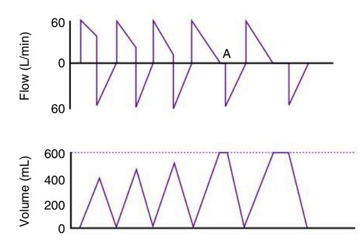

**Fig. 12.2** Effect of inspiratory time  $(T_i)$  and inspiratory plateau on delivered tidal volume  $(V_T)$  in the pressure-controlled ventilation (PC-CMV) mode. Initially, as  $T_i$  is increased,  $V_T$  increases. Once an inspiratory plateau (A) is reached, a further increase in  $T_i$  will not increase  $V_T$ . Kacmarek RM, Stoller JK, Heuer AJ: *Egan's fundamentals of respiratory care*, ed 12, St. Louis, MO, 2021, Elsevier.

the upper limit of this range and  $P_{plat}$  is greater than 30 cm  $H_2O$ ,  $V_T$  may be decreased to achieve a lower  $P_{plat}$ .

With pressure-controlled continuous mandatory ventilation (PC-CMV), the set pressure is generally adjusted to obtain the targeted  $V_T$ . PC-CMV is time cycled. If inspiratory time  $(T_I)$  is short, increasing it may also increase volume delivery, without requiring an increase in pressure (P) (Fig. 12.2).

### Cli

### Clinical Scenario: Adjusting PC-CMV in a Patient With Respiratory Acidosis

A 165-lb (75-kg, IBW) patient is placed on PC-CMV with a rate of 10 breaths/min, a set pressure of 25 cm  $H_2O$ , and a measured  $V_T$  of 425 mL. The flow-time curve for this patient is shown in Curve A.  $T_I$  is 0.7 seconds. The ABGs are as follows: pH = 7.30;  $P_aCO_2 = 50$  mm Hg;  $HCO_3^- = 23$  mEq/L.

To improve ventilation, two things can be adjusted. The  $T_I$  can be increased so that the set pressure reaches the alveolar level. This would be apparent when the flow scalar shows a period of zero flow during inspiration (*curve B*). This strategy may be tried first. If this does not improve volume delivery sufficiently, the set pressure can be increased.

#### Clinical Scenario: Respiratory Acidosis—Increasing Tidal Volume

A 50-year-old man with respiratory acidosis is receiving mechanical ventilatory support. He is 6-ft, 2-in tall and weighs 190 lb (81 kg, IBW) (anatomical dead space [ $V_{Danat}$ ] = 190 mL). Exhaled  $V_{T}$  measured at the endotracheal tube (ET) is 400 mL. His respiratory rate is 16 breaths/min. The patient is receiving VC-CMV. ABGs show a  $P_{a}CO_{2}$  of 55 mm Hg and a pH of 7.33. The patient has no pulmonary disease. His desired  $P_{a}CO_{2}$  is 40 mm Hg. What ventilator change must be made to decrease the  $P_{a}CO_{2}$ ?

Because the  $V_T$  setting is less than 8 mL/kg and the patient has no pulmonary disease, it is appropriate to hold the rate constant and change  $V_T$ :

$$\begin{aligned} \text{Desired V}_{\text{T}} &= \frac{\text{Known P}_{\text{a}}\text{CO}_{2} \times \text{Known V}_{\text{T}}}{\text{Desired P}_{\text{a}}\text{CO}_{2}} \\ \text{Desired V}_{\text{T}} &= \frac{55 \times 400}{400} = \ 550 \ \text{mL} \end{aligned}$$

The new  $V_T$  is set at 550 mL ( $\sim$ 7 mL/kg IBW) to achieve a desired  $P_aCO_2$  of 40 mm Hg. The alveolar ventilation has been increased appropriately to correct the respiratory acidosis.

### Clinical Scenario: Respiratory Acidosis—Increasing Rate

A 48-year-old woman who is 5-ft, 2-in tall is receiving VC-CMV and generating no spontaneous breaths. She has a  $P_aCO_2$  of 58 mm Hg, pH is 7.28, and  $V_T$  at the ET is 425 mL. IBW is 115 lb (52 kg), and  $V_{Danat}$  is 115 mL. Respiratory rate is 15 breaths/min. How can the ventilator settings be adjusted to achieve a desired  $P_aCO_2$  of 40 mm Hg?

In this case the patient's  $V_T$  is set at about 8 mL/kg, so it is appropriate to change f and not increase  $V_T$ .

$$Desired f = \frac{Known \ f \times Known \ P_aCO_2}{Desired \ P_aCO_2}$$

Increasing the breathing frequency to 23 breaths/min should decrease the  $P_aCO_2$  to 40 mm Hg. It is important to recognize, however, that setting high respiratory rates may be associated with air trapping because of a reduced expiratory time. (NOTE: It is useful to monitor the flow scalar when setting breathing frequencies greater than 20 breaths/min.)

### Clinical Scenario: Changes During Pressure-Targeted Ventilation

During PC-CMV, the same types of adjustments for  $V_T$  and f are made on the basis of ABGs, except that the set pressure is increased or decreased to achieve a desired VT. Exhaled volume is monitored until the desired VT is obtained. (NOTE: It is important to ensure that TI is long enough to gain the most benefit from the set pressure [see Case Study 12.1].)

A 165-lb (75-kg, IBW) patient with respiratory acidosis is receiving PC-CMV ( $P_aCO_2 = 59 \text{ mm Hg}$ ; pH = 7.31; desired  $P_aCO_2 = 40$  mm Hg). At a set pressure of 10 cm  $H_2O$ , the exhaled VT is 400 mL (5.3 mL/kg) and the rate is 16 breaths/ min. The patient is not spontaneously breathing. TI is set so that the flow returns to zero before the end of inspiration and a Pplat period can be measured. What ventilator adjustment must be made to decrease his PaCO2? The VT setting is less than 8 mL/kg, so it is appropriate to hold f constant and

Desired 
$$V_T = \frac{59 \times 400}{40} = 590 \text{ mL}$$
 or about 600 mL

A set pressure (P) of 10 cm H2O results in a VT of 400 mL (0.4 L); what is an estimated pressure that will achieve a VT of 600 mL (0.6 L)? Assume that compliance does not change. Remember static compliance  $(C_S) = V_T/(P_{plat} - positive)$ end-expiratory pressure [PEEP]),  $C_S = 400/10$ , and  $C_S =$ 40 mL/cm H2O

Desired P = 
$$\frac{\text{Desired V}_T}{C_s}$$

Desired P =  $\frac{600 \text{ mL}}{40 \text{ mL}}$  and P = 15 cm H2O

Desired pressure is 15 cm H2O

Increasing pressure during PC-CMV will normally increase VT. Conversely, decreasing pressure decreases VT for patients with respiratory alkalosis during PC-CMV.

#### Respiratory Alkalosis: VC-CMV and PC-CMV **Changes**

When PaCO2 is decreased (<35 mm Hg) and pH increases (>7.45), respiratory alkalosis is present, indicating that the alveolar ventilation is excessive. Common causes of respiratory alkalosis include the following2:

- Hypoxia with compensatory hyperventilation
- Parenchymal lung disease
- Medications (salicylate, xanthines, analeptics)
- Mechanical ventilation
- Central nervous system disorders (meningitis, encephalitis, head trauma)
- Anxiety
- Metabolic problems (sepsis, hepatic disease)

In mechanically ventilated patients, hyperventilation is often the cause of respiratory alkalosis. To correct respiratory alkalosis in this situation, the clinician should decrease minute ventilation during volume-controlled ventilation by decreasing f and, if necessary, decreasing VT. If pressure-controlled ventilation is used,

#### Case Study 12.1

#### Hyperventilation

A 190-lb (86-kg), 68-year-old man (IBW = 80 kg) is admitted to the hospital. He is placed on mechanical ventilation for acute respiratory failure compounded by metabolic acidosis. It is determined that he has a renal disorder. The physician orders peritoneal dialysis. In the interim, the physician asks the respiratory therapist to target a pH of 7.35 with assisted ventilation. Initial assessment of the patient resulted in the following ABG: pH = 7.22,  $P_aCO_2 = 38$  mm Hg,  $HCO_3^- = 15$ mEq/L,  $P_aO_2 = 98$  mm Hg on  $F_1O_2 = 0.25$ .

The ventilator settings are VC-CMV, f = 24 breaths/min,  $V_T = 600 \text{ mL}, F_1O_2 = 0.25.$ 

ABG results on this new setting are pH = 7.37,  $P_aCO_2$  mm Hg = 23,  $HCO_3^- = 13.5$  mEq/L,  $P_aO_2 = 115$  mm Hg. A flow-time graphic shows the following:

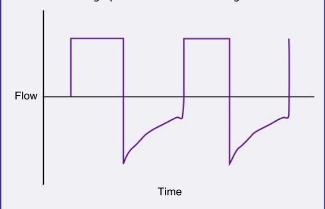

What is the problem, and what would you suggest to correct this problem and still help the patient?

the clinician should decrease f first and then decrease set pressure,

#### Clinical Scenario: Respiratory Alkalosis—Decreasing the Rate

A 35-year-old man with respiratory alkalosis (PaCO2 = 20 mm Hg; pH = 7.60) is on CMV with no spontaneous breaths and a delivered VT of 550 mL, a rate of 18 breaths/ min, and VDanat at 150 mL. His desired PaCO2 is 40 mm Hg. IBW is 70 kg.  $V_T$  setting is approximately 8 mL/kg. It is appropriate to decrease f and leave  $V_T$  constant:

Desired 
$$f = \frac{18 \times 20}{40} = 9 \frac{\text{breaths}}{\text{min}}$$

A new rate of 9 breaths/min should achieve the desired PaCO2 of 40 mm Hg. (NOTE: This case did not state whether this was volume-controlled or pressure-controlled ventilation. It does not matter in this situation, however, because the targeted change was the rate.)

#### Clinical Scenario: Respiratory Alkalosis: Decreasing the Volume in Pressure-Controlled Ventilation

A 50-year-old woman on PC-CMV originally had a set pressure of 20 cm H2O, which resulted in a VT of 450 mL  $(C_S = 28 \text{ mL/cm H}_2\text{O})$ . The set rate was 12 breaths/min with no spontaneous efforts. TI is long enough to provide a slight pause (zero flow) at end inspiration. ABGs on this setting showed a pH = 7.41 and a  $P_aCO_2$  of 44 mm Hg. The patient's IBW is 60 kg.

After 2 days of ventilation on these settings, the pH = 7.51and  $P_aCO_2 = 29$  mm Hg. The pressure is still at 20 cm  $H_2O$ and VT is 625 mL (10.4 mL/kg IBW). CS is now 32 mL/cm H2O. This is a substantial improvement. The VT is high, based on IBW. What would be an appropriate target volume for this patient?

Desired 
$$V_T = \sim 450 \text{ mL}$$

How do you set a pressure to get this VT?

Remember 
$$C_s = V_T/\Delta P$$
, so  $P = V_T/C_s$ 

and

Desired P = 
$$450 \text{ mL}/(32 \text{ mL}/\text{cm H}_2\text{O}) = 14 \text{ cm H}_2\text{O}$$

A decrease in pressure to 14 cm H2O should achieve the new targeted VT of 450 mL, which is 7.5 mL/kg IBW for this patient.

#### Clinical Scenario: Respiratory Alkalosis **During Spontaneous Efforts**

A 25-year-old man on VC-CMV has a set rate of 14 breaths/ min and a VT of 560 mL. The patient's IBW is 80 kg (176 lb). The patient is triggering the ventilator an additional 4 breaths/ min. Total rate is 18 breaths/min; PaCO2 is 30 mm Hg; pH is 7.50. What can the respiratory therapist do to improve ventilation? The VT is 7 mL/kg IBW, which is appropriate for this patient. Suppose the therapist reduces the set f on the ventilator to 10 breaths/min. What effect would this have on ventilation? As long as the patient continues to trigger additional breaths, reducing the set f will have no effect.

Decreasing VT (or, more specifically, pressure during PC-CMV) may be effective in reducing minute ventilation unless the patient increases his spontaneous rate, thus maintaining high alveolar ventilation. In addition, lowering the VT to less than 7 mL/kg may result in atelectasis from low VT ventilation.

In this situation, several alternatives are available: (1) reduce the VT but ensure an adequate level of PEEP is being administered to reduce the potential for atelectasis; (2) institute another mode, such as synchronized intermittent mandatory ventilation (IMV) or pressure-supported ventilation (PSV), to allow the patient to breathe without receiving a mandatory breath with every inspiration; or (3) sedate the patient to control breathing better. Sedation may be needed for patients demonstrating extreme agitation, increased work of breathing (WOB), or patient-ventilator asynchrony. It is important to recognize that sedation may not always be the best choice. Whenever possible, the cause of hyperventilation should be investigated and treated. Common causes of hyperventilation include hypoxemia, pain, anxiety, fever, agitation, and asynchrony.

Head injury that results in a high  $\dot{V}_{E}$  and hyperventilation is sometimes difficult to control, regardless of the mode selected. Some patients with brain injury have a tendency to breathe with a high VT and f, which is the result of a central nervous system lesion and cannot be corrected.3

#### **Metabolic Acidosis and Alkalosis**

Treatment of metabolic acidosis and alkalosis should focus on identifying metabolic factors that can cause these acid-base disturbances. Although it may not be apparent, a respiratory component may also be involved, and this possibility should be addressed.

#### **Metabolic Acidosis**

Patients in apparent respiratory distress may present with metabolic acidosis. Blood gases indicate pH = 7.00 to 7.34 and a bicarbonate in the range of about 12 to 22 mEq/L. These patients are often struggling to lower their PaCO2 to achieve some degree of hyperventilation to compensate for the metabolic acidosis. As a consequence, these patients are at risk for developing respiratory muscle fatigue. Thus, in this situation, mechanical ventilation is indicated to meet the minimum goal of compensated hypocapnia.4 Whether this can be accomplished with noninvasive or invasive ventilation depends on whether the patient meets the criteria for this mode of ventilation (see Chapter 19). If invasive ventilation is required, the risks must be balanced against the temporary benefits.

Causes of metabolic acidosis include the following processes:

- **Ketoacidosis** (alcoholism, starvation, diabetes)
- Uremic acidosis (renal failure to excrete acid)
- Loss of bicarbonate (diarrhea)
- Renal loss of base after administration of carbonic anhydrase inhibitors (e.g., acetazolamide [Diamox])
- Lactic acidosis
- Toxins ingested that produce acidosis (salicylate, ethylene glycol [antifreeze], methanol)

Treatment for metabolic acidosis includes initiating effective therapy to address the cause of the acidosis and assessing the need to reverse the acidemia with the administration of an alkalizing agent. Treating the underlying cause of acidemia and making sure vascular volume and cardiac output are normal, in addition to ensuring adequate oxygenation, are essential. These actions allow time for the normal metabolism of organic acids (lactic acid and ketoacids) and allow time for the kidneys to generate bicarbonate to replace losses.4

Controversy abounds regarding the benefit of using alkalinizing agents, such as bicarbonate administration, in the treatment of metabolic acidosis. Lowering arterial CO2 is also controversial, but if the patient is losing the struggle to maintain high  $\dot{V}_E$  with spontaneous breathing, assisted ventilation may be necessary to avoid respiratory failure. In this situation it is appropriate to keep the pH within normal limits (7.35–7.45) (Case Study 12.1).

#### **Metabolic Alkalosis**

Metabolic alkalosis is present when pH (7.45–7.70) and bicarbonate (26–48 mEq/L) are elevated above normal. Common causes include the following:

- Loss of gastric fluid and stomach acids (vomiting, nasogastric suctioning)
- Acid loss in the urine (diuretic administration)
- · Acid shift into the cells (potassium deficiency)
- · Lactate, acetate, or citrate administration
- · Excessive bicarbonate loads (bicarbonate administration)

As with metabolic acidosis, treatment involves identifying the underlying cause and reversing those factors leading to the alkalosis. In severe cases, carbonic anhydrase inhibitors, acid infusion, and low bicarbonate dialysis may be required.5

Uncomplicated metabolic alkalosis is not usually associated with alveolar hypoventilation as a compensatory mechanism because of the resulting hypoxemia that occurs with severe hypoventilation. For example,  $P_aCO_2$  will usually not rise higher than 55 mm Hg. Remember that the  $P_aO_2$  will fall as the  $CO_2$  rises. Thus hypoventilation is accompanied by hypoxemia in a patient who is breathing room air. The hypoxemia will cause stimulation of the peripheral chemoreceptors, resulting in increased minute ventilation. Only in rare circumstances does full compensation of metabolic alkalosis occur.5

#### **Mixed Acid-Base Disturbances**

Some patients with acute respiratory failure have mixed respiratory and metabolic disturbances, such as respiratory acidosis combined with metabolic alkalosis. Notice that the pH may actually be near normal. The following case can be used to illustrate this point. Two additional case studies are presented to illustrate the management of patients with (1) combined respiratory alkalosis with metabolic acidosis and (2) combined respiratory acidosis with metabolic alkalosis.

### Clinical Scenario: Mixed Respiratory and Metabolic Disturbances

A 65-year-old patient on mechanical ventilation has a nasogastric tube in place with suction. He is also receiving diuretics for congestive heart failure (CHF). The pH is 7.36,  $P_aCO_2$  is 58 mm Hg,  $HCO_3^-$  31 mEq/L, and  $P_aO_2$  is 111 mm Hg ( $F_IO_2=0.30$ ).  $V_T$  is 400 mL, and the rate is 12 breaths/ min. Is it appropriate to increase  $\dot{V}_E$  so that the  $P_aCO_2$  can be returned to 40 mm Hg? In this case it is *not* appropriate to increase  $\dot{V}_E$  to decrease the  $P_aCO_2$ . This can rapidly result in alkalosis with accompanying cardiac dysrhythmias, seizures, and other neurological disturbances. The cause of both problems should be determined and corrected.

#### Clinical Scenario: Combined Respiratory Alkalosis and Metabolic Acidosis

A 55-year-old man is transported by helicopter to a large metropolitan hospital. His initial diagnosis is acute myocardial infarction. Paramedics intubate the patient, start an intravenous (IV) drip with normal saline, and begin manual ventilation with 100% O2. After admission to the

hospital, the patient has a vascular stent placed in one of the coronary vessels to improve its patency. The patient is stabilized, and mechanical ventilation is initiated with the following settings: IMV 16 breaths/min and  $V_T=750~\text{mL}$  ( $\approx 10~\text{mL/kg}, \text{IBW}).$  No spontaneous breaths are present. No changes are made in the ventilator settings, and the  $V_T$  is maintained at approximately 10 mL/kg IBW.

Two days later the respiratory therapist obtains a 6:00 a.m. ABG for this patient. The ventilator settings are still the same. ABG results are as follows:

$$P_aCO_2 = 25 \text{ mm Hg}; pH = 7.42; HCO_3^- 17 \text{ mEq/L}$$

The patient does not have a history of pulmonary or metabolic disease. His normal  $P_aCO_2$  is about 40 mm Hg. Both the  $V_T$  and rate are high for this patient. Because the  $P_{plat}$  is only 20 mm Hg, the therapist decides to reduce the rate initially to begin targeting the patient's normal  $P_aCO_2$ .

Desired  $f = (Actual \ rate \times Actual \ P_aCO_2)/Desired \ P_aCO_2$ 

Desired  $f = (16 \times 25)/40$ Desired f = 10 breaths/min

Attempts to reduce ventilator rate to 10 breaths/min result in an increased spontaneous rate of more than 25 breaths/min. The patient is conscious, appears anxious, and is laboring to breathe. Why is it difficult to reduce the mandatory rate in this situation?

The patient has a compensated respiratory alkalosis. The initial  $\dot{V}_E$  was set too high for this patient (set  $\dot{V}_E=12$  L/min; predicted  $\dot{V}_E=10$  L/min). After 2 days on these settings, the kidneys have compensated for an iatrogenic hyperventilation by excreting excess bicarbonate. To allow the reverse process to take place, the mandatory rate will have to be reduced slowly (1–2 breaths about every 2–4 hours) so that normal ventilation can be restored and the kidneys given time to increase the bicarbonate back to a normal level.

#### Clinical Scenario: Combined Respiratory Acidosis and Metabolic Alkalosis

A 35-year-old woman is receiving mechanical ventilation. ABG analysis shows a  $P_aCO_2$  of 60 mm Hg, pH of 7.41,  $HCO_3^-=35$  mEq/L. (NOTE: The patient's normal  $P_aCO_2$  is 40 mm Hg.) The fact that the high  $P_aCO_2$  is not reflected in the pH indicates that the patient appears to have a metabolic alkalosis and a respiratory acidosis. Before the  $P_aCO_2$  can be corrected with ventilator adjustment, the metabolic alkalosis must be corrected. If the  $P_aCO_2$  were decreased to 40 mm Hg, the pH would increase and the patient would develop severe alkalosis.

#### **Increased Physiological Dead Space**

If pure respiratory acidosis persists even after alveolar ventilation has been increased, the patient may have a problem that is the result of increased alveolar dead space. Increased alveolar dead space can be caused by a pulmonary embolism or low cardiac output resulting in low pulmonary perfusion. **Key Point** 12.1 Increased alveolar dead space can occur when high levels of positive end-expiratory pressure compress pulmonary capillaries and reduce pulmonary blood flow to the lungs.

Increased **alveolar dead space** can also occur when ventilatory support reduces pulmonary blood flow to the lungs by causing high alveolar pressures, such as in the application of high PEEP (Key Point 12.1). Reduced pulmonary perfusion can be associated with air trapping that results from a high  $\dot{V}_E$ , a low inspiratory gas flow (high inspiratory-to-expiratory [I/E] ratio, such as 3:1), or an uneven distribution of ventilation because of a pathological lung problem.

In the case of air trapping (auto-PEEP), increasing the flow or decreasing the I/E ratio (to 1:3 or 1:4) may correct the problem. (Increasing inspiratory flow can shorten  $T_{\rm I}$  and allow more time for exhalation.) Sometimes repositioning the patient so that the disease-compromised lung receives minimal blood flow (nondependent position) while the nondiseased lung receives greater blood flow can significantly improve gas exchange and help address the problem. (See section on positioning later in this chapter.)

The normal ratio of dead space to tidal volume  $(V_D/V_T)$  is 0.2 to 0.4. In critically ill patients, this value can be greater than 0.7. Calculation of  $V_D/V_T$  ratio uses the Enghoff modification of the Bohr equation:  $V_D/V_T = (P_aCO_2 - P_ECO_2)/P_aCO_2$ , where  $P_ECO_2$  is the partial pressure of  $CO_2$  in the mixed expired gases collected from the patient.\* A blood gas sample is collected and the average  $V_T$  is measured while the  $P_ECO_2$  is being measured. Note that although this method of measuring the  $V_D/V_T$  ratio can provide useful information on mechanically ventilated patients, it typically requires additional equipment and is not routinely performed.

It is more common in patients on ventilation to monitor the end-tidal CO2 (EtCO2; normal  $P_{et}CO_2 = 35-43$  mm Hg) and the gradient between arterial and EtCO2 to determine whether dead space is changing (normal  $P_aCO_2$ -to- $P_{et}CO_2$  gradient = 4–6 mm Hg). A decrease in EtCO2 and an increase in the  $P_aCO_2$ -to- $P_{et}CO_2$  gradient suggest increased dead space. Some clinicians use the mean value of the  $P_{et}CO_2$  instead of measuring mixed expired gas to calculate the  $V_D/V_T$  ratio.6 Advances in capnography using single-breath volumetric  $CO_2$  monitoring offer still another alternative for estimating  $V_D/V_T$ . (See Chapter 10 for more details on  $P_{et}CO_2$  and volumetric  $CO_2$  monitoring.)

### Increased Metabolism and Increased Carbon Dioxide Production

Metabolic rate and  $\dot{V}CO_2$  are elevated in patients who have fever, burns, multiple trauma, sepsis, hyperthyroidism, muscle tremors or seizures, or agitation and in patients who have undergone multiple surgical procedures. Regardless of the cause, it is clear that  $\dot{V}_E$  will be increased and WOB will be elevated. Increasing the ventilator rate will decrease the patient's WOB, but auto-PEEP may occur. If auto-PEEP is a factor, it may be beneficial to add

Mixed expired gas includes alveolar gas and gas from the anatomical dead space. Historically, mixed expired analyses were obtained using a large airtight collection bag, such as a Douglas bag. Exhaled gases were collected over a 3-minute period, and then a sample of the exhaled gas was analyzed using a standard blood gas analyzer. With most intensive care unit (ICU) ventilators, mixed expired gas samples can be obtained using rapid-responding CO2 analyzers and computer software incorporated into the ventilator design.

enough pressure support (PS) for the spontaneous breaths to reduce WOB through the ET and circuit. Other options might include switching to PC-CMV and using sedation to reduce the patient's work.

### Clinical Scenario: Increased Metabolism and Increased CO2 Production

A 25-year-old patient with burns on IMV has a  $V_T$  of 0.7 L, rate of 10 breaths/min,  $P_aCO_2$  of 40 mm Hg, and pH of 7.39. The patient has a spontaneous rate of 15 breaths/min and a spontaneous  $V_T$  of 600 mL. His  $P_aO_2$  is 88 mm Hg on 0.5  $F_IO_2.$  This patient has a high total  $\dot{V}_E$  (ventilator  $\dot{V}_E=7$  L/min + patient  $\dot{V}_E=9$  L/min; total  $\dot{V}_E=16$  L/min). Given this level of  $\dot{V}_E$ , one would expect the  $P_aCO_2$  to be lower. The reason that it is not lower may be either an increased  $\dot{V}CO_2$  or an increased  $\dot{V}_D/V_T.$ 

#### **Intentional latrogenic Hyperventilation**

Historically, **iatrogenic** hyperventilation has been used in patients with acute head injury and increased intracranial pressure (ICP). Hyperventilation lowers  $CO_2$  in the blood, which in turn is associated with constriction of cerebral blood vessels, resulting in a reduction in blood flow to the brain. Although this approach was believed by many clinicians to help lower increased ICP, therapeutic guidelines for head injuries with increased ICP do *not* recommend prophylactic hyperventilation ( $P_aCO_2 < 25 \text{ mm Hg}$ ) during the first 24 hours. 7,8 Hyperventilation during the first few days after severe traumatic brain injury may actually increase cerebral **ischemia** and cause cerebral hypoxemia (see Chapter 7 section on closed head injury).

Hyperventilation may be required for brief periods when acute neurological deterioration is present and ICP is elevated. Mild hyperventilation ( $P_aCO_2$  30–35 mm Hg) may be used for longer periods in situations in which increased ICP is refractory to standard treatment, including sedation and analgesia, neuromuscular blockade, cerebrospinal fluid drainage, and **hyperosmolar** therapy. (NOTE: Guidelines for ventilation therapies used in the treatment of brain injuries also include recommendations for monitoring jugular venous  $O_2$  saturation [Sj $O_2$ ] and the partial pressure of brain tissue  $O_2$  [Btp $O_2$ ] to measure  $O_2$  delivery to the brain if hyperventilation is used. (S) It is important to mention that the practice of iatrogenic hyperventilation is debatable because of the effects associated with reductions in cerebral blood flow and resultant development of cerebral ischemia. The following case study provides an example of the use of iatrogenic hyperventilation.

#### Clinical Scenario: Iatrogenic Hyperventilation

A 42-year-old woman who is 5-ft, 4-in tall (IBW = 125 lb [57 kg]) is on controlled ventilation for 12 hours after a severe cerebral concussion. Her  $P_aCO_2$  is 48 mm Hg, her pH is 7.32, and her  $V_T$  is 400 mL. Respiratory rate is 12 breaths/min. What are your recommendations? Current  $V_T$  is 7 mL/kg. Is it appropriate to change f? In this case it would be appropriate to increase the f and maintain the  $P_aCO_2$  at normal levels for the first 24 hours.

If we change the rate, the following recommendation would apply:

Desired  $f = 12 \times 48/40 = 14 \text{ breaths/min}$ 

#### **Permissive Hypercapnia**

Occasionally, it becomes impossible to maintain normal  $P_aCO_2$  levels in a patient without risking lung damage from high  $P_{plat}$  (>30 cm  $H_2O$ ) and volumes. Patients with acute respiratory distress syndrome (ARDS) or status asthmaticus and sometimes patients with chronic obstructive pulmonary disease (COPD) who require ventilatory support are at risk for ventilator-induced injury. Inappropriate ventilator settings can result in severe lung injury and activation of inflammatory mediators and can even potentially lead to multisystem organ failure. (See Chapter 17 for additional information on ventilator-induced lung injury.)

A technique referred to as **permissive hypercapnia** (PHY) is an alternative form of protective ventilator patient management. PHY is a deliberate limitation of ventilatory support to avoid lung overdistention and injury of the lung. During PHY arterial  $P_aCO_2$  values are allowed to rise above normal (e.g.,  $\geq 50$  and  $\leq 150$  mm Hg), and pH values are allowed to fall below normal (e.g.,  $\geq 7.10-7.30$ ). Patients who do not have renal failure or cardiovascular problems usually tolerate a pH of 7.20 to 7.25. Younger patients may tolerate even lower pH values. Many clinicians who use PHY allow for a gradual rise in  $P_aCO_2$  because an abrupt increase in  $P_aCO_2$  is usually not well tolerated.  $^{11}$ 

The physiologic effects of hypercapnia are complex. It can affect multiple organ systems.  $^{10,12}$  Although most investigators agree that a pH of 7.25 or greater is acceptable, no one is certain whether a lower pH is acceptable. Survival without complications has been demonstrated in isolated cases in which the pH dropped as low as 6.6 and the  $P_aCO_2$  rose as high as 375 mm Hg when oxygenation was well maintained.  $^{11,13}$  Similar findings have been shown in studies of patients with ARDS and acute asthma.  $^{14-17}$ 

During hypoventilation, increases in  $P_aCO_2$  are accompanied by a decrease in  $P_aO_2$ , so  $O_2$  administration must be provided and oxygenation status monitored carefully. Increases in  $P_aCO_2$  and decreases in pH that occur in acute respiratory acidosis also cause a right shift in the oxyhemoglobin dissociation curve. Although this shift in the curve facilitates unloading of  $O_2$  at the tissue level, it also reduces  $O_2$  loading at the lungs and can further compromise gas exchange.

Increases in  $CO_2$  have an additional physiological effect. A higher-than-normal  $P_aCO_2$  stimulates the drive to breathe. Therefore it is appropriate to provide sedation to patients with acute lung injury in whom permissive hypercapnia is being used. The sedation may improve patient comfort. (Note that extremely high levels of  $P_aCO_2$  can result in an anesthesia effect referred to as  $CO_2$  narcosis [Key Point 12.2].)

#### Procedures for Managing Permissive Hypercapnia

Efforts to maintain eucapnic breathing (i.e., near a patient's normal level of PaCO2) might include removing sources of

**EXECUTE: EXECUTE:** Extremely high levels of  $P_aCO_2$  (>200 mm Hg) can result in an anesthesia effect also known as  $CO_2$  narcosis.

### BOX **12.1**

### Protocol for the Implementation of Permissive Hypercapnia

When adequate ventilation cannot be maintained within acceptable limits for pressures and volumes, permissive hypercapnia (PHY) can be implemented using the following steps21:

- 1. Hypercapnia should be implemented progressively in increments of 10 mm Hg/h to a maximum of 80 mm Hg/day.
- If hypercapnia should exceed 80 mm Hg, progress more slowly.
- 3.  $F_1O_2$  is adjusted to maintain arterial  $O_2$  saturation ( $S_aO_2$ ) at 85% to 90%. Adequate oxygenation is imperative and can require the intermittent use of 100%  $O_2$ .
- 4. If PHY is used for less than 24 hours, PaCO2 can be allowed to decrease by 10 to 20 mm Hg/h, provided that PaCO2 is greater than 80 mm Hg. The closer the patient is to normocapnia, the slower the process should be.
- If PHY is used for more than 24 hours or if large amounts of buffer agents are used, discontinue PHY even more slowly (in 1-3 days).

mechanical dead space and increasing the frequency of mandatory breaths. When the decision is made to allow  $P_aCO_2$  to rise above normal, the following strategy may be used 19,20:

- 1. Allow  $P_aCO_2$  to rise and pH to fall without changing the mandatory rate or volume. Do nothing other than sedate the patient, avoid high ventilating pressures, and maintain oxygenation.
- 2. Reduce CO2 production by using paralytic agents, cooling the patient, and restricting glucose intake.
- 3. Administer agents such as sodium bicarbonate, *tris*(hydroxymethyl)aminomethane (tromethamine [THAM], an amino buffer), or Carbicarb (a mixture of sodium carbonate and bicarbonate) to keep pH greater than 7.25.
- In some cases, extracorporeal CO2 removal (ECCO2R) may be a viable alternative method of CO2 removal to maintain a lung protective ventilation strategy.

Note that use of buffering agents remains debatable and not well studied in PHY. A short-term increase in  $P_aCO_2$  might occur when bicarbonate is administered. This is exhaled over time if the level of ventilation is constant. The use of THAM is not associated with an increased  $P_aCO_2$ . It produces intracellular and extracellular buffering of pH. Whether buffers have any effect on the tolerance of permissive hypercapnia is not known. A protocol for the implementation of permissive hypercapnia is provided in  $P_aCO_2$ .

#### **Contraindications of Permissive Hypercapnia**

 ${\rm CO_2}$  is a powerful vasodilator of cerebral vessels. Thus increasing  ${\rm CO_2}$  levels can result in cerebral edema and increased ICP, which can aggravate cerebral disorders, such as cerebral trauma or hemorrhage, and cerebral-occupying lesions. For this reason the use of PHY is contraindicated in the presence of disorders such as head trauma and intracranial disease. Indeed, it is generally avoided for those patients who demonstrate intracranial lesions (Key Point 12.3).  $^{22}$ 

PHY is relatively contraindicated in patients with preexisting cardiovascular instability. Circulatory effects of PHY can include

**Ney Point 12.3** Permissive hypercapnia is generally avoided for those patients who demonstrate intracranial lesions.

decreased myocardial contractility, arrhythmias, vasodilation, and increased sympathetic activity. A common finding in patients receiving PHY is increased cardiac output, a normal systemic blood pressure (BP), and pulmonary hypertension.23 If the patient's sympathetic response is impaired or blocked, or if cardiac function is impaired, an increase in cardiac output might not occur, allowing the vasodilatation to result in hypotension.19

The exact response of the cardiovascular system to PHY is difficult to predict; therefore PHY should be used with caution. This is particularly true when working with patients with any of the following cardiovascular conditions: cardiac ischemia, left ventricular compromise, pulmonary hypertension, and right heart failure (Key Point 12.4).22

Finally, it is worth noting that elevated CO2 or decreased pH may affect regional blood flow; skeletal and smooth muscle function; nervous system activity; and endocrine, digestive, hepatic, and renal system functions. Although these effects have not caused significant concern in the clinical setting, further research in these areas is warranted to improve our understanding of this ventilatory strategy.

#### ( Clinical Scenario: Permissive Hypercapnia

A 30-year-old man with ARDS has been on ventilatory support for 5 days. Current settings are  $V_T = 500$  mL; f = 12breaths/min; peak inspiratory pressure (PIP) =  $37 \text{ cm H}_2\text{O}$ ; and  $P_{plat} = 29$  cm  $H_2O$ . The patient is 5-ft, 8-in tall and has an IBW of 70 kg. ABGs show pH = 7.24 and  $P_aCO_2$  = 64 mm Hg. What change is appropriate to return his PaCO2 to normal? If we tried to increase his VT, pressures would increase. If we increase f, the desired f would be

Desired 
$$f = 12 \times 64/40 = 19$$
 breaths/min

This equation assumes that we want to maintain a normal PaCO2 of 40 mm Hg. One might suspect that the increased rate would also lead to air trapping, an increase in mean airway pressure, and an increased risk for lung injury. However, in patients with ARDS, lung units are more likely to empty quickly (short time constants). We might increase the rate slightly and allow PaCO2 to remain high (i.e., PHY). To protect the patient from increasing airway pressures, it might be appropriate to use pressure ventilation.

The use of PHY is restricted to situations in which the target airway pressure is at its maximum and the highest possible rates are being used. Although no adverse shortterm effects of PHY have been noted for most patients, it is not known whether any long-term effects occur. The risks for hypercapnia are considered by some to be preferable to the high Pplat required to achieve normal CO2 levels. This represents a significant shift in thinking in regard to ventilator management and ARDS.24

**New Point 12.4** Permissive hypercapnia should be used with caution when treating patients demonstrating cardiac ischemia, left ventricular compromise, pulmonary hypertension, and right heart failure.

#### **Airway Clearance During Mechanical** Ventilation

During mechanical ventilation, several techniques can be used to help clear secretions from the airway. These procedures differ somewhat from those used with nonintubated, spontaneously breathing patients. Included in this section are discussions of the following topics: suctioning, aerosol delivery, postural drainage and percussion, and fiberoptic bronchoscopy. High-frequency percussive ventilation can also assist with secretion clearance.

#### SECRETION CLEARANCE FROM AN ARTIFICIAL **AIRWAY**

Clearing secretions from the ET or tracheostomy tube (TT) of mechanically ventilated patients is an important component of bronchial hygiene therapy. Although it is not uncommon to see a physician's order read "Suction Q 2 hr," suctioning at fixed intervals is not appropriate and should be performed only when necessary (i.e., based on patient assessment findings).

Suctioning a patient's artificial airways involves insertion of a suction catheter into the patient's trachea and application of negative pressure as the catheter is gradually withdrawn.25 Suctioning a patient with an artificial airway typically involves shallow suctioning, in which the catheter is inserted to a depth that approximates the length of the artificial airways. Deep suctioning involves inserting the catheter into the artificial airway until a resistance is met. Once the resistance is encountered, the catheter is withdrawn approximately 1 cm before applying negative pressure.

Two methods of suctioning are typically described on the basis of the type of catheter used: the open suctioning technique and the closed suctioning technique. The open-circuit technique requires disconnecting the patient from the ventilator; the closed-circuit technique can be performed without removing the patient from the ventilator. With the closed-circuit technique, a sterile, inline suction catheter is incorporated into the ventilator circuit, thus allowing passage of the catheter into the ET and trachea without disconnecting the patient from the ventilator (Key Point 12.5).

Suction catheters are generally made of transparent flexible plastic that is rigid enough to allow it to be easily inserted into the artificial airway but flexible enough to negotiate turns and not cause trauma to the airway. Catheters are smooth tipped with two or more side holes near the distal end (Fig. 12.3). (It is thought that these smooth-tipped catheters with side holes may help reduce trauma to the mucosa.26)

**Key Point** 12.5 Two methods of endotracheal suctioning can be performed on the basis of the type of catheter used: open-circuit technique and closed-circuit technique.

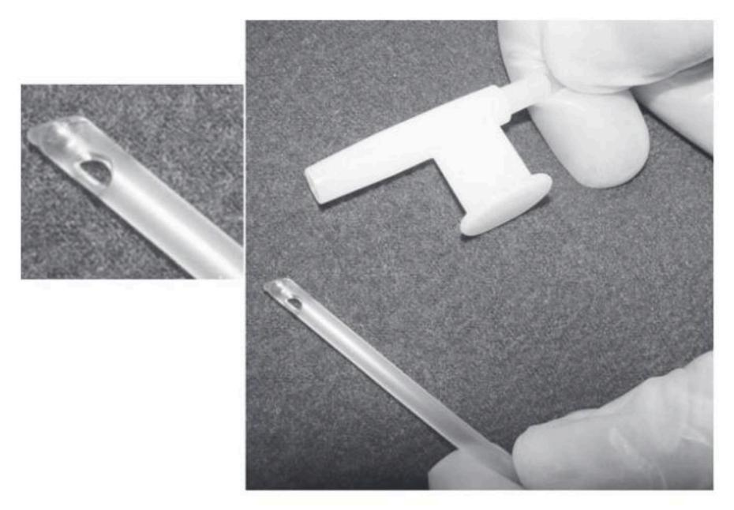

Fig. 12.3 Flexible suction catheter for lower airway suctioning showing rounded tip with side port (cutaway of photo).

The proximal end of the catheter connects to a collecting canister via a large-bore plastic tube. A thumb port located at the proximal end of the suction catheter allows the operator to control the suction pressure. When it is covered, suction pressure is applied to the catheter and into the airway. The suction pressure applied should be the lowest possible pressure required to effectively clear secretions. Table 12.1 provides a list of suggested suction pressure levels. These recommended suction levels are based on current practice, although it is common to see higher than recommended suction pressures used in many clinical settings. It is important to note that to date no experimental studies are available to support these values.

The catheter length should be long enough to reach a mainstem bronchus. This requires a catheter length of about 22 inches (56 cm).26 Note that in infants and in patients with recent tracheal reconstructive surgery or pneumonectomy, the suction catheter should not be inserted more than 1 cm below the distal tip of the ET.27

Remember that the left mainstem bronchus is narrower and branches at a more acute angle than the right bronchus. Consequently, suction catheters often enter the right rather than the left bronchus. A special-tipped suction catheter is available with a bend at the distal end to help facilitate left bronchial suctioning, particularly if the patient is supine or lying on the left side or if the head is turned to the left. Left bronchus suctioning is easier when the patient has a TT in place rather than an ET.27

## TABLE 12.1 Patient Size and Appropriate Suction Levels

| Patient                   | Range                                                            | Maximum                                |
|---------------------------|------------------------------------------------------------------|----------------------------------------|
| Adults Child Infant | -100 to $-120$ mm Hg $-80$ to $-100$ mm Hg $-60$ to $-100$ mm Hg | -150 mm Hg -125 mm Hg -100 mm Hg |

The diameter of the suction catheter selected is governed by the internal diameter of the artificial airway. It is generally accepted that the diameter of the suction catheter should not exceed 50% of the internal diameter of the artificial airway for children and adults and 30% of the internal diameters for infants. Suction catheter sizes are based on French units. French units refer to the circumference of the tube. (NOTE: Circumference equals diameter multiplied by 3.1416  $[\pi]$ .) Because ETs are sized in centimeters and suction catheters are sized in French units, a conversion is required to estimate the correct size (Box 12.2).

Suctioning should be preceded by hyperoxygenation with 100%  $O_2$  for 30 seconds, followed by hyperoxygenation with 100%  $O_2$  for 1 minute after suctioning is complete, especially in patients who are hypoxemic before or during suctioning.28 This can be done manually with a resuscitation bag, although this approach does not guarantee  $V_T$  or pressure, and it has been shown to be ineffective in delivering an  $F_1O_2$  of  $1.0.^{25}$  Hyperoxygenation is therefore best accomplished using a temporary  $O_2$ -enrichment program that is available on many microprocessor ventilators.

The duration of suctioning should be brief and must not exceed 15 seconds. Shallow suctioning is recommended over deep suctioning, particularly because deep suctioning has not been shown to be superior and may be associated with significantly greater chance of trauma to the tracheal mucosa. Although there is some

### BOX **12.2**

### Estimating Correct Suction Catheter Size Based on Endotracheal Tube (ET) Size

Multiply ET size by 3. This converts the ET size to French units (Fr). Then divide this number by 2 to use half or less of the ET diameter.

For example: With a size 8 ET,  $3 \times 8 = 24$ ; 24/2 = 12. A size 12-Fr suction catheter would be appropriate.

debate regarding intermittent versus continuous suctioning, many clinicians choose applied suction intermittently rather than continually as it is withdrawn.29,30

#### **Hazards and Complications of Suctioning**

Loss of suction pressure may be caused by a leak in the system or because the collection canister is full. All connections should be checked, including ensuring that the suction jar is properly seated and screwed on tightly. In cases in which the collection canister is full, a float valve at the top of the canister will close the suction line to prevent the transmission of suction to the wall connection line.

Suctioning can cause a great deal of discomfort and anxiety. Stimulation of the airway with the catheter commonly induces coughing and can result in bronchospasm in patients with reactive airways. Suctioning can also cause hemorrhage, airway edema, and ulceration of the mucosal wall if it is performed improperly.30

The severity of the complications associated with suctioning is generally related to the duration of the procedure, the amount of suction applied, the size of the catheter, and whether oxygenation and hyperventilation are done appropriately. Reductions in lung volume can occur with suctioning and lead to atelectasis and hypoxemia. Note that to avoid atelectasis, the clinician should limit the duration of suctioning and the amount of negative pressure applied to the patient's airways. Hyperoxygenation and hyperventilation of the patient before and after suctioning can also reduce many of the complications associated with suctioning. It is also important to recognize that there is a temporary loss of applied PEEP when a patient is disconnected from the ventilator, which in turn can increase the severity of hypoxemia.

Cardiac arrhythmias can also occur during aggressive suctioning. Tachycardia is generally attributed to hypoxemia and irritation caused by the procedure; bradycardia can occur if the catheter stimulates vagal receptors in the upper airways.31 Hypotension may occur as a result of cardiac arrhythmias or severe coughing episodes. Hypertension may occur because of hypoxemia or increased sympathetic tone resulting from stress, pain, anxiety, or a change in hemodynamics from hyperinflation (Case Study 12.2).32,33

Secretion removal is critical in patients with small airways, particularly infants and children, because of the smaller luminal ETs. Suction catheters can even result in pneumothorax in infants if the suction catheter perforates a bronchus.28 Crosscontamination of the airway can occur if suctioning is not performed using sterile conditions.34

As previously mentioned, patients with closed head injuries usually have increased ICP. The simple process of inserting the suction catheter without suction being applied in patients with severe brain injury can raise the increased mean intracranial pressure, mean arterial pressure, and cerebral perfusion pressure. 32,35 This is particularly worrisome in this group of patients.

#### Case Study 12.2

#### **Assessment During Suctioning**

During suctioning of a ventilated patient, the therapist notices a cardiac monitor alarm. The patient's heart rate has increased from 102 to 150 beats/min. What should the therapist do?

See Appendix A for the answer.

If ICP is being monitored, pressures should be observed before and during suctioning. Oxygenating and hyperventilating the patient are important in this situation. It may even be appropriate to pretreat the patient with topical anesthetic approximately 15 minutes before the procedure to help reduce the risk for increasing ICP. 36,37

### **Closed-Suction Catheters (Inline Suction Catheters)**

The closed-suction procedure is considered equally effective as the standard open-suction procedure. The closed-suction procedure uses inline catheters that are encased in clear plastic sheaths. The plastic sheaths are attached to special assemblies that connect to a patient's ventilator circuit, near the Y-connector (Fig. 12.4). Notice that inline catheters may add weight and increase the tension on the ET.

The advantage of using the closed-suction technique is that disconnecting the patient from the ventilator can be avoided. This is especially important in patients receiving high F1O2 values and PEEP because disconnecting the patient from the ventilator can increase the likelihood of hypoxia and alveolar collapse because of alveolar derecruitment. Another advantage of this technique is that it reduces the risk for contaminating the airway and lungs when patients are disconnected from the ventilator. For example, using a manual resuscitation bag may introduce contamination into the patient's lower airways when a single-use disposable suction catheter, which is accidentally contaminated by the handler, is used to suction a patient. In addition, aerosolized particles from the ventilator circuit can be released into the air during disconnection of the ventilator circuit, thus presenting a potential risk for contamination to the caregiver. Using inline suction avoids these problems and has been shown to reduce the incidence of ventilator-associated pneumonia (VAP).41 Specific indications for closed-suction catheters are listed in Box 12.3, 42

Although manufacturers typically recommend that inline catheters be changed daily, studies have shown that there is no increase in mortality, VAP, or length of stay in the hospital when the inline catheters are left in longer. Weekly changes do not seem to increase the incidence of VAP compared with daily changes. In addition, changing less frequently reduces the cost of patient care. (NOTE: Inline suction catheters should be changed more often than weekly if the device mechanically fails or becomes excessively soiled.)

As with regular suctioning, the procedure of hyperoxygenation of the patient is needed when closed suctioning is performed.47 Hyperoxygenation is best accomplished using the ventilator as opposed to a manual resuscitation bag. However, different types of problems can occur with inline catheters compared with use of open-suctioning methods. Sometimes the catheter remains in the airway after suctioning or migrates into the airway between procedures. The clinician should ensure the suction catheter is withdrawn from the airway after suctioning. During pressure ventilation, this increases Raw and can affect the patient's VT delivery. In addition, when the catheter is rinsed with saline after the procedure, there is a risk for accidentally allowing some of the saline to go into the patient's airway. 26 Reduced pressure in the circuit during the suctioning procedure caused by using a high suction pressure can cause the ventilator to trigger. Aside from these few problems, the closed-suction catheter is effective and advantageous.

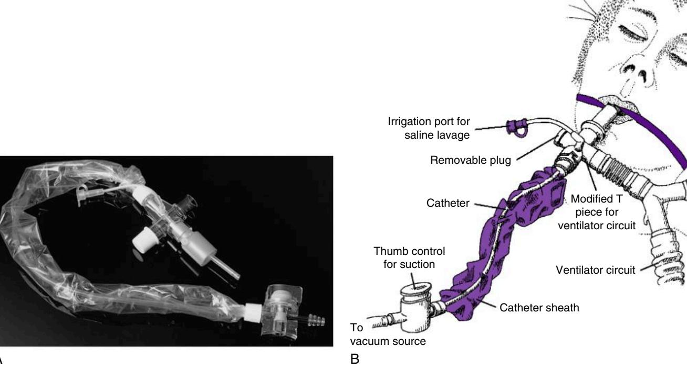

**Fig. 12.4** (A) A closed-system suction catheter. (B) Labeled parts of the self-contained closed-system suction catheter. (Based on the Kimberly Clark Ballard Trach Care Closed Suction System.) (A From Cairo JM, Pilbeam SP: *Mosby's respiratory care equipment*, ed 11, St. Louis, MO, 2022 (Cardinal Health Respiratory Care Products and Services, Dublin, Ohio), Mosby. B From Sills JR: *The comprehensive respiratory therapist examination review: entry and advanced levels*, ed 5, St. Louis, MO, 2010, Mosby.)

### BOX **12.3**

### Indications for Using Closed-Suction Catheter Systems

Unstable patients who are ventilated (e.g., in acute lung injury or acute respiratory distress syndrome) and have high ventilator requirements:

- High PEEP ≥10 cm H2O
  - High  $P_{aw} \ge 20 \text{ cm H}_2O$
  - Long inspiratory time ≥1.5 second
  - High  $F_1O_2 > 0.6$
- Patients who become hemodynamically unstable during suctioning with an open system and ventilator disconnection
- Patients who desaturate significantly (a drop in  $S_pO_2$ ) during suctioning with an open system and ventilator disconnection
- Patients with contagious infections, such as active tuberculosis, in which open suctioning and ventilator disconnect may contaminate health care workers
- Patients on ventilation who require frequent suctioning, for example, more than 6 times a day
- Patients receiving inhaled gas mixtures (such as nitric oxide or heliox therapy) that cannot be interrupted by ventilator disconnection

#### **Aspiration of Subglottic Secretions**

Cuffed ETs have been used for years to protect the patient's airway from aspiration. However, even while aspiration of large volumes of material (gastric regurgitation) is generally avoided with a cuff, silent aspiration does occur.

High-volume low-pressure cuffs represent the majority of ETs used in the acute care setting today. Although the lower cuff pressures used with these ETs reduces the potential for tissue damage, these devices may not prevent silent aspiration of subglottic secretions if the cuff pressure is too low. Silent aspiration of subglottic secretions can increase bacterial colonization of the tracheobronchial tree and result in VAP, which is also referred to as endotracheal tube—associated pneumonia.26 (See Chapter 14 for a discussion of VAP.) Silent aspiration and VAP can occur with cuffed ETs for several reasons:

- Injury to the mucosa during insertion and manipulation of the tube after insertion
- Interference with the normal cough reflex
- Aspiration of contaminated secretions that pool above the ET cuff
- Development of a contaminated biofilm around the ET48

Silent aspiration occurs in the following manner. Large cuffs can develop longitudinal folds when inflated in the trachea. Liquid pharyngeal secretions leak through these folds (silent aspiration) into the lower airway. Increasing the cuff pressure does not completely eliminate this problem, which in turn can lead to VAP.26 (It is worth

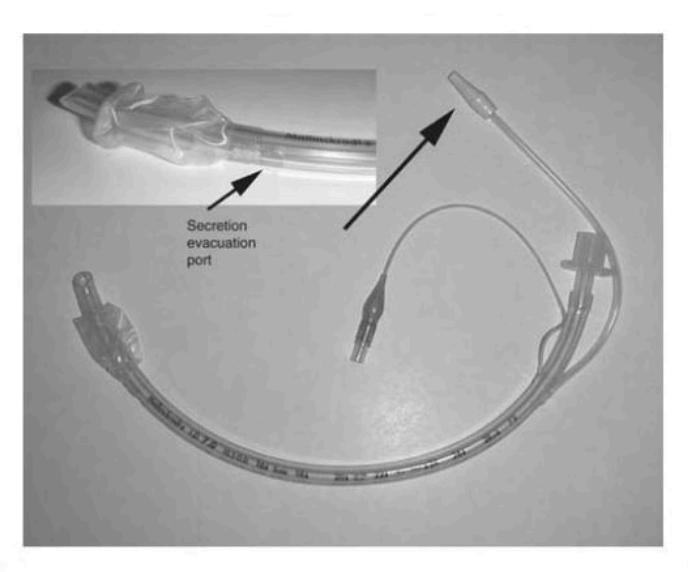

**Fig. 12.5** Hi-Lo Evac endotracheal tube with endotracheal tube connector (*top*), suction port connector, pilot balloon. Note the close-up of the suction lumen above the cuff. (From Cairo JM: *Mosby's respiratory care equipment*, ed 10, St. Louis, MO, 2018, Elsevier.)

mentioning that the incidence of VAP is between 10% and 60%, and it is associated with increased mortality.  $^{49}$ )

Specialized ETs that may reduce the incidence of silent aspiration have been developed (e.g., Hi-Lo Evac ET, Mallinckrodt, Covidien, Boulder, CO; Fig. 12.5). The Hi-Lo Evac ET has a suction port just above the cuff on the dorsal side of the tube to remove secretions above the cuff of the ET and reduce the risk for VAP associated with silent aspiration. The Hi-Lo Evac ET allows for the continuous aspiration of subglottic secretions (CASS). The manufacturer recommends using 20 mm Hg of continuous suction. Other advances in ET tube design that have been shown to reduce the incidence of silent aspiration include specially designed ET cuffs made of polyurethane or silicone. These specially designed ET tubes reduce the formation of longitudinal channels in the cuff, which provide openings for secretions to leak around the cuff and enter the lower airways.

Continuous suction tubes are more expensive than standard ETs and as a consequence are not typically inserted in all patients. However, some hospitals have policies to allow insertion of these tubes in emergency departments and during emergency intubations. For patients who may require an extended period on a ventilator with an ET in place, it may be appropriate to change the standard ET tube for the specialized tube. CASS may be most effective in patients requiring intubation for more than 3 days. Although the tube costs more than a standard ET, cost savings can be gained if the patient's length of stay in the intensive care unit (ICU) is reduced. Furthermore, the Centers for Disease Control and Prevention recommends the use of this device because it has been shown to reduce the incidence of nosocomial pneumonias or VAP. Also-53 One study showed a fivefold greater likelihood of VAP when CASS was not used.

In general, complications associated with CASS are minimal. Use of CASS can result in severe damage to the airway if the inline catheter is placed in a fixed position. In a case reported in the literature, a fatal tracheal—innominate artery fistula occurred as a result of CASS. In this incident, the inline catheter was fixed to a tooth (the left upper molar) and its position was not changed, resulting in erosion of the tissues.54

In addition to silent aspiration, another source of bacterial colonization of the lungs is the presence of a biofilm that forms inside ETs and may serve as a source of bacteria. It is thought that these bacterial colonies can be dislodged from the inner lumen during standard suctioning procedures.26

In addition to CASS, another way of avoiding VAP may include decreasing colonization of bacteria in the stomach by maintaining an acid environment in the stomach and using nonabsorbable antibiotics to reduce the number of growing organisms.

#### **Normal Saline Instillation**

An airway clearance technique used by many ICU clinicians involves the instillation 3 to 5 mL of sterile normal saline or half-normal saline into the airway (saline lavage), followed by hyperoxygenation (with 100%  $O_2$ ) of the patient before suctioning. The intent of saline lavage is to loosen secretions and stimulate the patient to cough.  $^{25,55}$ 

Presently there is insufficient evidence to support the practice of instilling normal saline into the ET before suctioning. In fact, a number of recent studies indicate that this practice actually may be harmful.25 Indeed, saline does not thin secretions, and instilling saline may increase the risk for dislodging bacteria-laden biofilm from the ET, which in turn can lead to the development of nosocomial pneumonia.37,55 Saline instillation may also cause irritation to the airways, resulting in severe coughing episodes and bronchospasm in some patients.

It is also worth noting that less fluid is suctioned compared with the amount instilled into the airway during saline instillation. In addition, saline instillation can increase the volume of secretions in the airways and potentially add to airway obstruction.56 It can also reduce oxygenation and increase a patient's sensation of dyspnea, particularly in older patients (i.e., older than 60 years).57

#### **Assessment After Suctioning**

The amount, color, odor, and physical characteristics of the sputum should be documented on a ventilator flow sheet along with evaluation of the breath sounds after suctioning. It is also important to check for bilateral breath sounds to assess the effects of suctioning and ensure that the ET has not changed position. It is worth mentioning that right mainstem intubation can occur during these types of procedures and might not always be detected with auscultation.58 For this reason, some institutions have a standing order for a chest radiograph to be taken every 24 hours to ensure proper tube placement and check for any pathological changes from the previous film (Box 12.4).59

### BOX 12.4 Routine Chest Radiographs

A study conducted by Krivopal and associates found that monitoring daily chest radiographs (CXRs) was not associated with reduced length of stay in the intensive care unit or the hospital or with a reduction in mortality compared with CXRs taken only when a change in the patient's condition warranted a chest film. New findings on nonroutine CXRs resulted in a significantly greater number of patient interventions. Routine CXRs may not be as important in patient management compared with protocols that recommend the use of a CXR when the patient's condition warrants this evaluation.

BOX **12.5** 

Excerpts From the American Association for Respiratory Care (AARC) Clinical Practice Guidelines for Endotracheal Suctioning of Mechanically Ventilated Adults and Children With Artificial Airways

#### Indications

The need to remove accumulated pulmonary secretions as evidenced by:

- · Patient's inability to generate an effective spontaneous cough
- · Changes in monitored flow-volume graphics
- Deterioration of  ${\rm O}_2$  saturation or arterial blood gas (ABG) values
- Increased peak inspiratory pressure (PIP) with volume ventilation
- A decrease in  $V_{\text{T}}$  with pressure ventilation
- · Visible secretions in the airway
- · Acute respiratory distress
- · Suspected aspiration of gastric or upper airway secretions

#### Contraindications

Most contraindications are relative to the patient's risk for developing adverse reactions or worsening clinical condition as a result of the procedure. When suctioning is indicated, there is no absolute contraindication because abstaining from suctioning to avoid possible adverse reaction may, in fact, be lethal.

#### **Hazards and Complications**

- Decrease in dynamic lung compliance and functional residual capacity
- · Pulmonary atelectasis: reduction of lung volume
- · Hypoxia or hypoxemia
- Hypoxia or hypoxemia: ventilator disconnection and loss of PEEP
- · Tracheal or bronchial mucosal trauma: suction pressures
- Cardiac or respiratory arrest: extreme response to suctioning and ventilator disconnect
- Bronchoconstriction or bronchospasm
- Increased microbial colonization of the patient's lower airways
- Pulmonary hemorrhage or bleeding: trauma to the airways from suctioning
- · Elevated intracranial pressure
- · Cardiac dysrhythmias
- Hypertension
- Hypotension

• Routine use of normal saline instillation before endotracheal tube (ET) suctioning may be associated with excessive coughing, decreased  $O_2$  saturation, bronchospasm, and dislodgment of bacterial biofilm that colonizes the ET into the lower airways.

#### **Assessment of Need**

Qualified personnel should assess the need for endotracheal suctioning as a routine part of a patient-ventilator system assessment.

#### **Assessment of Outcome**

- Improvement in the appearance of ventilator graphics and breath sounds
- Decreased PIP with narrowing of PIP-Pplat; decreased airway resistance or increased dynamic compliance; increased VT delivery during pressure-limited ventilation
- Improvement in ABG values or saturation as reflected by pulse oximetry (SpO2)
- · Removal of pulmonary secretions

#### **Monitoring**

The following should be monitored before, during, and after the procedure:

- · Breath sounds
- O2 saturation (SpO2)
- F1O2
- · Respiratory rate and pattern
- Pulse rate, blood pressure, electrocardiogram (if indicated and available)
- Sputum (color, volume, consistency, odor)
- · Ventilator parameters
- ABGs
- Cough effort
- Intracranial pressure (if indicated and available)

From the AARC Clinical Practice Guideline: endotracheal suctioning of mechanically ventilated patients with artificial airways, *Respir Care* 55:758–764, 2010.

The American Association for Respiratory Care (AARC) has produced an updated Clinical Practice Guideline (CPG) that outlines the procedure for endotracheal suctioning of patients on mechanical ventilation.25 This CPG provides valuable information regarding patient preparation, the suctioning event and follow-up care, indications, contraindications, hazards and complications, limitations, need and outcome assessments, required resources, types of monitoring that should be used during and after the procedure, and infection control precautions (Box 12.5).

### ADMINISTERING AEROSOLS TO VENTILATED PATIENTS

The delivery of therapeutic aerosols during mechanical ventilation has received considerable attention during the past decade. A number of drugs and agents can be administered to mechanically ventilated patients, including bronchodilators, corticosteroids, antibiotics, mucolytics, and surfactants. 61 Bronchodilators are the most frequently used drug administered by aerosol to mechanically ventilated patients.

Fig. 12.6 illustrates a variety of factors that must be considered when delivering aerosols to mechanically ventilated patients.61,62 These factors include the following:

- Type and placement of aerosol-generating device used
- · Ventilator mode and settings
- Severity of the patient's condition
- Nature and type of medication and gas used to deliver it These factors are reviewed in more detail later in this section. Aerosol administration of bronchodilators to mechanically

ventilated patient is indicated for the treatment of bronchoconstriction or increased Raw. The decision to administer a bronchodilator should be based on the patient's history and physical assessment findings. Use of ventilator graphics can support these findings (see Fig. 9.24). Box 12.6 summarizes the AARC CPG for the selection of an aerosol device and administration of a bronchodilator to a ventilated patient.63

#### Ventilator related

- · Mode of ventilation
- Tidal volume
- Respiratory rate
- Duty cycle
- · Inspiratory waveform
- · Breath-triggering mechanism

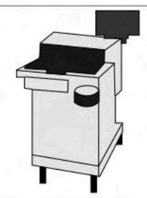

#### Circuit related

- Endotracheal tube
- Inhaled gas humidity
- · Inhaled gas density/viscosity

#### Device related—MDI

- Type of spacer or adapter used
- Position of spacer in circuit
- Timing of MDI actuation

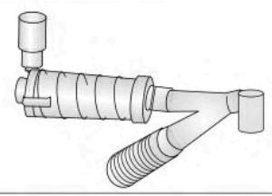

#### Device related—nebulizer

- · Type of nebulizer used
- Continuous/intermittent operation
- Duration of nebulization
- · Position in the circuit

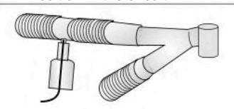

#### **Drug related**

- Dose
- Aerosol particle size
- · Duration of action

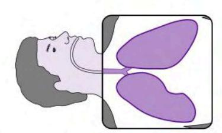

#### Patient related

- Severity of airway obstruction
- Mechanism of airway obstruction
- Presence of dynamic hyperinflation
- Patient–ventilator synchrony

Fig. 12.6 Factors that influence aerosol delivery in mechanically ventilated patients: MDI, Metered-dose inhaler. (Reproduced with permission of the © ERS 2023: European Respiratory Journal 9(3):585-595; https://doi.org/10.1183/09031936.96.09030585, Published 1 March 1996.)

BOX 12.6 Excerpts From the American Association for Respiratory Care (AARC) Clinical Practice Guidelines for Selection of a Device for Administration of a Bronchodilator and Evaluation of the Response to **Therapy in Mechanically Ventilated Patients** 

#### Indication

Aerosol administration of a bronchodilator and evaluation of response are indicated whenever bronchoconstriction or increased airway resistance is documented or suspected in mechanically ventilated patients.

#### **Contraindications**

Some assessment maneuvers may be contraindicated for patients in extremis, for example, a prolonged inspiratory pause for patients with high auto—positive end-expiratory pressure (PEEP). The use of certain medications also may be contraindicated in some patients. The package insert should be consulted for these product-specific contraindications.

#### **Hazards and Complications**

- Specific assessment procedures may have inherent hazards or complications, for example, a prolonged inspiratory or expiratory pause.
- Inappropriate selection or use of a device or technique variable may result in underdosing.
- · Device malfunction may result in reduced drug delivery and may compromise the integrity of the ventilator circuit.
- Complications may arise from specific pharmacological agents. Higher doses of β-agonists delivered by pressurized metereddose inhaler or nebulizer may cause adverse effects secondary to systemic absorption of the drug or propellant. The potential

- for hypokalemia and atrial and ventricular dysrhythmias may exist with high doses in critically ill patients.
- Aerosol medications, propellants, or cold, dry gases that bypass the natural upper respiratory tract may cause bronchospasm or irritation of the airway.
- · The aerosol device or adapter used and the technique of operation may affect ventilator performance characteristics or alter the sensitivity of the alarm systems.
- Addition of gas to the ventilator circuit from a flowmeter or other gas source to power an inline small-volume nebulizer (SVN) may increase volumes, flows, and peak airway pressures, thereby altering the intended pattern of ventilation. The added gas source will also alter O2 delivery. Ventilator setting adjustments and alarm changes made to accommodate the additional gas flow must be reset at the end of the treatment
- Addition of gas from a flowmeter to an inline nebulizer in the ventilator circuit may result in the patient becoming unable to trigger the ventilator during nebulization, leading to hypoventilation.

Modified from AARC Clinical Practice Guideline: Selection of a device for administration of a bronchodilator and evaluation of the response to therapy in mechanically ventilated patients, Respir Care 44:105-113, 1999.

#### **TYPES OF AEROSOL-GENERATING DEVICES**

Two types of devices are used for administering aerosols to mechanically ventilated patients: pressurized metered-dose inhalers (pMDIs) and nebulizers, including small-volume (jet) nebulizers (SVNs), ultrasonic nebulizers (USNs), and vibrating mesh nebulizers (VMNs). Historically, pMDIs and SVNs have been the most commonly used nebulizers but USNs and VMNs are becoming more widely used. The primary advantage of using USNs and VMNs is that these devices produce smaller aerosol particles than pMDIs and SVNs without the addition of gas into the ventilator circuit. 65,66

Early in vitro and in vivo studies reported that drug deposition rates for aerosolized medications during mechanical ventilation ranged from only 1.5% to 3.0% for SVNs and pMDIs. More recent studies demonstrated that the deposition rates for SVNs can be significantly improved (up to 15%) when optimum conditions are used. 65 Deposition rates for pMDIs can range from as low as 2.0% to as high as 98%, depending on the delivery technique and whether a spacer is used.

Both pMDIs and SVNs can produce aerosol particles with a mean mass aerodynamic diameter of 1 to 5  $\mu$ m. Although the physiological response of the patient is similar whether a pMDI or an SVN is used, pMDI doses may need to be adjusted to deliver an adequate amount of medication during mechanical ventilation (i.e., using four or more puffs). This may require doubling the dose that would typically be administered to a spontaneously breathing patient.  $^{62}$ 

#### **Ventilator-Related Factors**

As Fig. 12.6 illustrates, various ventilator-related factors can affect aerosol delivery. Tables 12.2 and 12.3 list various device-related factors that can affect medication delivery to mechanically

### TABLE **12.2**

#### Ventilator-Related Factors That Influence Aerosol Delivery in Mechanically Ventilated Patients

| Ventilator- Related Factor     | Effect on Aerosol Delivery a                                                                                                                            |
|-----------------------------------|--------------------------------------------------------------------------------------------------------------------------------------------------------------------|
| Ventilator mode                   | Spontaneous breaths >500 mL improve aerosol delivery compared with mandatory breaths. VC-CMV is more effective for aerosol delivery compared with PC-CMV.          |
| Tidal volume (V T ) | A set V T that is large enough to include volume of the tubing and ET tube improves aerosol delivery and ensures that dead space is cleared of aerosol. |
| Respiratory rate                  | Lower respiratory rates improve aerosol delivery.                                                                                                                  |
| Duty cycle or T                   | Longer duty cycle (T I /TCT) or longer T I improves delivery.                                                                                |
| Inspiratory waveform           | Square waveform delivers less aerosol than decreasing ramp or sinusoidal waveforms.                                                                                |

&lt;sup>aMetered-dose inhaler medication delivery not influenced by  $T_{\mu}$  flow pattern, lung mechanics, or mode (volume-controlled versus pressure-controlled ventilation).

### TABLE **12.3**

#### Device-Related Factor to Optimize Bronchodilator Delivery During Mechanical Ventilation in Adults

| Device-Related Factors                   | Effect on Aerosol Delivery                                                                                                                                                                                                                                                                                                                                                                                                                                                                                                                                                                                                                                                                                                                                                                                                                                                                                                                                                                                                                                                                                                                                                                                                                                                                                                                                                                                                                                                                                            |
|---------------------------------------------|-----------------------------------------------------------------------------------------------------------------------------------------------------------------------------------------------------------------------------------------------------------------------------------------------------------------------------------------------------------------------------------------------------------------------------------------------------------------------------------------------------------------------------------------------------------------------------------------------------------------------------------------------------------------------------------------------------------------------------------------------------------------------------------------------------------------------------------------------------------------------------------------------------------------------------------------------------------------------------------------------------------------------------------------------------------------------------------------------------------------------------------------------------------------------------------------------------------------------------------------------------------------------------------------------------------------------------------------------------------------------------------------------------------------------------------------------------------------------------------------------------------------------|
| Position of aerosol device in circuit | The location of the aerosol device in the ventilator circuit significantly affects the amount of drug delivery and aerosol deposition.                                                                                                                                                                                                                                                                                                                                                                                                                                                                                                                                                                                                                                                                                                                                                                                                                                                                                                                                                                                                                                                                                                                                                                                                                                                                                                                                                                                |
| Nebulizer- related factors               | Nebulizer type: Vibrating mesh nebulizers, ultrasonic nebulizers, and pMDIs with spacer are more efficient than jet nebulizers.  Intermittent and continuous nebulization: Intermittent nebulization synchronized with expiration is more efficient for aerosol delivery than                                                                                                                                                                                                                                                                                                                                                                                                                                                                                                                                                                                                                                                                                                                                                                                                                                                                                                                                                                                                                                                                                                                                                                                                                                         |
| pMDI-related factors                     | continuous nebulizers. Residual dead volume: The greater the dead volume, the less amount of drug is nebulized. Jet nebulizers do not aerosolize below dead volume of 1—2.5 mL. Vibrating mesh nebulizers have smaller residual volumes than jet or ultrasonic nebulizers. Gas flow: The ultrasonic and vibrating nebulizers are not influenced by gas flow as they are electrically powered. Particle size is minimally affected with heliox. Heliox improves aerosol deposition by creating laminar flow that decreases impaction losses. Operating the jet nebulizer at a lower flow or pressure than the design will increase particle size and reduce delivery. Gas flow is inversely related to nebulization time with the jet nebulizer Synchronized pMDI actuations with inspiration increase aerosol delivery. Spacer: Using a chamber spacer with the pMDI reduces losses in the circuit and increases drug delivery up to sixfold. The efficiency of a bidirectional inline adapter was higher than the efficiency of a unidirectional inline adapter and achieved efficiency marginally less than chamber spacers. Use of chamber spacers with the pMDIs enhances aerosol administration to patients on mechanical ventilation. Bidirectional inline adapters are a better option than unidirectional low-volume inline adapters. Shaking the canister: The drug in the pMDI formulations are separated when standing. Therefore not shaking a pMDI canister reduces total and respirable dose up to 35%. |

pMDI, Pressurized metered-dose inhalers.

Modified from Ari A, Fink JB: Factors affecting bronchodilator delivery in mechanically ventilated adults, *Nurs Crit Care* 15:192–203, 2010.

ET, Endotracheal tube; PC-CMV, pressure-controlled continuous mandatory ventilation; TI, inspiratory time; TCT, total cycle time.

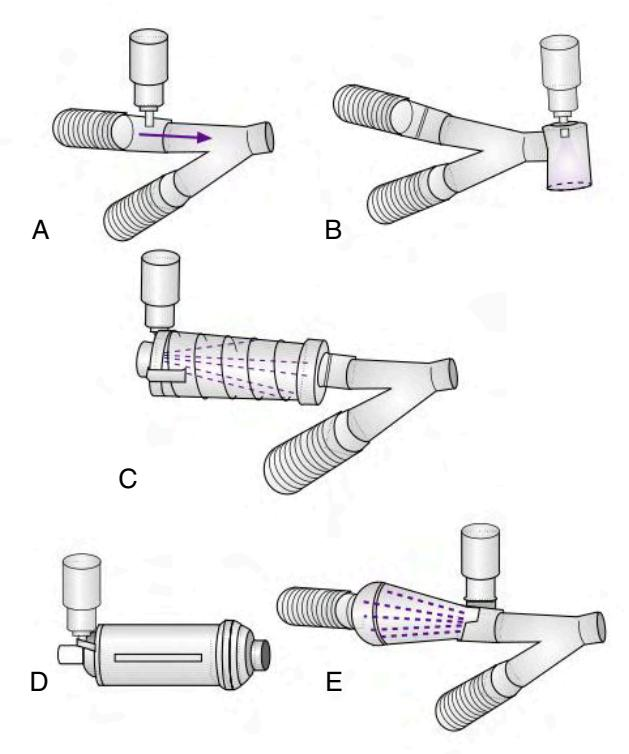

**Fig. 12.7** Devices used to adapt a metered-dose inhaler to a ventilator circuit. (A) Inline device. (B) Elbow device. (C) Collapsible chamber device. (D) Chamber device. (E) Chamber device in which aerosol is directed retrograde into the ventilator circuit. (Reproduced with permission of the © ERS 2023: *European Respiratory Journal* 9(3):585—595; https://doi.org/10.1183/09031936.96.09030585. Published 1 March 1996.)

ventilated adults.  $^{65-67}$  Although ventilator settings cannot always be adjusted for aerosol delivery, it can be helpful whenever possible to use low flow rates, higher  $V_T$ s, and lower respiratory rates during the treatment.

The pMDI can be introduced into a ventilator circuit through an elbow adapter or with unidirectional and bidirectional inline chamber and spacer adapters. Elbow adapters are connected directly to the ET. Inline chambers and spacers are placed in the inspiratory limb of the ventilator circuit, as illustrated in Fig. 12.7. Several studies have demonstrated that inline chambers and bidirectional spacers produce considerably greater aerosol delivery than do elbow adapters and unidirectional spacers. Elbow adapters, by virtue of their design, create a 90-degree connection with the circuit. Other abrupt angles in the ventilator circuit created by the Y-connector and inline suction catheters can provide points of impact and turbulence that interfere with aerosol delivery (Key Point 12.6). Recent studies suggest the best position for a pMDI is approximately 6 inches from the Y-connector. 65,66

**Key Point 12.6** Devices that create abrupt angles between the pMDI and the ET can significantly reduce aerosol delivery to the patient.

#### **Patient-Related Factors**

Patients with large amounts of secretions in the ET or who are experiencing severe bronchospasm present a special challenge for

aerosol delivery. As airflow obstruction increases, the delivery of aerosol decreases. Thus the patient's condition can affect the aerosol delivery pattern. In patients with COPD and increased  $R_{\rm aw}$ , intermittent delivery of nebulized bronchodilators (i.e., during inspiration) may be more effective than continuous delivery. The presence of auto-PEEP (hyperinflation) and patient-ventilator asynchrony can also interfere with aerosol delivery.

#### **Circuit-Related Factors**

It is generally accepted that larger ETs ( $\geq$ size 7) permit greater aerosol deposition. This fact is particularly important to remember during pediatric ventilation because the internal diameter of the airway may be between 3 and 6 mm, which can reduce aerosol deposition because of the small size of the ET.

Heated humidifiers can affect aerosol delivery. Increased humidity increases particle size and is likely to reduce the amount of medication delivered to the patient, regardless of the device. However, bypassing the humidifier during a treatment is generally not advisable. In fact, placement of an SVN between the ventilator outlet and the humidifier may improve aerosol delivery from the device. In addition, some nebulizer treatments take up to minutes, and inhalation of dry gases for this amount of time may cause damage to the airway.

Delivery of aerosolized bronchodilators is also affected by the delivery gas. Although previous studies stated that helium-oxygen mixtures could not be used to deliver aerosols because helium is a "poor vehicle" for aerosol transport, more recent studies have shown that helium-oxygen mixtures may improve aerosol deposition in patients with asthma by reducing airflow turbulence.75

#### Use of Pressurized Metered-Dose Inhaler During Mechanical Ventilation

The pMDIs present fewer technical problems than do the SVNs when used during mechanical ventilation. Furthermore, using a pMDI with a spacer has been shown to be more efficient than using a nebulizer in delivering a bronchodilator to the lower respiratory tract76 (see the section on problems associated with SVNs).

The following procedure is recommended when administering aerosols to mechanically ventilated patients with a pMDI65:

- 1. Review the order, identify the patient, and assess the need for bronchodilator. (Suction airway if needed.)
- 2. Establish the initial medication dose (e.g., four puffs of albuterol).
- 3. Shake the pMDI and warm to hand temperature.
- Place the pMDI in spacer adapter in the inspiratory limb of ventilator circuit.
- 5. Remove the heat-moisture exchanger (HME). (Do not disconnect humidifier if one is in use.)
- 6. Minimize the inspiratory flow during VC-CMV; increase  $T_{\rm I}$  (>0.3 seconds) during PC-CMV.
- 7. Coordinate actuation of pMDI with the precise beginning of inspiration. (Be sure that mandatory breaths are synchronized with a patient's inspiratory effort.  $V_T$  must be large enough to compensate for the ventilator circuit, ET, and  $V_{Danat}$ .)
- 8. If the patient can take a spontaneous breath (>500 mL), coordinate actuation of the pMDI with a spontaneous breath initiation and encourage a 4- to 10-second breath hold. Otherwise, allow passive exhalation.

- 9. Wait at least 20 to 30 seconds between actuations. Administer total dose.
- Monitor for any adverse responses to the administration of medication.
- Assess the patient response to therapy and titrate dose to achieve desired effect.
- 12. Reconnect HME.
- 13. Document clinical outcomes and patient assessment.

### Use of Small-Volume Nebulizers During Mechanical Ventilation

Although pMDIs and SVNs are most often used to deliver bronchodilators and corticosteroids, SVNs are commonly used to deliver mucolytics, antibiotics, prostaglandins, and surfactants.62 Use of an external SVN powered by a separate gas source, such as an O2 flowmeter, is a common method for delivery of aerosolized medications during mechanical ventilation (Key Point 12.7).76,77 Fig. 12.6 and Box 12.7 illustrate various factors that can affect aerosol deposition with SVNs during mechanical ventilation. 66,67,78-80

**Key Point 12.7** When a patient requires a larger dose of a β-agonist, such as a patient with acute severe asthma, a nebulizer (e.g., SVN, USN, VMN) may deliver more medication into the respiratory tract than a pMDI with spacer.

BOX **12.7** 

#### Factors That Affect Aerosol Deposition With Small-Volume Nebulizers (SVN) During Mechanical Ventilation

The performance and rate of aerosol production of SVNs vary by manufacturer and even by production batch.

The volume of liquid (medication + diluent) placed in the SVN before the treatment and the dead volume (amount of medication trapped in the reservoir after the treatment that cannot be nebulized) affect aerosol dose delivery. (Using a 5-mL volume is recommended.)

Position of the SVN in the circuit is important. A better deposition occurs when the SVN is proximal to the humidifier. The system of the system of the system of the treatment, resulting in more aerosol being lost during the expiratory phase. Longer delivery time usually increases aerosol delivery. A flow of 6 to 8 L/min is typically recommended.

The duration of nebulization varies from 3 to 5 minutes for continuous nebulization and from 15 to 20 minutes or longer for intermittent nebulization. Continuous nebulization allows the main inspiratory line of the ventilator circuit to fill with aerosol particles during exhalation, although some studies suggest that nebulization only during inspiration may be more efficient because it eliminates aerosol waste during exhalation phase. (NOTE: Nebulization during inspiration can be accomplished only by a nebulizer control that is built into the ventilator.) Continuous nebulization is recommended in patients with status asthmaticus.

### **Technical Problems Associated With Continuous Nebulization Using an External Gas Source**

Several problems are associated with adding a nebulizer to a patient circuit. Because the external nebulizer is powered by a continuous external gas source, ventilator function is affected. This is particularly true of the microprocessor ventilators that rely on the monitoring of exhaled gas flows and pressures. For example, expiratory monitors will display higher flows and volumes from previous settings because they will detect the added gas flow from the flowmeter powering the SVN. The high volumes may cause activation of volume alarms that were set when mechanical ventilation was initiated.

When the expiratory valve closes to deliver a positive pressure breath, the added flow increases volume and pressure delivery within the circuit and the patient. This added volume and pressure could be quite significant in infants.81

Preset ventilator variables may need to be adjusted during the treatment. In any patient-triggered mode, the patient must inhale (overcome) the flow added to the circuit by the external source to trigger the ventilator. As a result, patients with weak inspiratory efforts may be unable to trigger a machine breath. The apnea alarm will not activate because the expiratory flow monitors detect the flow from the external gas source. Using an external gas source can also alter the  $F_1O_2$  delivery to the patient.

Medications that pass through the expiratory valve and flow measuring devices may "gum up" these devices, thereby changing their functions. An expiratory gas filter can be used to prevent accumulation of aerosolized medications on the expiratory valves and monitors. However, these filters should be used with caution because as drugs accumulate on the filter, they can increase expiratory resistance and contribute to the generation of auto-PEEP. (NOTE: It is also important to recognize that the increased resistance detected may be the result of a "clogged" expiratory filter rather than from an increase in the patient's  $R_{\rm aw}$ .) It may be necessary to change the low-VT alarm settings, the low  $\dot{V}_{\rm E}$  alarm settings, and the sensitivity setting when adding an external nebulizer so that ventilation is guaranteed during treatment. The clinician must remember to change them back after the treatment is completed.

The use of expiratory filters during mechanical ventilation can reduce exposure of the staff to the aerosols emanating through the ventilator's expiratory filter and into the environment. (Risk for exposure to second hand or exhaled aerosol can account for more than 45% of the medication dose administered in addition to droplet nuclei produced by the patient.) Use of ventilators without expiratory filters increases the risk for exposure to aerosol released to the atmosphere from the ventilator, which increases the risk for second-hand exposure for caregivers and families. Without an expiratory filter, aerosol released from the ventilator is more than 160-fold higher than when an expiratory filter is added. 83,84

Inline SVNs can become contaminated with bacteria and increase the risk for nosocomial infection because these contaminated aerosol particles can be delivered directly into the patient's respiratory tract. The CDC recommends cleaning nebulizers before every treatment. Nebulizers should be removed from the circuit after each use, disassembled, rinsed with sterile water (if rinsing is needed), air-dried, and stored aseptically.34

#### **Nebulization Provided by the Ventilator**

Several microprocessor-controlled ventilators are equipped with nebulizer-powering systems. It is important to recognize that these ventilators differ in their ability to power nebulizers. Some ventilators power the nebulizer only during mandatory breaths on inspiration, whereas other ventilators can power the nebulizer only when inspiratory gas flow is greater than a certain value (e.g., >10 L/min gas flow from the ventilator). In some ventilators the duration of nebulizer flow also changes with the inspiratory flow waveform selected. In still others, each breath triggers nebulizer flow, whether mandatory or spontaneous.

Delivery of the aerosol by the ventilator is greater when the pressure powering the nebulizer is 3.5 to 8.5 pounds-per-square-inch gauge (psig). The clinician must be familiar with the ventilator used to know which ventilator modes can be used with a nebulizer and the unit's flow requirements and capabilities. Sophisticated algorithms in the software of current ICU ventilators maintain the  $F_1O_2$  and the  $V_T$  delivery so that these settings are not altered when the ventilator's nebulizer system is activated.

A growing trend is the use of USNs and VMN devices during mechanical ventilation. These devices produce particles in the approximate range of 5 to 10  $\mu m$ . In addition, they do not require a separate gas source because they are electrically powered. Consequently, these devices do not alter volume delivery or  $O_2$  delivery. By comparison, pMDIs, VMNs, and USNs are more efficient than SVNs. For example, mean inhaled percent dose is two to four times greater with a VMN than an SVN. However, note that when bias flow is present, an SVN or VMN positioned proximal to the ventilator (before the humidifier) delivers more aerosol than when placed at the Y-piece.  $^{85}$ 

The Aeroneb Pro and Aeroneb Solo (Aerogen, Inc., Galway, Ireland) use vibrating mesh technology and can be connected to a variety of mechanical ventilators. The aerosol particle characteristics are similar to those of a USN. An example of a ventilator that uses a small-volume USN is the Servo-i ventilator (Fig. 12.8). Undiluted medication can be injected directly through a membrane at the top of the device, so the nebulizer does not have to be opened to accomplish filling. The mass median diameter of particles produced by the nebulizer is  $4.0~\mu m$ . The operator sets the amount of time desired for nebulization on the ventilator, and

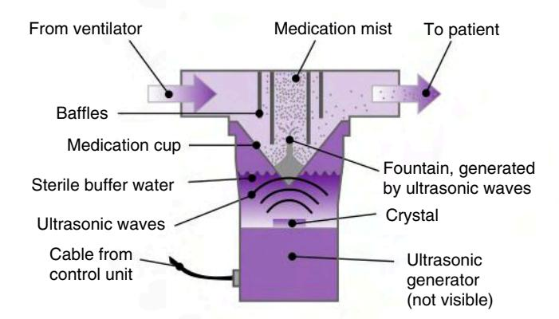

**Fig. 12.8** A small-volume ultrasonic nebulizer designed for use with a mechanical ventilator. A vibrating piezoceramic crystal generates ultrasonic waves that pass through the couplant (sterile buffer water) and the medication cup to produce a standing wave of medication, which produces aerosol particles. (Courtesy Aerogen, Inc, Galway, Ireland; <a href="http://www.aerogen.com">http://www.aerogen.com</a>.)

### BOX **12.8**

## Protocol for the Administration of Medications With Nebulizers During Mechanical Ventilation

The following procedure is recommended when administering aerosols to patients on mechanical ventilation with a small-volume nebulizer (SVN), ultrasonic nebulizer (USN), or vibrating mesh nebulizer (VMN):

- 1. Review the order, identify the patient, and assess the need for bronchodilator. (Suction airway if needed.)
- Establish the dose required to compensate for decreased delivery (possibly 2-5 times the normal dose for a spontaneous patient when using an SVN).
- 3. Place the prescribed amount of drug in the nebulizer and add diluent to an optimum fill volume.
- 4. Place the SVN proximal to the humidifier and the USN and VMN in the inspiratory line about 15 cm (6 in.). from the Yconnector. Check to ensure the circuit has no leaks.
- 5. If possible, turn off bias flow or flow trigger that produces a continuous flow through the circuit during exhalation while nebulization is proceeding.
- 6. Remove the heat—moisture exchanger (HME) from the
- 7. Turn on the USN or VMN, or set the gas flow to SVN at 6 to 8 L/min. (NOTE: Use the ventilator nebulizer system if it meets the SVN flow needs and cycles on inspiration; otherwise, use continuous flow from an external source.)
- 8. When possible, adjust the ventilator for optimum medication delivery (high  $V_T$  range, low f range, low flow range, long inspiratory time ( $T_L > 0.3$  s), while maintaining appropriate  $\dot{V}_E$ . (NOTE: Added flow from an external source will increase volume and pressure delivery.)
- 9. In the case of the SVN, adjust the low  $V_T$  and low  $\dot{V}_E$  alarm, upper pressure limit, and sensitivity to compensate for added flow. With USN and VMN, no changes are required because they do not alter volume, flow, pressure, or  $O_2$  delivery.
- Check for adequate aerosol generation and manually tap nebulizer periodically during treatment until all medication is nebulized.
- Monitor for any adverse response to administration of medication.
- 12. Remove SVN from the circuit, rinse with sterile water, airdry, and store in safe place. USN and VMN might not require removal or rinsing. The manufacturer's recommendations should be followed with these two devices.
- 13. Replace the HME into the circuit.
- Return ventilator settings to pretreatment values, if changed.
- Return low VT, low V

  E, upper pressure limit alarms, and sensitivity setting to original appropriate settings, if changed.
- 16. Evaluate and assess outcome and document findings.

nebulization is administered continuously. Other small-volume USNs are also available for mechanical ventilators. See Box 12.8 for protocol for using nebulizers for drug administration.

### Use of Nebulizers During Noninvasive Positive Pressure Ventilation

Several points should be mentioned regarding nebulization of medications during noninvasive positive pressure ventilation (NIV). Preliminary studies suggest that both pMDI and SVN can be used to deliver bronchodilators during NIV. For the pMDI and SVN, the greatest aerosol deposition occurs when the nebulizer is placed close to the patient (between the leak port and the face mask), the inspiratory pressure is high (20 cm H2O), and the expiratory pressure is low (5 cm H2O). Additional studies will be required to determine the optimum settings to be used with the USN and VMN during NIV.

#### **Patient Response to Bronchodilator Therapy**

Monitoring patient response to bronchodilators can be done by measuring lung mechanics (e.g., compliance, resistance, ventilating pressures), listening to breath sounds, evaluating vital signs and  $S_pO_2$ , and monitoring pressure-time curves, flow-volume loops, and pressure-volume loops. The following suggest an improvement after therapy:

- Reduced peak inspiratory pressure (PIP)
- Reduced transairway pressure (PTA)\*
- Increase in peak expiratory flow rate (PEFR)
- Reduction in auto-PEEP levels (if present before beginning treatment)

Fig. 12.9 shows before and after flow-volume loops illustrating how both inspiratory and expiratory flow and volume delivery improve after bronchodilator therapy (Case Study 12.3). 86,87

### POSTURAL DRAINAGE AND CHEST PERCUSSION

Although suctioning remains the primary method of secretion clearance for patients with ETs in place, secretions in peripheral bronchi cannot be reached with this procedure. Postural drainage and chest percussions are other techniques that can be used to help clear airway secretions and improve the distribution of ventilation. In patients on ventilation, postural drainage involves placing the patient in a number of prescribed positions to drain the affected lung segment. Note that identifying the affected lung segments can be accomplished by analyzing chest radiographs and auscultation of the chest. This procedure is commonly accompanied by percussion of the chest wall using manual techniques or pneumatic percussors.

A study by Takahashi and associates88 recommended the following positions for patients on ventilation based on their findings:

- Supine
- 45-degree rotation prone with left side up
- · 45-degree rotation prone with right side up
- Return to supine
- Additional patient positions thought to be helpful include 10 degrees right-side-up supine and 45 degrees rotation prone with head raised 45 degrees

Positioning, particularly toward the prone position, is difficult in patients on mechanical ventilation and typically requires two or more clinicians to accomplish. Extreme care must be used when moving patients to avoid accidental extubation or loss, stretching, or kinking of catheters. Patient comfort and safety should always be a primary concern when working with critically ill patients. Because of the potential difficulties that can occur during postural drainage and chest percussions in patients with reduced

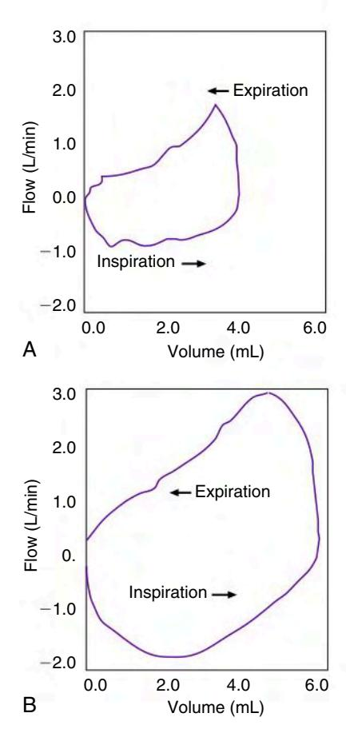

**Fig. 12.9** These tidal flow—volume loops are based on mechanical breaths from an infant with a dramatic response to bronchodilator therapy during ventilation. (A) Before bronchodilator. (B) Twenty minutes after bronchodilator. Notice the increase in tidal volume and peak flows after bronchodilator administration. (From Holt WJ, Greenspan JS, Antunes MJ, et al.: Pulmonary response to an inhaled bronchodilator in chronically ventilated preterm infants with suspected airway reactivity, *Respir Care* 40:145—151, 1995.)

#### Case Study 12.3

#### **Evaluation of Bronchodilator Therapy**

After the administration of 2.5 mg of albuterol by SVN, the respiratory therapist evaluates preparameters and post-parameters and notes the following:

- Pretreatment: PIP = 28 cm  $H_2O$ ,  $P_{plat}$  = 13 cm  $H_2O$ ,  $P_{TA}$  = 15 cm  $H_2O$
- PEFR = 35 L/min (measured from flow-volume loop)
- Post-treatment: PIP = 22 cm  $H_2O$ ,  $P_{plat}$  = 15 cm  $H_2O$ ,  $P_{TA}$  = 7 cm  $H_2O$
- PEFR = 72 L/min
- Did the treatment reduce the patient's airway resistance?

cardiopulmonary reserve or ICP, other methods, such as use of an oscillating vest (Fig. 12.10), may provide alternative methods for secretion clearance. With the Vest Airway Clearance System (Hill-Rom, St. Paul, MN), chest wall vibrations are delivered to a vest

 $^{\dagger}P_{TA} = PIP - P_{plat}$ 

Fig. 12.10 The Vest Airway Clearance System. (Manufacturer Advanced Respiratory, St. Paul, Minn.)

positioned around the patient's thorax. Vibrations are produced when pressure pulses generated by an air compressor are delivered through tubing to the vest. The pressure settings and frequency of oscillation are adjustable.

Although all the techniques discussed appear to be effective, additional studies are needed to compare the effectiveness of the various airway clearance methods in mechanically ventilated patients and better define potential complications associated with their use.

#### **FLEXIBLE FIBEROPTIC BRONCHOSCOPY**

Bronchoscopy is an invasive procedure used to visualize the upper and lower respiratory tract. It has become an important procedure for the diagnosis and treatment of various types of respiratory disorders, including inflammatory, infectious, and malignant diseases. It can be accomplished using either a flexible fiberoptic or rigid bronchoscope. The flexible fiberoptic bronchoscope consists of a long, flexible tube that contains three separate channels (Fig. 12.11), which are described as follows:

- A light-transmitting channel contains optical fibers that conduct light into the airway.
- A visualizing channel uses optical fibers to conduct an image of the airway to an eyepiece.
- An open multipurpose channel that can be used for aspiration, tissue sampling, or O2 administration.

Bronchoscopy can be used to inspect the airways, remove objects from the airway, obtain biopsies of tissue and secretion samples, and clear secretions from the airway. Box 12.9 lists the indications and contraindications for fiberoptic bronchoscopy. Newer fiberoptic bronchoscopes like the endobronchial ultrasound (EBUS-TBNA: Olympus, Center Valley, PA) allow the use of ultrasound technology to locate specific structures in the lungs and airways, such as lymph nodes, blood vessels, and abnormal structures (e.g., tumors). EBUS-TBNA allows sampling of lymph nodules with real-time view, potentially making lung biopsy less invasive and safer than conventional blind biopsy.

Another fiberoptic bronchoscope, the Electromagnetic Navigation Bronchoscope (superDimension, Inc., i-Logic System, Minneapolis, MN) incorporates a computed tomographic image that is reconfigured into a three-dimensional image. The image maps a navigational pathway through the airways to help locate lesions in lung tissue and mediastinal lymph nodes. The scope can navigate to the outer periphery of the lungs to perform a biopsy of suspicious findings in the lung fields.

Before beginning a bronchoscopy, the respiratory therapist should explain the procedure to the patient, gather the equipment and medications that will be needed, and administer preprocedure medications. An intravenous (IV) line is typically placed for the procedure to administer IV drugs for conscious sedation.

Atropine is sometimes administered 1 to 2 hours before the procedure to reduce secretion production and help dry the patient's airway so that it is easier to visualize. Atropine also blocks the vagal response (e.g., bradycardia and hypotension) that can occur when the bronchoscope enters the upper airway. Conscious sedation typically involves the use of agents such as:

 Opioid analgesics: Fentanyl citrate (Sublimaze), meperidine hydrochloride (Demerol), and hydromorphone hydrochloride (morphine)

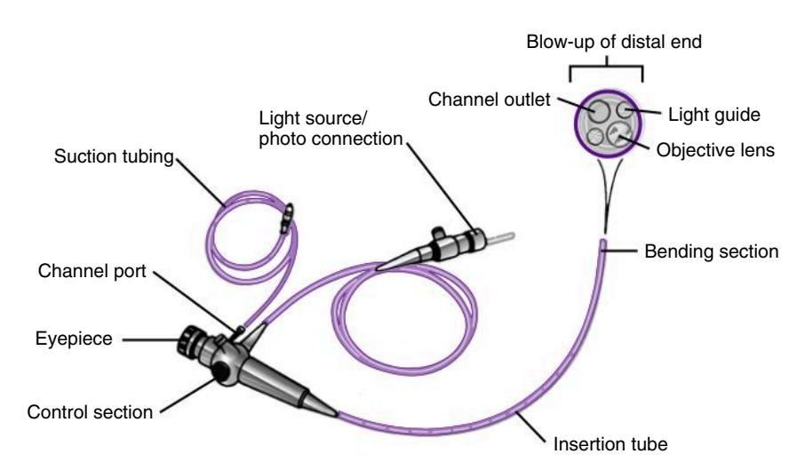

**Fig. 12.11** Flexible fiberoptic bronchoscope. (See text for additional information.) (From Wilkins RL, Stoller JK, Kacmarek RM, editors: *Egan's fundamentals of respiratory care*, ed 9, St. Louis, MO, 2009, Mosby.)

### BOX **12.9**

#### **Excerpts From the AARC Clinical Practice Guidelines for Bronchoscopy Assisting**

#### **Indications**

- The presence of lesions of unknown cause on the chest radiograph or the need to evaluate persistent atelectasis or pulmonary infiltrates
- The need to assess upper airway patency or mechanical properties of the upper airways
- Suspicious or positive sputum cytology results
- The suspicion that secretions or mucus plugs are causing atelectasis

#### The need to:

- Obtain lower respiratory tract secretions, cell washings, or biopsy samples for evaluation
- Investigate hemoptysis, unexplained cough, wheeze, or stridor
- Evaluate endotracheal or tracheostomy tube problems
- Assist in performing difficult intubations
- Determine the location/extent of inhalation or aspiration injuries
- · Remove abnormal tissue or foreign material
- · Retrieve a foreign body
- Therapeutically manage ventilator-associated pneumonia
- · Achieve selective intubation of a mainstem bronchus
- · Place and/or assess airway stent function
- Perform airway balloon dilation in the treatment of tracheobronchial stenosis

#### **Contraindications**

#### **Absolute Contraindications**

- Absence of patient informed consent, unless a medical emergency exists and the patient is not competent
- Absence of an experienced bronchoscopist to perform or supervise the procedure
- Lack of adequate facilities and personnel to care for emergencies, such as cardiopulmonary arrest, pneumothorax, or bleeding
- Inability to adequately oxygenate the patient during the procedure

### Perform Only If Benefit Outweighs Risk in Patients With the Following Disorders

- · Coagulopathy or bleeding diathesis that cannot be corrected
- Severe obstructive airways disease
- · Refractory hypoxemia
- · Unstable hemodynamic status including arrhythmias

#### Relative Contraindications (Recognize Increased Risk)

- Lack of patient cooperation
- · Recent myocardial infarction/unstable angina
- · Partial tracheal obstruction
- · Moderate to severe hypoxemia or any degree of hypercarbia
- · Uremia and pulmonary hypertension
- · Lung abscess
- · Obstruction of the superior vena cava
- Debility, advanced age, and/or malnutrition
- Disorders requiring laser therapy, biopsy of lesions obstructing large airways, or multiple transbronchial lung biopsies
- Known or suspected pregnancy (safety concerns of possible radiation exposure)

#### **Hazards and Complications**

- Adverse reaction to medications used before and during the bronchoscopic procedure
- Hypoxemia
- Hypercarbia
- Bronchospasm
- Hypotension

- Laryngospasm, bradycardia, or other vagally mediated phenomena
- · Epistaxis, pneumonia, and hemoptysis
- · Increased airway resistance
- Infection hazard for health care workers or other patients
- · Cross contamination of specimens or bronchoscopes
- Nausea and vomiting
- · Fever and chills
- · Cardiac dysrhythmias
- Death

#### Resources

#### Equipment

- · Rigid or flexible fiberoptic bronchoscope
- Bronchoscopic light source and any related video or photographic equipment, if needed
- Specimen collection devices
- Syringes for medication delivery, normal saline lavage, and needle aspiration
- · Bite block
- Laryngoscope
- · Endotracheal tubes in various sizes
- · Thoracotomy tray
- Adaptor with ability to connect mechanical ventilator and bronchoscope simultaneously
- Sterile gauze
- · Water-soluble lubricant and lubricating jelly
- · Laboratory requisition documentation

#### **Monitoring Devices**

- Pulse oximeter
- · Electrocardiogram monitor
- · Sphygmomanometer and stethoscope
- Whole-body radiation badge for personnel if fluoroscopy is used
- Capnograph

#### **Procedure Room Equipment**

- O2 and related delivery devices
- Resuscitation equipment
- · Medical vacuum system
- Fluoroscopy equipment, including personal protection devices, if warranted
- Adequate ventilation and other measures to prevent transmission of tuberculosis
- · Decontamination area equipment
- Medications, including topical anesthetics, anticholinergic agents, sedatives, vasoconstrictor, nasal decongestants, and emergency and resuscitation drugs

#### Monitoring

Patient monitoring should be performed before, at regular intervals during, and after bronchoscopy until the patient meets appropriate discharge criteria. The level of monitoring required will be influenced by the level of sedation used during the procedure.

#### Infection Control

- Standard precautions should be used unless disease-specific precautions are required
- Centers for Disease Control and Prevention Guideline for Handwashing and Hospital Environmental Control, Section 2: Cleaning, Disinfecting, and Sterilizing Patient Care Equipment
- · Hepatitis B vaccination for personnel

Modified from American Association for Respiratory Care Clinical Practice Guideline: bronchoscopy assisting, *Respir Care* 52:74–80, 2007

Benzodiazepines: Midazolam hydrochloride (Versed) or diazepam (Valium)

Narcotics depress the laryngeal cough reflex and alter the respiratory pattern to a slower and deeper pattern. Naloxone hydrochloride (Narcan) or flumazenil (Romazicon) should be available if reversal of the sedation is required. In ventilated patients some analgesics and sedatives may already be in use. Therefore obtaining a list of medications the patient is currently receiving is important.

Other useful information to obtain before the procedure includes thoracic imaging reports and laboratory data, particularly clotting factors. A discussion concerning performing the procedure on a spontaneously breathing patient is reviewed elsewhere and is beyond the scope of this text.90

Topical anesthesia to the upper airway, which is normally administered to spontaneous nonintubated patients, is usually not required when fiberoptic bronchoscopy is performed on intubated patients. A solution of 2% lidocaine is sometimes instilled into the ET to help reduce coughing when the bronchoscope is introduced.

Performing fiberoptic bronchoscopy generally requires three team members, including a physician, a respiratory therapist or pulmonary function technologist, and an individual trained in conscious sedation (nurse or respiratory therapist). The nurse typically manages drug administration and keeps records of the drugs used, O2 saturation, and vital signs. The physician performs the bronchoscopy, and the respiratory therapist or pulmonary function technologist assists the physician by passing different instruments used for biopsy and specimen collection or suctioning the airway. The therapist is also responsible for monitoring the patient and ventilator.

In patients with artificial airways, choosing the appropriately sized fiberoptic bronchoscope is critical. Once the scope is inserted into the ET, it may occupy 50% or more of the radius of the ET. To help compensate for the tube obstruction, the  $F_IO_2$  is increased to 1.0 during the procedure. To insert the scope, a special adapter like the one shown in Fig. 12.12 is placed between the Y-connector and the patient's ET connector. Once the scope is introduced, the decrease of the ET diameter causes the PIP to increase (during VC-CMV) and the delivered  $V_T$  to decrease as some leaking around

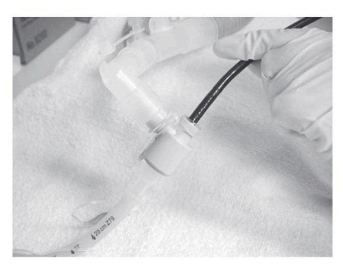

**Fig. 12.12** Photograph of an adapter used during fiberoptic bronchoscopy for patients on invasive mechanical ventilation. The adapter is placed between the Y-connector and the endotracheal tube.

the scope occurs. Auto-PEEP may occur as well. The respiratory therapist will typically have to adjust the ventilator, silence alarms, and monitor  $S_pO_2$  and exhaled  $V_T$  during the procedure. 91

## ADDITIONAL PATIENT MANAGEMENT TECHNIQUES AND THERAPIES IN VENTILATED PATIENTS

#### **Sputum and Upper Airway Infections**

Patients on mechanical ventilation with artificial airways in place are at high risk for upper airway infections and VAP. Some of the causative agents for VAP are discussed in Chapter 14.

An elevated patient temperature with an increased white blood cell count (>10,000 cm³) may be evidence of an infection. A sputum specimen should be collected and examined for color, quantity, and consistency and then sent to a laboratory for a culture and sensitivity and wet sputum analyses. Table 12.4 lists sputum color and characteristics that are associated with certain patient problems. Isolating and culturing an organism from the sputum or blood of an infected patient can indicate the causative microbe.

The evaluation of sputum can be correlated with other clinical data such as physical findings and radiographic reports to show a complete picture of a patient's condition in relation to a pulmonary infection. Physical findings might include the presence of crackles, dullness to percussion on physical examination, and purulent sputum. The chest radiograph of an infected patient will typically show evidence of a new or progressive infiltrate, consolidation, cavitation, or pleural effusion, any of which may be consistent with the presence of pneumonia. 92,93

### TABLE **12.4**

### Sputum Color and Possible Associated Problems

| Piobleilis                |                                                                                                                                                                             |
|---------------------------|-----------------------------------------------------------------------------------------------------------------------------------------------------------------------------|
| Sputum Color              | Potential Problem                                                                                                                                                           |
| Yellow                    | Suggests the presence of pus (white blood cells) and possible infection                                                                                                     |
| Green, thick              | Suggests that sputum has been in the airway for a while because the break- down of mucopolysaccha- rides (a component of sputum) results in a green color |
| Green, foul-smelling      | Occurs with <i>Pseudomonas</i> infection                                                                                                                                    |
| Pink-tinged               | May indicate fresh blood or can occur after treatment with aerosolized epinephrine, isoproterenol, racemic epinephrine, or isoetharine                                      |
| Fresh blood present       | Suggests airway trauma, pneumonia, pulmonary infarction, or emboli                                                                                                    |
| Brown                     | Usually indicates old blood                                                                                                                                                 |
| Rust                      | Might indicate a <i>Klebsiella</i> infection                                                                                                                                |
| Pink, copious, and frothy | Indicates pulmonary edema                                                                                                                                                   |

#### **FLUID BALANCE**

Positive pressure ventilation can affect fluid balance and urine output, so it is important to monitor fluid input and output. This can be done by comparing daily fluid intake with output (i.e., urine output) and measuring body weight daily. This information can be used to alert the medical staff of significant changes in a patient's fluid balance.

Normal urine production is about 50 to 60 mL/h (approximately 1 mL/kg/h). Oliguria is a urine output of less than 400 mL/day or less than 20 mL/h. Polyuria is a urine output of more than 2400 mL/day or 100 mL/h.  $^{94}$ 

Decreases in urine output during mechanical ventilation can be caused by any of the following:

- · Decreased fluid intake and low plasma volume
- Decreased cardiac output resulting from decreased venous return, increased levels of plasma antidiuretic hormone (ADH), heart failure, or relative hypovolemia (dehydration, shock, hemorrhage)
- · Decreased renal perfusion
- · Renal malfunction
- Postrenal problems such as obstruction or extravasation of urinary flow from the urethra, bladder, ureters, or pelvis
- A blocked Foley catheter (one of the most common causes of sudden drops in urine flow, which can be quickly reversed by irrigating the catheter)

Laboratory evaluation of acute renal failure includes tests of blood urea nitrogen (BUN), serum creatinine, ratio of BUN to serum creatinine, serum and urine electrolytes, urine creatinine, and glomerular filtration rate. An increase in body weight that is not associated with increased food intake is typically caused by fluid retention. When urine production is reduced and body weight is increased, the cause must be identified and corrected.

Changes in fluid balance may also affect blood cell counts. Fluid retention (overhydration) causes a dilution effect (hemodilution), leading to reduced hemoglobin, hematocrit, and cell counts. Dehydration can cause hemoconcentration and falsely high readings of these same variables.

For a patient receiving positive pressure ventilation, high mean airway pressures ( $P_{aw}$ ) can lead to decreased cardiac output and increased plasma ADH. When this occurs, attempts to decrease  $P_{aw}$  should be made. Pulmonary artery pressure (PAP) monitoring is valuable in this situation. If cardiac output increases when  $P_{aw}$  is decreased, alterations in fluid balance may be the result of positive pressure ventilation.

Relative hypovolemia can be caused by dehydration, shock, or hemorrhage. Clinically it causes low vascular pressures (low PAP, low central venous pressure [CVP], and low pulmonary artery occlusion pressure [PAOP]). (See Chapter 11 for additional information on hemodynamic monitoring.) Dehydration commonly results from inadequate fluid intake, vomiting, or diarrhea. It can also be caused by fluid shifting from the plasma to the interstitial space.

Dehydration or relative hypovolemia is evaluated by giving fluid challenges until adequate BP values are restored. Shock is usually treated with fluid administration and appropriate medications, such as dopamine, phenylephrine, norepinephrine, or metaraminol, any of which may help increase BP (Case Study 12.4).

If cardiac output and urine output are decreased and PAOP is increased, failure of the left side of the heart should be suspected. Chronic failure of the left side of the heart also increases PAP and

#### Case Study 12.4

#### **Evaluating Fluid Status**

A patient receiving mechanical ventilatory support has elevated red and white blood cell counts. Skin turgor is decreased; urine output has been averaging 40 mL/h; and blood pressure has been lower than the patient's normal value. What is the most likely problem and what would you recommend?

CVP and is treated with drugs such as digitalis (to increase contractility and cardiac output) and morphine (to decrease venous return to the heart), diuretics (to unload excess fluids through the kidneys), and  $O_2$  (to improve myocardial oxygenation). Sodium nitroprusside can be used to dilate both arterial and venous vessels, which reduces preload (venous return and end-diastolic volume) and afterload (peripheral vascular resistance). However, the use of this agent must be monitored carefully because of its effects on vascular pressures (i.e., PAOP, PAP, and BP).

Renal failure or malfunction is another common cause of decreased urine production in critically ill patients. Severe hypoxemia, sepsis, and other clinical problems can lead to renal malfunction. The urine is checked for the presence of blood cells and elevated protein or glucose levels, as well as for its specific gravity, color, and amount. The presence of abnormal substances in the urine and abnormal BUN levels are indicative of renal malfunction.

Excessive fluid intake can also result from iatrogenic causes. An IV line may malfunction and cause fluids to be administered too rapidly. Another factor often overlooked regarding fluid intake and output in patients receiving mechanical ventilation is to account for the water associated with high humidity from heated humidifiers. This additional fluid may represent a considerable portion of a patient's fluid intake, particularly in neonates and infants.

#### **PSYCHOLOGICAL AND SLEEP STATUS**

As patients regain consciousness while on ventilatory support, it is important to show encouragement and explain to them why the ventilator and ET are being used. It is also important to demonstrate to the patient how to communicate his or her needs. Patients should have confidence in the personnel who care for them. Whenever an alarm sounds, the clinician should check the patient first and then check the equipment. It can be comforting to a patient to have the clinician explain that all is well and that he or she need not be concerned about the alarm.

Critically ill patients typically demonstrate a certain level of sleep disturbance secondary to factors such as pain, medications, staff interruptions, noise, and light. The level of sleep disturbance or sleep fragmentation in patients on mechanical ventilation is similar to that seen in patients with obstructive sleep apnea who have impaired cognitive function and excessive daytime sleepiness. 95

Relatively little information is available about the relation between patient—ventilator interaction and sleep. In one study, the

ventilator mode was noted to alter sleep function in some patients. PSV used during sleep was thought to induce frequent periods of apnea (central apnea) compared with VC-CMV, which has a set minimum rate. These apneic periods were attributed to longer  $T_{\rm I}$ , deeper  $V_{\rm T}$ , and the subsequent transient lowering of  $P_{\rm a}CO_2$  values (hypocapnia). In this study, the decreased  $P_{\rm a}CO_2$  reduced the drive to breathe and the patient then experienced sleep apnea and sleep disturbance. During the apneic periods, the  $P_{\rm a}CO_2$  rose to 7 mm Hg above wakeful state  $P_{\rm a}CO_2$ . The apneic periods were also associated with frequent patient arousals from sleep. Repeated arousals can elevate catecholamine levels and BP and contribute to cardiac arrhythmias and cardiac failure. Practitioners are cautioned against misinterpreting the periods of hypercapnia during sleep in patients receiving ventilation with PSV.

Patients in the ICU who are deprived of sleep and given a variety of drugs can have many psychological problems. It is not unusual for them to become combative, restless, anxious, depressed, frustrated, and angry and even experience hallucinations. Fortunately, many patients cannot later recall the time they spent in the ICU. The staff must understand that patients may respond in unusual or atypical ways; it is important to explain this to family members. Whenever possible, allow patients to rest and sleep undisturbed and give them as much privacy as possible, a concept that is often not practiced in many ICUs.

Members of the health care team should be respectful, kind, and reassuring and keep a positive attitude at all times around the patients for whom they are caring. They should abide by patient confidentiality requirements and protect patients' private information. Being emotionally supportive of patients is vitally important. Addressing patients' psychological needs can be as important as ensuring that their physical needs are met.

#### **PATIENT SAFETY AND COMFORT**

Practitioners should always keep in mind the primary reasons for initiating ventilatory support. Patients receiving short-term mechanical ventilation include postoperative patients and those with an uncomplicated drug overdose. Patients who may require longer periods of mechanical ventilation (e.g., several days to 1–2 weeks) include posttrauma victims and patients with asthma, COPD, pulmonary edema, aspiration, and ARDS. Patients who may require 2 or more weeks of ventilator support typically include those with severe COPD, neuromuscular disorders such as myasthenia gravis, Guillain-Barré, tetanus, botulism, cerebrovascular accidents, and cranial tumors and those being treated for neurosurgical problems.

#### **Patient Safety**

To be ready for emergency situations, clinicians should always make sure that a manual resuscitator with mask, an  $O_2$  source, intubation equipment, an emergency tracheostomy kit, a thoracentesis tray, suction equipment, an emergency cart stocked with the appropriate emergency medication, and an ABG kit are accessible. Emergency equipment that is readily accessible can provide immediate patient care and protect patient safety.

Staff should rely on keen observation and early detection of problems in both patients and mechanical equipment to ensure patient safety and comfort. The patient-ventilator system should be monitored at regular intervals. It is important to try to anticipate problems and trust the assessments made with your senses

because the information obtained from monitors may not accurately reflect a patient's true condition or level of comfort.

#### **Patient Comfort**

A patient receiving ventilatory support may experience physical discomfort caused by pain from trauma or disease, an awkward body position, distended organs, inadequate ventilation, heavy tubing, restraints, limb boards, the inability to talk or swallow, coughing or yawning, poor oral hygiene, and overcooling or overheating because of environmental conditions. Every effort must be made to keep patients as comfortable as possible.

Feelings of confusion and delirium often occur in patients in the ICU.3 Imagine the sense of vulnerability and isolation that patients on mechanical ventilation feel while in the ICU. They cannot talk, they are not surrounded by familiar family faces, and they are not sure when someone will return to their bedside or what health care providers will do when they return.

A major problem in many ICUs is the lack of effective methods of communicating with patients. Physicians and other caregivers are often in a hurry to move on to other tasks.3 If it becomes difficult to communicate with a patient who has a tube in his or her mouth, all too often the caregiver gives up in frustration and leaves the patient no better off emotionally than when the caregiver first walked into the room.

Patients may also suffer from shortness of breath or dyspnea. Restoring ABGs to normal and alleviating patient-ventilator asynchrony may not alleviate dyspnea. Some speculate that using a low  $V_T$  for ventilation is associated with discomfort. It may be fair to assume that any volume that is different from what the patient desires produces discomfort and shortness of breath. As an example, patients with muscular diseases seem to desire a large  $V_T$  that often results in low  $P_a CO_2$  levels.

In a study involving reducing sedation in patients on mechanical ventilation in the ICU, researchers found that patients in the group who received continuous infusion of sedation remained awake for 9% of the time, whereas the group that had the sedation discontinued daily spent 85% of their time awake. The decision to use sedatives in mechanically ventilated patients should be based on the patient's psychological and physiological condition. In many cases, the suggestion might be that it is better to be awake most of the time.

Another comment that is often made by clinicians is, "Patients who recover from respiratory failure should be thankful just to be alive. Most have little or no memory of their experience during mechanical ventilation anyway." Several points can be made related to this comment:

- Most of us would not want to experience severe, sustained, and avoidable distress whether we remember it or not.
- Use of sedatives and analgesics needed to produce placidity and amnesia may be excessive and prolong the duration of ventilation and time in the ICU.97
- Long-term amnesia may not be as complete or protective as some believe. A high prevalence of anxiety disorders, depression, and posttraumatic stress disorder exists in survivors of ARDS.97
- Because of a significant lack of research in this area, little is known about the discomfort experienced by patients on ventilation.3 What do patients receiving mechanical ventilation mean when they report shortness of breath?
- How often does dyspnea occur, and how severe is it under different circumstances of mechanical ventilation?

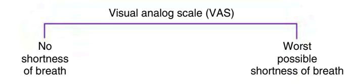

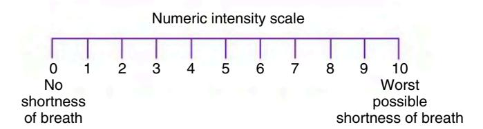

**Fig. 12.13** Visual analog and numeric intensity scales. (From Hansen-Flaschen JH: Dyspnea in the ventilated patient: a call for patient-centered mechanical ventilation, *Respir Care* 45:1460—1464, 2000.)

- Can we adjust the ventilator to minimize patient dyspnea and reduce the need for sedation and analgesia?
- Can the incidence or severity of posttraumatic stress disorder be reduced in survivors by minimizing respiratory distress during ventilation?

It has been suggested that a patient's level of dyspnea during mechanical ventilation can be gauged using a visual analog or numeric intensity scale (Fig. 12.13). Section A similar scale, the modified Borg scale, is widely used to measure dyspnea during exercise testing. Dyspnea scores do not correlate with physiological variables. It is important to recognize that clinicians cannot always assume a patient is comfortable just because the laboratory results look good. Dyspnea must be measured more objectively using tools such as those mentioned.

#### **Patient-Centered Mechanical Ventilation**

Patient-centered mechanical ventilation should be directed toward improving patient safety and survival while simultaneously reducing patient distress and fear.3 Patient comfort should be assessed at regularly scheduled intervals, such as when a patient-ventilator system check is performed. Several questions that the clinician can ask patients who are able to respond might include:

- 1. "Are you short of breath right now?" If the patient indicates that he or she is feeling short of breath, then,
- 2. "Is your shortness of breath mild (#1), moderate (#2), or severe (#3)?" (indicated by holding up fingers)

The clinician may be able to improve patient comfort by adjusting the ventilator flow rate or flow waveform, sensitivity level, pressure target, rise time percentage, and flow cycle criteria (in PSV) or switching modes. As changes are made, the patient can be asked whether one setting is more comfortable than another. When setting changes are completed, the clinician should check SpO2, EtCO2, ABGs, ventilator graphics, and breath sounds to verify that new settings are not resulting in undesirable changes in physiological parameters. If the clinician is unable to improve the patient's comfort level, he or she should communicate with the patient's nurse to determine whether alternative therapies are available. Respiratory therapists are generally successful in complying with this type of dyspnea evaluation protocol. 98 More research is required in the area of assessing dyspnea and comfort

levels in mechanically ventilated patients because limited information is currently available.

### TRANSPORT OF MECHANICALLY VENTILATED PATIENTS WITHIN AN ACUTE CARE FACILITY

Transporting a seriously ill patient on mechanical ventilation is often required to move the patient from the ICU to a diagnostic or therapeutic area of the hospital. The average duration of patient transport (one way) is between 5 and 40 minutes, and the average time spent at the destination is 35 minutes. 101

Every effort must be made to ensure the patient's condition remains stable. This often means continuing the use of medications, which requires transporting vascular lines and pumps. Catheters that may be attached to the patient, including Foley catheters, pleural drainage systems, cardiac and hemodynamic lines, and monitors, will need to be transported. The ventilator, a manual resuscitator and mask, and a reliable O2 source must also be transported. Box 12.10 lists some of the equipment used during

BOX **12.10** 

Patient Support Equipment and Monitoring Equipment for Transport of the Ventilated Patient

#### **Equipment**

- · Emergency airway management supplies
- Stethoscope (for breath sounds and blood pressure)
- Self-inflating manual resuscitator and mask (appropriate size)

#### **Monitors**

- · Pulse oximeter
- Electrocardiogram and heart rate monitor and minimum of one channel vascular pressure measurement (a sphygmomanometer should be available if an invasive line and monitor are not present)
- Handheld spirometer for VT monitoring (respiratory rate should be periodically monitored)

#### **Transport Ventilator**

If a ventilator capable of transport is used, it should have the following:

- Sufficient portable power (battery and gas) for the duration of transport
- Independent control of VT and rate (VT delivery should be consistent regardless of changing lung compliance or airway resistance)
- Continuous mandatory ventilation or intermittent mandatory ventilation mode capability
- · Positive end-expiratory pressure capabilities
- Disconnect alarm, high-pressure alarm, and low-power (battery) alarm
- · Pressure-monitoring capabilities
- Provide FIO2 (up to 100%)

From American Association for Respiratory Care Clinical Practice Guideline: In-hospital transport of the mechanically ventilated patient—2002 revision & update, *Respir Care* 47:721—723, 2002.

BOX **12.11** 

Excerpts From the American Association for Respiratory Care (AARC) Clinical Practice Guidelines for Contraindications, Hazards, and Complications of In-Hospital Transport of the Mechanically Ventilated Patient

#### **Contraindications**

Transport should not be undertaken unless all the essential personnel constituting the transport team are present.

Contraindications include the inability to do the following:

- Provide adequate oxygenation and ventilation during transport by manual resuscitation bag, portable ventilator, or standard intensive care unit ventilator.
- Maintain acceptable hemodynamic stability during transport.
- Monitor the patient's cardiopulmonary status during transport.
- · Maintain a patent airway during transport.

#### **Hazards and Complications**

- Hyperventilation during manual ventilation, which may result in respiratory alkalosis, cardiac arrhythmias, and hypotension
- Loss of positive end-expiratory pressure/continuous positive airway pressure leading to hypoxemia or shock
- Position changes leading to hypotension, hypercarbia, and hypoxemia
- · Tachycardia and other arrhythmias
- Equipment failure resulting in inaccurate data, loss of data, and loss of monitoring capabilities
- Accidental disconnection of intravenous access for drug administration resulting in hemodynamic instability
- Disconnection from ventilatory support and respiratory compromise resulting from movement
- · Accidental extubation
- · Accidental removal of vascular access
- · Loss of O2 supply leading to hypoxemia
- Ventilator-associated pneumonia resulting from transport

From AARC Clinical Practice Guideline: In-hospital transport of the mechanically ventilated patient—2002 Revision & Update, *Respir Care* 47:721–723, 2002.

transport of a seriously ill patient. Because of all the equipment and personnel involved, transportation should be undertaken only if the benefits outweigh the risks. 103

Box 12.11 lists the contraindications, hazards, and complications associated with in-hospital patient transport. Available literature on in-hospital transport of patients on ventilation suggests that as many as two thirds of transports performed fail to yield results from diagnostic studies that would have affected patient care.  $^{104}$ 

Three options are available for providing ventilation during transport.

1. Manual ventilation with a self-inflating bag. This option has several risks, including inappropriate ventilation of the patient and contamination of the airway.

- 2. Use of a transport ventilator designed specifically for that purpose. Sophisticated microprocessor-controlled transport ventilators are small, lightweight, and easy to use.
- 3. Most current-generation ICU ventilators can be used for transport. These units are usually large, but most are equipped with backup battery power to maintain function of flow-control valves, displays, alarms, microprocessor systems, and monitors. These ventilators usually require pneumatic power. During transport, these units can operate with cylinder air and O2.

Electrically powered transport ventilators rely on battery power during the transport procedure and then plug back into an AC outlet when an outlet is available. The battery power must be checked before beginning the transport process. Battery duration differs considerably among ventilators and may be shorter than that reported in the operator's manual. Clinicians need to be aware that portable ventilator battery life is affected by control settings, lung characteristics, and portable ventilator characteristics. 102 For example, the ventilator settings have an important effect on battery duration. The use of PEEP and pressure-controlled ventilation have the greatest effect on how long the battery will last in electrically powered transport ventilators. 102

Having the ability to maintain the same  $V_T$  delivery during VC-CMV ventilation is another important characteristic of transport ventilators. Of the ventilators tested in one study, most maintained the  $V_T$  through the terminal battery testing. At least one reported model did not. Clinicians should evaluate any ventilator by simulating transport conditions before they actually use a machine to transport a patient.

A major disadvantage of pneumatically powered ventilators is that they can consume large volumes of  $O_2$  during operation. It is difficult to determine how long a cylinder of  $O_2$  will last, because gas utilization depends on the  $O_2$  setting,  $\dot{V}_E$  requirements, lung mechanics, and operating characteristics of the ventilator. Transporting a patient receiving noninvasive ventilation may be difficult or impossible because leaks are typically present with these devices and ventilator gas consumption will be high as a result.

Ventilator selection and assembly, preparation of equipment, and personnel training and cooperation are all essential elements in the transport of patients within the acute care facility.

### SUMMARY

- $V_T$  and frequency adjustments should be based on the patient's pulmonary condition. Clinicians typically use  $V_T$ s in a range of 6 to 8 mL/kg while maintaining the  $P_{plat}$  at less than 30 cm  $H_2$ O. Breathing frequencies of 12 to 18 breaths/min are typically acceptable.
- Treatment of metabolic acidosis and alkalosis should focus on identifying metabolic factors that can cause these acid-base disturbances.
- Permissive hypercapnia is a ventilator technique in which ventilatory support is limited to avoid lung overdistention and injury of the lung. During permissive hypercapnia, arterial partial pressure of carbon dioxide  $(P_aCO_2)$  values are allowed to rise above normal (e.g.,  $\geq 50$ ), and pH values are allowed to fall below normal (e.g.,  $\geq 7.10$  to  $\leq 7.30$ ).

• The use of permissive hypercapnia is restricted to situations in which the target airway pressure is at its maximum and the highest possible rates are being used.

**CHAPTER 12** 

- Clearing secretions from the ET or TT of mechanically ventilated patients is an important component of bronchial hygiene therapy. Suctioning at fixed intervals is not appropriate and should be performed only on the basis of patient assessment findings.
- Two methods of endotracheal suctioning can be performed on the basis of the type of catheter used: the open-circuit technique and closed-circuit technique. The duration of suctioning should be brief and must not exceed 15 seconds, and shallow suctioning is recommended over deep suctioning to avoid trauma to the lung.
- There is insufficient evidence to support the practice of instilling normal saline into the ET before suctioning.
- The most common devices used for administering aerosol are (pMDIs) and SVNs. USNs and vibrating mesh nebulizers (VMNs) are becoming more widely used. The primary

- advantage of using USNs and VMNs is that these devices produce smaller aerosol particles without the addition of gas into the ventilator circuit.
- Although pMDIs and SVNs are most often used to deliver bronchodilators and corticosteroids, only SVNs, USNs, and VMNs are used to deliver mucolytics, antibiotics, prostaglandins, and surfactants.
- Numerous ventilator-associated factors can affect the delivery of aerosols, including the mode of ventilation used, VT and f, TI, and inspiratory waveform.
- Bronchoscopy has become an important procedure for the diagnosis and treatment of various types of respiratory disorders, including inflammatory, infectious, and malignant diseases.
- A number of routine procedures should be used to ensure that the patient is comfortable and safe during mechanical ventilation.
- Patients on mechanical ventilation with artificial airways in place are at high risk for upper airway infections and VAP.

### **REVIEW QUESTIONS** (See Appendix A for answers.)

- **1.** A patient on PC-IMV with no PEEP has the following ventilatory parameters and ABGs: set pressure =  $20 \text{ cm H}_2\text{O}$ ;  $V_T = 400 \text{ mL}$ ; set rate = 8 breaths/min; spontaneous f = 25 breaths/min; spontaneous  $V_T = 225 \text{ mL}$ ;  $F_1\text{O}_2 = 0.4$ ;  $P_a\text{CO}_2 = 58 \text{ mm Hg}$ ; pH = 7.28; and  $P_a\text{O}_2 = 89 \text{ mm Hg}$ . The patient is at IBW of 140 lb (64 kg).
  - A. Estimate the patient's total alveolar ventilation (assuming that the dead space changes associated with the ET and  $V_{Dmech}$  balance each other).
  - B. Calculate the patient's  $C_S$  (assuming that flow drops to zero before end inspiration).
  - C. On the basis of ABG results and ventilator data, how do you interpret these data, and what change(s) do you recommend?
- **2.** A 67-year-old man with COPD is receiving mechanical ventilation with the following settings:  $V_T=425\,$  mL (6 mL/kg lBW), f=6 breaths/min on IMV,  $F_1O_2=0.24$ . He has a spontaneous f of 25 breaths/min and a spontaneous  $V_T$  of 200 mL. PIP = 30 cm  $H_2O$  and  $P_{plat}=22$  cm  $H_2O$ . The following ABGs are obtained: pH = 7.25;  $P_aCO_2=89\,$  mm Hg;  $P_aO_2=55$ ; and  $HCO_3=38\,$  mEq/L. This patient has a normal  $P_aCO_2$  of 55 mm Hg. What changes would you recommend?
- **3.** A 45-year-old man with Pickwickian syndrome who is 5-ft, 4-in tall and weighs 280 lb (127 kg) is placed on mechanical ventilatory support after hip replacement surgery. The initial parameters are as follows:  $V_T=1000$  mL, f=9 breaths/min, PIP = 50 cm  $H_2O$ ,  $P_{plat}=35$  cm  $H_2O$ . ABGs show pH = 7.41,  $P_aCO_2=39$  mm Hg,  $P_aO_2=120$ ,  $HCO_3=24$  mEq/L, and  $F_1O_2=0.3$ . What changes would you recommend?
- **4.** A 22-year-old comatose, apneic man with a closed head injury is on mechanical ventilation. He is also being medically treated for increased ICP.  $V_T = 600$  mL (7.5 mL/kg), mode = VC-CMV, f = 14 breaths/min, no spontaneous efforts,  $P_aCO_2 = 40$  mm Hg, pH = 7.39,  $P_aO_2 = 80$  mm Hg on 0.25  $F_iO_2$ . Which of the following changes would be most appropriate?
  - A. Make no change at this time.
  - B. Increase f to 18 breaths/min.

- C. Increase VT to 1000 mL (about 12.5 mL/kg).
- D. Switch to the IMV mode of ventilation.
- **5.** A 35-year-old woman with a size 9 ET requires suctioning.
  - A. What is an appropriate suction catheter size?
  - B. How long should the catheter be?
  - C. What is an appropriate suction pressure?
- **6.** Closed-suction catheters may be more appropriate than using open suctioning because of which of the following?
  - A. They are less expensive.
  - B. They reduce the risk for infections.
  - C. There is no risk for catheter migration into the ET.
  - D. The catheter adds no additional weight to the ventilator circuit.
- **7.** The procedure of instilling normal saline into the ET before suctioning is known to do which of the following?
  - A. Effectively thin secretions
  - B. Pose no risk to the patient
  - C. Increase an elderly patient's sensation of dyspnea
  - D. Require a physician's order
- **8.** Silent aspiration and VAP can occur with cuffed ETs as a result of which of the following?
  - 1. Injury to the mucosa during insertion and manipulation of the tube after insertion
  - 2. Interference with the normal cough reflex
  - Aspiration of contaminated secretions that pool above the ET cuff
  - 4. Rupture of the ET cuff
    - A. 1 and 2 only
    - B. 1 and 4 only
    - C. 1, 2, and 3 only
    - D. 1, 2, and 4 only
- **9.** Which of the following is true regarding the special ET that provides continuous aspiration of subglottic secretions?
  - A. A pressure of 20 mm Hg is applied continuously to the suction lumen.
  - B. The suction port is located just below the cuff on the dorsal side of the tube.

- C. It is most effective in patients requiring intubation for less than 1 to 2 days.
- D. It is no more expensive than a standard ET.
- **10.** A 15-year-old patient with severe acute asthma is being mechanically ventilated. Which of the following methods will deliver the largest quantity of a  $\beta$ -agonist to the respiratory tract?
  - A. pMDI
  - B. pMDI with spacer
  - C. SVN
  - D. Dry powdered capsule
- **11.** When delivering a medication by pMDI to a patient on mechanical ventilation, which of the following statements describes the best placement for the device?
  - A. Between the Y-connector and the ET using elbow connector
  - B. In the ventilator inspiratory limb proximal to the HME and the patient  $\,$
  - C. On the expiratory limb at the Y-connector
  - D. In the ventilator circuit inspiratory limb at the Y-connector or between the elbow and the ET
- **12.** Which of the following statements is *not* true when using an externally powered SVN placed in the ventilator circuit?
  - A. The added flow will alter monitoring of exhaled  $V_{T}$  and  $\dot{V}_{E}.$
  - B. Patient inspiratory efforts may not be sufficient to trigger inspiratory flow from the ventilator.
  - C. Use of an expiratory filter may protect the expiratory valve and expiratory monitors from medication deposition.
  - D. The HME does not have to be removed from the circuit when using an SVN.
- **13.** The use of atropine in patients who will be having a fiberoptic bronchoscopy is for the purpose of which of the following?
  - A. Calming the patient
  - B. Reducing respiratory rate and  $\dot{V}_{E}$
  - C. Drying the airways
  - D. Helping the patient sleep
- **14.** During fiberoptic bronchoscopy of mechanically ventilated patients, the respiratory therapist can anticipate what types of changes in ventilator function?
  - A. Increase in volume delivery

- B. Increase in peak pressure
- C. High-rate alarm
- D. High minute volume alarm
- **15.** Postural drainage positions recommended for mechanically ventilated patients include all but which of the following?
  - A. Supine
  - B. 45-degree rotation prone with left side up
  - C. 45-degree rotation prone with right side up
  - D. Seated
- **16.** A patient on mechanical ventilation is suctioned for large amounts of foul-smelling green sputum. The patient has a temperature of 39° C and an elevated white blood cell count. The most likely cause of this problem is which of the following?
  - A. An overheated cascade humidifier
  - B. Cardiogenic pulmonary edema
  - C. An allergic reaction to acetylcysteine
  - D. A Pseudomonas infection
- 17. Patient-centered mechanical ventilation involves which of the following?
  - A. Looking at the patient first and not the machine when a ventilator alarm is activated
  - B. Involving the family in making ventilator changes
  - C. Asking the patient about his or her level of comfort and dyspnea when making ventilator changes
  - D. Involving all members of the health care team in patient management
- **18.** Which of the following must be performed during patient transport to reduce the risk for complications?
  - A. Provide adequate oxygenation and ventilation during transport by manual resuscitation bag, portable ventilator, or standard ICU ventilator
  - B. Maintain acceptable hemodynamic stability during transport
  - C. Monitor the patient's cardiopulmonary status during transport
  - D. All of the above

#### References

- Epstein SK, Singh N: Respiratory acidosis, Respir Care 46:366-383, 2001.
- 2. Kacmarek RM, Stiller JK, Heuer AJ: Egan's fundamental of respiratory care, ed 11, St. Louis, MO, 2021, Elsevier.
- Hansen-Flaschen JH: Dyspnea in the ventilated patient: a call for patient-centered mechanical ventilation [discussion], Respir Care 45:1460-1464, 2000.
- 4. Swenson ER: Metabolic acidosis, Respir Care 46:342-353, 2001.
- Khanna A, Kurtzman NA: Metabolic alkalosis, Respir Care 46:354–365, 2001.
- 6. Cairo JM, editor: ed 11, St. Louis, MO, 2022, Elsevier.
- Stoccheti N, Maas AI, Chieregato A, et al.: Hyperventilation in head injury: a review, Chest 127:1812–1827, 2005.
- Carney N, Totten AM, O'Reilly C, et al.: Guidelines for the management of severe traumatic brain injury, ed 4, Neurosurgery 80:6-15, 2017.
- 9. Go SL, Singh JM: Pro/con debate: should PaCO2 be tightly controlled in all patients with acute brain injuries? *Crit Care* 17:202, 2012.
- Laffey JG, Kavanagh BP: Permissive hypercapnia. In Tobin MJ, editor: Principles and Practice of Mechanical Ventilation, ed 3, New York, NY, 2013, McGraw-Hill Companies, Inc.

- 11. Kollef MH, Schuster DP: Medical progress: the acute respiratory distress syndrome, *N Engl J Med* 332:27—37, 1995.
- 12. Hickling KG: Permissive hypercapnia, *Respir Care Clin N Am* 8:155–169, 2002.
- Potkin RT, Swenson ER: Resuscitation from severe acute hypercapnia: determinants of tolerance and survival, *Chest* 102:1742–1745, 1992.
- Kregenow DA, Rubenfeld GD, Hudson LD, et al.: Hypercapnic acidosis and mortality in acute lung injury, Crit Care Med 34:17, 2006.
- 15. Hickling KG, Henderson SJ, Jackson R: Low mortality associated with low volume, pressure limited ventilation with permissive hypercapnia in severe adult respiratory distress syndrome, *Intensive Care Med* 16:372—377, 1990.
- 16. Darioli A, Perret C: Mechanical controlled hypoventilation in status asthmaticus, *Am Rev Respir Dis* 129:385—387, 1984.
- 17. Broccard AF, Hotchkiss JR, Vannay C: Protective effects of hypercapnic acidosis on ventilator-induced lung injury, *Am J Respir Crit Care Med* 164:802–806, 2001.
- Richecoeur J, Lu Q, Vieira SR, et al.: Expiratory washout versus optimization of mechanical ventilation during permissive hypercapnia in patients with severe acute respiratory distress syndrome, Am J Respir Crit Care Med 160:77–85, 1999.