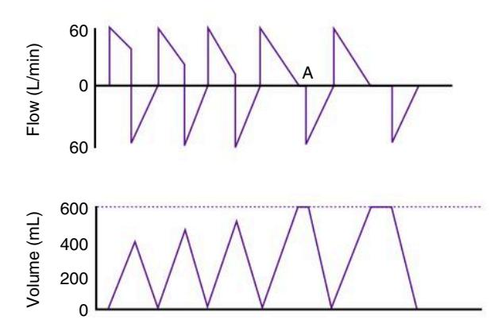
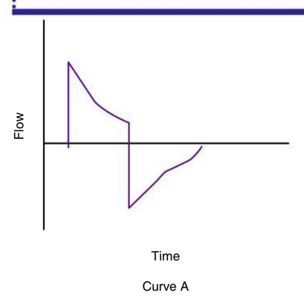
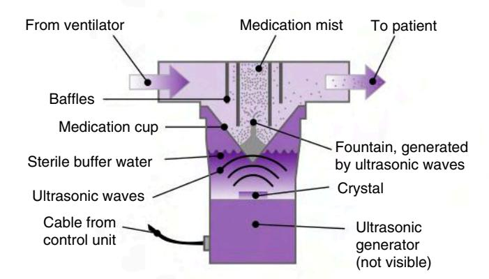
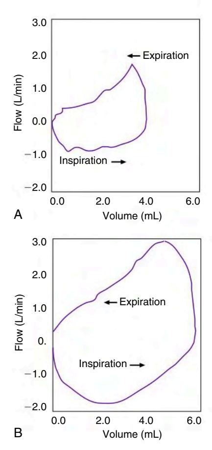
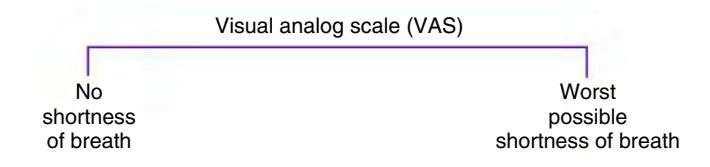

# Методы улучшения вентиляции в управлении пациентом и аппаратом ИВЛ

## Краткое резюме

### Коррекция нарушений вентиляции – изменение МОД
* **Основное уравнение:** Известный PₐCO₂ × Известная МОД = Желаемый PₐCO₂ × Желаемая МОД (при условии постоянства V̇CO₂ и мертвого пространства). Если частота постоянна: Желаемый ДО = (Известный PₐCO₂ × Известный ДО) / Желаемый PₐCO₂. Если ДО постоянен: Желаемая f = (Известный PₐCO₂ × Известная f) / Желаемый PₐCO₂.
* **Респираторный ацидоз (PₐCO₂ >45, pH <7,35):** Увеличить МОД (увеличить ДО или частоту). Целевой ДО 6‑8 мл/кг ИМТ, Pплато <30 см H₂O. При PC‑CMV можно увеличить Tвдоха (позволяет давлению достичь альвеол → увеличивается ДО) или увеличить установленное давление.
* **Респираторный алкалоз (PₐCO₂ <35, pH >7,45):** Уменьшить МОД (сначала уменьшить частоту, затем ДО при необходимости). Если пациент инициирует дополнительные вдохи, уменьшение заданной частоты может не помочь – рассмотрите уменьшение ДО (с ПДКВ для предотвращения ателектаза), переключение на режим ПВЛ/PSV или седацию.
* **Метаболический ацидоз (pH 7,00‑7,34, HCO₃⁻ 12‑22):** Пациенты гипервентилируют для компенсации; может потребоваться ИВЛ для предотвращения утомления. Лечить основную причину. Использование бикарбоната спорно.
* **Метаболический алкалоз (pH 7,45‑7,70, HCO₃⁻ 26‑48):** Выявить и лечить причину (диуретики, назогастральная аспирация, дефицит K⁺). Полная респираторная компенсация возникает редко, поскольку гиповентиляция вызывает гипоксемию.
* **Смешанные нарушения:** Примеры – респираторный ацидоз + метаболический алкалоз (pH близок к норме). Скорректируйте метаболический компонент перед изменением вентиляции (в противном случае возникнет тяжелый алкалоз).

### Повышенное мертвое пространство и метаболизм
* **Повышенное альвеолярное мертвое пространство:** Причины – тромбоэмболия легочной артерии, низкий сердечный выброс, высокое ПДКВ, сдавливающее капилляры (Ключевой момент 12.1). Контролируйте PetCO₂ – увеличение градиента Pₐ‑ₑₜCO₂ предполагает увеличение мертвого пространства.
* **Повышенное V̇CO₂:** Лихорадка, ожоги, травма, сепсис, судороги, возбуждение. Может потребоваться увеличение МОД; рассмотрите седацию, охлаждение или поддержку давлением для снижения работы.

### Ятрогенная гипервентиляция (черепно-мозговая травма)
* **Временная умеренная гипервентиляция (PₐCO₂ 30‑35 мм рт.ст.)** может использоваться при рефрактерном повышении ВЧД, но профилактическая гипервентиляция (PₐCO₂ <25) НЕ рекомендуется (может вызвать церебральную ишемию). Использовать только кратковременно.

### Допустимая гиперкапния (ДГ)
* **Определение:** Преднамеренное ограничение вентиляции для избежания повреждения легких (Pплато >30). Допускается повышение PₐCO₂ (≥50, до 150 мм рт.ст.), pH ≥7,10‑7,30. Переносится при отсутствии почечной или сердечно-сосудистой недостаточности (pH 7,20‑7,25 приемлем) (Ключевой момент 12.2 – CO₂-наркоз при >200 мм рт.ст.).
* **Процедура (Рамка 12.1):** Повышать PₐCO₂ постепенно (10 мм рт.ст./ч до 80 мм рт.ст./сут). Поддерживать SₐO₂ 85‑90%. Седатировать пациента. Буферы (бикарбонат, ТАМ) остаются спорными.
* **Противопоказания (Ключевые моменты 12.3, 12.4):** Внутричерепные поражения (CO₂ вазодилатирует церебральные сосуды → повышение ВЧД). Кардиальная ишемия, недостаточность ЛЖ, легочная гипертензия, правожелудочковая недостаточность.

### Очищение секрета – санация трахеи
* **Размер катетера для санации (Рамка 12.2):** Размер ЭТТ × 3 = размер во French; затем разделить на 2 (≤50% от внутреннего диаметра ЭТТ для взрослых/детей, ≤30% для младенцев). Пример: ЭТТ 8 → 24 Fr /2 = катетер 12 Fr.
* **Давление санации (Таблица 12.1):** Взрослые –100 – –120 мм рт.ст. (макс –150), дети –80 – –100 (макс –125), младенцы –60 – –100 (макс –100).
* **Продолжительность:** ≤15 секунд. Гипероксигенировать 100% O₂ в течение 30 с до и 1 мин после (используйте обогащение O₂ на аппарате, а не ручной мешок, который может не обеспечить FIO₂ 1,0). Предпочтительна поверхностная санация, а не глубокая.
* **Закрытые (инлайновые) катетеры (Рамка 12.3):** Показания – высокое ПДКВ (≥10), высокая FIO₂ (>0,6), частая санация (>6 раз/сут), нестабильные пациенты, контагиозные инфекции. Преимущества – поддержание ПДКВ, снижение ВАП, снижение контаминации персонала. Недостатки – катетер может мигрировать, добавляет вес на ЭТТ.
* **Осложнения (Рамка 12.5):** Гипоксемия, ателектаз, бронхоспазм, аритмии, гипотензия/гипертензия, повышение ВЧД (при ЧМТ). **Введение физиологического раствора перед санацией** – не рекомендуется (не разжижает секрет, может сместить биопленку, усиливает одышку, доказанной пользы нет).
* **Непрерывная аспирация субглоттического секрета (CASS) – Hi‑Lo Evac ЭТТ (Рис. 12.5):** Аспирационный порт выше манжеты, непрерывное давление 20 мм рт.ст. Снижает частоту ВАП. Наиболее эффективна при интубации >3 дней. Дороже, но экономически выгодна, если сокращает пребывание в ОИТ.

### Доставка аэрозолей во время ИВЛ
* **Устройства:** дозированный ингалятор (с камерой), малообъемный небулайзер (МОН), ультразвуковой небулайзер (УЗН), вибрирующий сетчатый небулайзер (ВСН). УЗН/ВСН не добавляют газ в контур, производят более мелкие частицы, более эффективны.
* **Факторы аппарата (Таблица 12.2):** Спонтанные вдохи >500 мл улучшают доставку. VC‑CMV лучше PC‑CMV для аэрозолей. Больший ДО, меньшая частота, более длительное Tвдоха (>0,3 с), нисходящая форма потока улучшают депозицию.
* **Техника pMDI (Ключевой момент 12.6):** Поместите камеру в инспираторную ветвь на расстоянии 6 дюймов от Y-коннектора. Удалите HME. Синхронизируйте активацию с началом вдоха. Выждите 20‑30 с между дозами.
* **МОН с внешним источником газа (Рамка 12.7, Ключевой момент 12.7):** Проблемы – добавленный газ увеличивает ДО и ПДВ, может препятствовать инициации вдоха пациентом, изменяет FIO₂, забивает выдыхательные клапаны. Используйте выдыхательный фильтр (но он может забиться → повышение аутоПДКВ). Корректируйте сигналы тревоги на время лечения, после – верните.
* **Небулизация аппаратом:** Некоторые аппараты имеют встроенное управление небулайзером, которое циклирует только во время вдоха, поддерживая FIO₂ и ДО. УЗН/ВСН (Aerogen, Servo‑i) имеют электропитание, не добавляют газ в контур.
* **Доставка аэрозоля при НИВЛ:** Размещайте небулайзер близко к пациенту (между портом утечки и маской). Высокое IPAP (20 см H₂O), низкое EPAP (5 см H₂O).
* **Оценка ответа:** ↓ ПДВ, ↓ PTA, ↑ ПСВ, ↓ аутоПДКВ, улучшение на петле поток-объем (Рис. 12.9).

### Постуральный дренаж и перкуссия грудной клетки
* Положения (Takahashi и соавт.): на спине → 45° поворот на живот левым боком вверх → 45° поворот на живот правым боком вверх → возврат на спину. Требуется ≥2 специалистов. Альтернатива: осциллирующий жилет (Рис. 12.10).

### Гибкая фиброоптическая бронхоскопия (Рамка 12.9)
* Показания: стойкий ателектаз, удаление секрета/инородных тел, биопсия, сложная интубация, установка стента, лечение ВАП.
* Противопоказания: невозможность оксигенации, коагулопатия, нестабильная гемодинамика, тяжелая обструкция.
* **Процедура:** Адаптер между Y-коннектором и ЭТТ (Рис. 12.12). FIO₂ до 1,0. Бронхоскоп занимает ≥50% просвета ЭТТ → ↑ ПДВ, ↓ ДО, аутоПДКВ. Терапевт контролирует SₚO₂, выдыхаемый ДО, регулирует аппарат, отключает звук сигналов.
* Лекарства: атропин (подсушивает секрет, блокирует вагусный ответ), опиоиды (фентанил, меперидин, морфин), бензодиазепины (мидазолам, диазепам). Антагонисты: налоксон (наркотики), флумазенил (бензодиазепины).

### Инфекции мокроты и верхних дыхательных путей (Таблица 12.4)
* **Признаки:** лихорадка, ↑ лейкоцитов, гнойная мокрота. **Зеленая, зловонная** – *Pseudomonas*. **Ржавого цвета** – *Klebsiella*. **Розовая, пенистая** – отек легких.
* Диагностика: посев мокроты, рентген грудной клетки (новый инфильтрат, консолидация).

### Жидкостный баланс
* Нормальный диурез: 50‑60 мл/ч (~1 мл/кг/ч). Олигурия <400 мл/сут или <20 мл/ч.
* Причины снижения диуреза: гиповолемия, ↓ сердечный выброс, ↓ почечная перфузия, почечная недостаточность, закупорка катетера Фолея (наиболее частая причина внезапного падения). Также высокое P̅aw → ↓ CO → ↑ АДГ → задержка жидкости.
* **Клинический случай 12.4:** Повышенные эритроциты/лейкоциты, ↓ тургор кожи, ↓ АД → обезвоживание → инфузионная нагрузка.

### Психологический статус и сон
* Нарушения сна часто в ОИТ (боль, шум, прерывания). PSV может вызывать центральное апноэ (снижение PₐCO₂ → апноэ → пробуждение). Повторные пробуждения → ↑ катехоламинов, аритмии.
* Пациенты могут становиться агрессивными, тревожными, галлюцинировать. Персонал должен успокаивать, давать отдых, обеспечивать методы общения.

### Безопасность и комфорт пациента
* Аварийное оборудование: ручной респиратор, O₂, набор для интубации, набор для трахеостомии, набор для торакоцентеза, отсос, реанимационная тележка, набор для АБГ.
* **Пациенто-ориентированная ИВЛ (Рис. 12.13):** Оценивайте одышку с помощью визуально-аналоговой или числовой шкалы (0‑10). Регулируйте поток, форму волны, чувствительность, давление, время нарастания, цикл потока; спрашивайте пациента, что удобнее. Седация должна быть минимизирована – ежедневное прерывание сокращает пребывание в ОИТ.

### Транспортировка вентилируемого пациента (Рамка 12.10, 12.11)
* Варианты: ручной мешок (риски – гипо/гипервентиляция), транспортный аппарат (маленький, аккумулятор), реанимационный аппарат (большой, нужны аккумулятор и баллоны O₂).
* **Время работы от аккумулятора** зависит от ПДКВ и PC‑CMV (более высокое потребление). Проверьте перед транспортировкой.
* **Осложнения (Рамка 12.11):** случайная экстубация, потеря ПДКВ, отсоединение, потеря подачи O₂, аритмии, ВАП.
* Показания к транспортировке только если польза превышает риск.

## КОРРЕКЦИЯ НАРУШЕНИЙ ВЕНТИЛЯЦИИ

Обычно клиницисты используют первые 30‑60 минут после начала ИВЛ для сбора информации, которая может быть использована для оценки эффективности респираторной поддержки. Как обсуждалось в главе 8, эти данные обычно включают жизненно важные показатели, дыхательные шумы и оценку респираторной механики (т.е. растяжимости легких и сопротивления дыхательных путей). Графический мониторинг аппарата также может быть ценным ресурсом при оценке взаимодействия пациента и аппарата (см. главу 9).

В этой главе представлен обзор вентиляционных стратегий, которые могут быть использованы для лечения пациентов с различными кислотно-щелочными нарушениями. Она также включает обсуждение методов очищения дыхательных путей, аэрозольной терапии, гибкой фиброоптической бронхоскопии во время вентиляции, позиционирования пациента и методов оценки жидкостного баланса. Также обсуждается важность обеспечения комфорта и безопасности пациента, а также внутрибольничная транспортировка пациента на ИВЛ.

После выполнения первичного физикального обследования следует взять образец газов артериальной крови для оценки респираторного и кислотно-щелочного статуса пациента. Оценку результатов АБГ можно разделить на три части: кислотно-щелочной статус, вентиляция и оксигенация – pH (щелочность и кислотность) и бикарбонат; PₐCO₂; и статус оксигенации (PₐO₂, SₐO₂, CₐO₂ и доставка кислорода). Следующее обсуждение фокусируется на факторах, которые могут изменять PₐCO₂ во время ИВЛ, включая минутную вентиляцию, физиологическое мертвое пространство и продукцию CO₂ ([Рис. 12.1](#fig-12-1)). Методы улучшения оксигенации рассматриваются в главе 13.

**РИСУНОК 12.1** Факторы, влияющие на парциальное давление углекислого газа в артериальной крови (PₐCO₂) во время ИВЛ. V̇CO₂, Продукция углекислого газа; V̇A, альвеолярная вентиляция; V̇E, минутная вентиляция; V̇D, вентиляция мертвого пространства; VT, дыхательный объем; TI, инспираторное время; TE, экспираторное время; f, частота дыхания. (Из Hess DR, MacIntyre NR, Mishoe SC, et al.: *Respiratory care principles and practice*, ed 2, Sudbury, MA, 2012, Jones and Bartlett.)

## ОБЩИЕ МЕТОДЫ ИЗМЕНЕНИЯ ВЕНТИЛЯЦИИ НА ОСНОВЕ PₐCO₂ И pH

После подключения пациента к аппарату ИВЛ часто требуется изменение минутной вентиляции. Нередко изначально используется полная респираторная поддержка, а затем параметры корректируются после выполнения первичной оценки. Примеры, представленные в этом обсуждении, предполагают полную поддержку пациента с апноэ.

Во время ИВЛ изменение установленного дыхательного объема или частоты может использоваться для коррекции респираторного алкалоза или ацидоза. Эти изменения основаны на следующем уравнении:

$$\text{Известный } P_aCO_2 \times \text{Известная } \dot{V}_E = \text{Желаемый } P_aCO_2 \times \text{Желаемая } \dot{V}_E$$

Если предположить, что физиологическое мертвое пространство и продукция CO₂ (в результате метаболизма) не существенно меняются в течение короткого периода, уравнение можно изменить:

$$\text{Известный } P_aCO_2 \times \text{Известная минутная альвеолярная вентиляция } (\dot{V}_A) = \text{Желаемый } P_aCO_2 \times \text{Желаемая } \dot{V}_A$$

Если целесообразно сохранить частоту постоянной и изменить ДО, уравнение принимает вид:

$$\text{Желаемый } V_T = \frac{\text{Известный } P_aCO_2 \times \text{Известный } V_T}{\text{Желаемый } P_aCO_2}$$

Если целесообразно сохранить ДО постоянным и изменить f, уравнение записывается:

$$\text{Желаемая } f = \frac{\text{Известный } P_aCO_2 \times \text{Известная } f}{\text{Желаемый } P_aCO_2}$$

### Респираторный ацидоз: изменения при объемной и давленческой вентиляции

Когда PₐCO₂ повышен (>45 мм рт.ст.), а pH снижен (<7,35), присутствует респираторный ацидоз, и альвеолярная вентиляция неадекватна. Острый респираторный ацидоз связан со следующим:
- Паренхиматозные заболевания легких (например, отек легких, пневмония)
- Заболевания дыхательных путей (например, тяжелый приступ астмы)
- Плевральные аномалии (например, выпоты)
- Деформации грудной стенки
- Нервно-мышечные расстройства (например, травма спинного мозга, миастения)
- Проблемы центральной нервной системы (например, передозировка наркотиков)

Для пациентов на ИВЛ респираторный ацидоз обычно может быть скорректирован изменением установленного ДО или f для достижения желаемой минутной вентиляции. Независимо от того, получает ли пациент объем-контролируемую или давление-контролируемую вентиляцию, увеличение минутной вентиляции снизит PₐCO₂.

Рекомендованные рекомендации – целевой ДО 6‑8 мл/кг идеальной массы тела при обеспечении давления плато менее 30 см H₂O. Как обсуждалось в главе 6, корректировки ДО и частоты дыхания должны основываться на легочной патологии пациента. Важно понимать, что диапазон 6‑8 мл/кг является средним. Если ДО находится в верхней части этого диапазона, а Pплато >30 см H₂O, ДО может быть уменьшен для достижения более низкого Pплато.

При давление-контролируемой непрерывной принудительной вентиляции установленное давление обычно регулируется для получения целевого ДО. PC‑CMV циклируется по времени. Если инспираторное время короткое, его увеличение также может увеличить доставку объема без необходимости увеличения давления (P) ([Рис. 12.2](#fig-12-2)).

**РИСУНОК 12.2** Влияние инспираторного времени (Tвдоха) и инспираторного плато на доставленный дыхательный объем (ДО) в режиме давление-контролируемой вентиляции (PC‑CMV). Изначально, по мере увеличения Tвдоха, ДО увеличивается. После достижения инспираторного плато (A) дальнейшее увеличение Tвдоха не увеличит ДО. (Из Kacmarek RM, Stoller JK, Heuer AJ: *Egan’s fundamentals of respiratory care*, ed 12, St. Louis, MO, 2021, Elsevier.)

#### Клинический сценарий: Коррекция PC‑CMV у пациента с респираторным ацидозом

Пациент весом 75 кг (ИМТ) переведен на PC‑CMV с частотой 10 вдохов/мин, установленным давлением 25 см H₂O и измеренным ДО 425 мл. Кривая поток-время для этого пациента показана на кривой A. Tвдоха составляет 0,7 секунды. АБГ: pH = 7,30; PₐCO₂ = 50 мм рт.ст.; HCO₃⁻ = 23 мэкв/л.

Для улучшения вентиляции можно скорректировать два параметра. Можно увеличить Tвдоха так, чтобы установленное давление достигало альвеолярного уровня. Это будет очевидно, когда скаляр потока покажет период нулевого потока во время вдоха (*кривая B*). Эту стратегию можно попробовать первой. Если это не улучшит доставку объема в достаточной степени, можно увеличить установленное давление.

#### Клинический сценарий: Респираторный ацидоз – увеличение дыхательного объема

50-летний мужчина с респираторным ацидозом получает респираторную поддержку. Его рост 6 футов 2 дюйма (188 см), вес 81 кг (ИМТ) (анатомическое мертвое пространство = 190 мл). Выдыхаемый ДО, измеренный у эндотрахеальной трубки, составляет 400 мл. Частота дыхания 16 вдохов/мин. Пациент получает VC‑CMV. АБГ показывают PₐCO₂ 55 мм рт.ст. и pH 7,33. У пациента нет легочных заболеваний. Желаемый PₐCO₂ – 40 мм рт.ст. Какое изменение вентиляции необходимо сделать для снижения PₐCO₂?

Поскольку настройка ДО менее 8 мл/кг и у пациента нет легочных заболеваний, целесообразно сохранить частоту постоянной и изменить ДО:

$$\text{Желаемый } V_T = \frac{55 \times 400}{40} = 550 \text{ мл}$$

Новый ДО устанавливается на 550 мл (~7 мл/кг ИМТ) для достижения желаемого PₐCO₂ 40 мм рт.ст.

#### Клинический сценарий: Респираторный ацидоз – увеличение частоты

48-летняя женщина ростом 5 футов 2 дюйма (157 см) получает VC‑CMV и не совершает спонтанных вдохов. У нее PₐCO₂ 58 мм рт.ст., pH 7,28, ДО у ЭТТ 425 мл. ИМТ 52 кг, VDанат 115 мл. Частота дыхания 15 вдохов/мин. Как можно скорректировать настройки аппарата для достижения желаемого PₐCO₂ 40 мм рт.ст.?

В этом случае ДО установлен около 8 мл/кг, поэтому целесообразно изменить f, а не увеличивать ДО.

$$\text{Желаемая } f = \frac{15 \times 58}{40} = 21,75 \approx 22 \text{ вдоха/мин}$$

Увеличение частоты дыхания до 22 вдохов/мин должно снизить PₐCO₂ до 40 мм рт.ст. Однако важно понимать, что установка высоких частот дыхания может быть связана с задержкой воздуха из-за сокращения экспираторного времени. (ПРИМЕЧАНИЕ: Полезно контролировать скаляр потока при установке частоты дыхания более 20 вдохов/мин.)

#### Клинический сценарий: Изменения при давление-целевой вентиляции

Во время PC‑CMV те же типы корректировок ДО и f выполняются на основе АБГ, за исключением того, что установленное давление увеличивается или уменьшается для достижения желаемого ДО. Выдыхаемый объем контролируется до получения желаемого ДО. (ПРИМЕЧАНИЕ: Важно убедиться, что Tвдоха достаточно велико, чтобы получить максимальную пользу от установленного давления.)

Пациент весом 75 кг (ИМТ) с респираторным ацидозом получает PC‑CMV (PₐCO₂ = 59 мм рт.ст.; pH = 7,31; желаемый PₐCO₂ = 40 мм рт.ст.). При установленном давлении 10 см H₂O выдыхаемый ДО составляет 400 мл (5,3 мл/кг), а частота 16 вдохов/мин. Пациент не дышит спонтанно. Tвдоха установлено так, что поток возвращается к нулю до окончания вдоха и может быть измерен период Pплато. Какое изменение вентиляции необходимо сделать для снижения PₐCO₂? Настройка ДО менее 8 мл/кг, поэтому целесообразно сохранить f постоянной и изменить ДО:

$$\text{Желаемый } V_T = \frac{59 \times 400}{40} = 590 \text{ мл (около 600 мл)}$$

Установленное давление (P) 10 см H₂O дает ДО 400 мл (0,4 л); каково расчетное давление, которое обеспечит ДО 600 мл (0,6 л)? Предположим, что растяжимость не меняется. Помните, статическая растяжимость (CС) = ДО / (Pплато – ПДКВ). CС = 400/10 = 40 мл/см H₂O.

$$\text{Желаемое } P = \frac{\text{Желаемый } V_T}{C_S} = \frac{600 \text{ мл}}{40 \text{ мл/см H}_2\text{O}} = 15 \text{ см H}_2\text{O}$$

Увеличение давления во время PC‑CMV обычно увеличивает ДО. И наоборот, снижение давления уменьшает ДО у пациентов с респираторным алкалозом во время PC‑CMV.

### Респираторный алкалоз: изменения при VC‑CMV и PC‑CMV

Когда PₐCO₂ снижен (<35 мм рт.ст.), а pH повышен (>7,45), присутствует респираторный алкалоз, указывающий на избыточную альвеолярную вентиляцию. Общие причины респираторного алкалоза включают:
- Гипоксию с компенсаторной гипервентиляцией
- Паренхиматозные заболевания легких
- Лекарства (салицилаты, ксантины, аналептики)
- ИВЛ
- Заболевания центральной нервной системы (менингит, энцефалит, черепно-мозговая травма)
- Тревогу
- Метаболические проблемы (сепсис, заболевания печени)

У пациентов на ИВЛ гипервентиляция часто является причиной респираторного алкалоза. Для коррекции респираторного алкалоза в этой ситуации клиницист должен уменьшить минутную вентиляцию при объем-контролируемой вентиляции, снижая f и, при необходимости, уменьшая ДО. Если используется давление-контролируемая вентиляция, клиницист должен сначала уменьшить f, а затем, при необходимости, уменьшить установленное давление.

#### Клинический сценарий: Респираторный алкалоз – уменьшение частоты

35-летний мужчина с респираторным алкалозом (PₐCO₂ = 20 мм рт.ст.; pH = 7,60) находится на CMV без спонтанных вдохов с доставленным ДО 550 мл, частотой 18 вдохов/мин, VDанат = 150 мл. Его желаемый PₐCO₂ – 40 мм рт.ст. ИМТ 70 кг. Настройка ДО составляет примерно 8 мл/кг. Целесообразно уменьшить f и оставить ДО постоянным:

$$\text{Желаемая } f = \frac{18 \times 20}{40} = 9 \text{ вдохов/мин}$$

Новая частота 9 вдохов/мин должна достичь желаемого PₐCO₂ 40 мм рт.ст.

#### Клинический сценарий: Респираторный алкалоз – уменьшение объема при давление-контролируемой вентиляции

50-летняя женщина на PC‑CMV изначально имела установленное давление 20 см H₂O, что давало ДО 450 мл (CС = 28 мл/см H₂O). Установленная частота была 12 вдохов/мин, спонтанных усилий не было. Tвдоха достаточно велико, чтобы обеспечить небольшую паузу (нулевой поток) в конце вдоха. АБГ на этих настройках: pH = 7,41, PₐCO₂ = 44 мм рт.ст. ИМТ пациентки 60 кг.

После 2 дней вентиляции на этих настройках pH = 7,51, PₐCO₂ = 29 мм рт.ст. Давление все еще 20 см H₂O, ДО = 625 мл (10,4 мл/кг ИМТ). CС теперь 32 мл/см H₂O. Это значительное улучшение. ДО высок по сравнению с ИМТ. Каков будет целевой объем для этой пациентки?

Желаемый ДО = ~450 мл.

Как установить давление для получения этого ДО? Помните CС = ДО/ΔP, поэтому P = ДО/CС.

Желаемое P = 450 мл / (32 мл/см H₂O) = 14 см H₂O.

Снижение давления до 14 см H₂O должно обеспечить новый целевой ДО 450 мл, что составляет 7,5 мл/кг ИМТ для этой пациентки.

#### Клинический сценарий: Респираторный алкалоз во время спонтанных усилий

25-летний мужчина на VC‑CMV имеет установленную частоту 14 вдохов/мин и ДО 560 мл. ИМТ пациента 80 кг. Пациент инициирует дополнительные 4 вдоха/мин. Общая частота 18 вдохов/мин; PₐCO₂ 30 мм рт.ст.; pH 7,50. Что может сделать респираторный терапевт для улучшения вентиляции? ДО составляет 7 мл/кг ИМТ, что подходит для этого пациента. Предположим, терапевт уменьшает установленную f на аппарате до 10 вдохов/мин. Какое влияние это окажет на вентиляцию? Пока пациент продолжает инициировать дополнительные вдохи, уменьшение установленной f не даст эффекта.

Уменьшение ДО (или, более конкретно, давления при PC‑CMV) может быть эффективным для снижения минутной вентиляции, если только пациент не увеличивает свою спонтанную частоту, поддерживая тем самым высокую альвеолярную вентиляцию. Кроме того, снижение ДО до менее 7 мл/кг может привести к ателектазу из-за низкой объемной вентиляции.

В этой ситуации доступно несколько альтернатив: (1) уменьшить ДО, но обеспечить адекватный уровень ПДКВ для снижения потенциального ателектаза; (2) применить другой режим, такой как синхронизированная ПВЛ или PSV, чтобы позволить пациенту дышать, не получая принудительный вдох при каждой попытке вдоха; или (3) седировать пациента для лучшего контроля дыхания. Седация может потребоваться пациентам с выраженным возбуждением, повышенной работой дыхания или асинхронией пациента и аппарата. Важно понимать, что седация не всегда может быть лучшим выбором. По возможности следует исследовать и лечить причину гипервентиляции. Общие причины гипервентиляции включают гипоксемию, боль, тревогу, лихорадку, возбуждение и асинхронию.

Черепно-мозговая травма, приводящая к высокой МОД и гипервентиляции, иногда трудно поддается контролю, независимо от выбранного режима. У некоторых пациентов с черепно-мозговой травмой есть тенденция дышать с высоким ДО и f, что является результатом поражения центральной нервной системы и не может быть скорректировано.

### Метаболический ацидоз и алкалоз

Лечение метаболического ацидоза и алкалоза должно быть направлено на выявление метаболических факторов, которые могут вызывать эти кислотно-щелочные нарушения. Хотя это может быть не очевидно, респираторный компонент также может быть вовлечен, и эту возможность следует учитывать.

#### Метаболический ацидоз

Пациенты с явным респираторным дистрессом могут иметь метаболический ацидоз. Газы крови показывают pH = 7,00‑7,34 и бикарбонат в диапазоне около 12‑22 мэкв/л. Эти пациенты часто пытаются снизить свой PₐCO₂ для достижения некоторой степени гипервентиляции, чтобы компенсировать метаболический ацидоз. Вследствие этого эти пациенты подвержены риску развития утомления дыхательных мышц. Таким образом, в этой ситуации показана ИВЛ для достижения минимальной цели компенсированной гипокапнии. Можно ли этого достичь с помощью неинвазивной или инвазивной вентиляции, зависит от того, соответствует ли пациент критериям для этого режима вентиляции (см. главу 19). Если требуется инвазивная вентиляция, риски должны быть сопоставлены с временными преимуществами.

Причины метаболического ацидоза включают:
- Кетоацидоз (алкоголизм, голодание, диабет)
- Уремический ацидоз (почечная недостаточность, неспособность экскретировать кислоту)
- Потеря бикарбоната (диарея)
- Потеря оснований почками после введения ингибиторов карбоангидразы (например, ацетазоламид [Диамокс])
- Лактат-ацидоз
- Токсины, вызывающие ацидоз (салицилаты, этиленгликоль [антифриз], метанол)

Лечение метаболического ацидоза включает проведение эффективной терапии для устранения причины ацидоза и оценку необходимости коррекции ацидемии введением ощелачивающего агента. Лечение основной причины ацидемии, обеспечение нормального объема сосудов и сердечного выброса, а также адекватной оксигенации имеют важное значение. Эти действия дают время для нормального метаболизма органических кислот (молочной кислоты и кетокислот) и дают время почкам для выработки бикарбоната для восполнения потерь.

Существуют разногласия относительно пользы использования ощелачивающих агентов, таких как введение бикарбоната, при лечении метаболического ацидоза. Снижение артериального CO₂ также спорно, но если пациент проигрывает борьбу за поддержание высокой МОД при спонтанном дыхании, может потребоваться вспомогательная вентиляция для избежания дыхательной недостаточности. В этой ситуации целесообразно поддерживать pH в пределах нормы (7,35‑7,45) (см. Клинический случай 12.1).

#### Метаболический алкалоз

Метаболический алкалоз присутствует, когда pH (7,45‑7,70) и бикарбонат (26‑48 мэкв/л) повышены выше нормы. Общие причины включают:
- Потерю желудочной жидкости и желудочных кислот (рвота, назогастральная аспирация)
- Потерю кислоты с мочой (прием диуретиков)
- Сдвиг кислоты в клетки (дефицит калия)
- Введение лактата, ацетата или цитрата
- Чрезмерную нагрузку бикарбонатом (введение бикарбоната)

Как и при метаболическом ацидозе, лечение включает выявление основной причины и устранение факторов, приводящих к алкалозу. В тяжелых случаях могут потребоваться ингибиторы карбоангидразы, инфузия кислоты и диализ с низким содержанием бикарбоната.

Неосложненный метаболический алкалоз обычно не связан с альвеолярной гиповентиляцией как компенсаторным механизмом из-за возникающей гипоксемии при тяжелой гиповентиляции. Например, PₐCO₂ обычно не повышается выше 55 мм рт.ст. Помните, что PₐO₂ будет падать по мере повышения CO₂. Таким образом, гиповентилия сопровождается гипоксемией у пациента, дышащего комнатным воздухом. Гипоксемия вызовет стимуляцию периферических хеморецепторов, что приведет к увеличению минутной вентиляции. Только в редких случаях происходит полная компенсация метаболического алкалоза.

### Смешанные кислотно-щелочные нарушения

У некоторых пациентов с острой дыхательной недостаточности наблюдаются смешанные респираторные и метаболические нарушения, например, респираторный ацидоз в сочетании с метаболическим алкалозом. Обратите внимание, что pH может быть близким к норме. Следующий случай может быть использован для иллюстрации этого момента.

#### Клинический сценарий: Смешанные респираторные и метаболические нарушения

65-летний пациент на ИВЛ имеет назогастральную трубку на аспирации. Он также получает диуретики по поводу застойной сердечной недостаточности. pH = 7,36, PₐCO₂ = 58 мм рт.ст., HCO₃⁻ = 31 мэкв/л, PₐO₂ = 111 мм рт.ст. (FIO₂ = 0,30). ДО = 400 мл, частота = 12 вдохов/мин. Следует ли увеличить МОД, чтобы вернуть PₐCO₂ к 40 мм рт.ст.? В этом случае *не* целесообразно увеличивать МОД для снижения PₐCO₂. Это может быстро привести к алкалозу с сопутствующими сердечными аритмиями, судорогами и другими неврологическими нарушениями. Следует определить и устранить причину обеих проблем.

#### Клинический сценарий: Сочетание респираторного алкалоза и метаболического ацидоза

55-летний мужчина доставлен вертолетом в крупную городскую больницу. Первоначальный диагноз – острый инфаркт миокарда. Парамедики интубируют пациента, начинают внутривенную инфузию физиологического раствора и начинают ручную вентиляцию 100% O₂. После поступления в больницу пациенту устанавливают сосудистый стент в одну из коронарных артерий для улучшения ее проходимости. Пациент стабилизирован, начата ИВЛ со следующими настройками: ПВЛ 16 вдохов/мин и ДО = 750 мл (≈10 мл/кг ИМТ). Спонтанных вдохов нет. Настройки аппарата не меняются, ДО поддерживается на уровне примерно 10 мл/кг ИМТ.

Два дня спустя респираторный терапевт получает утренний АБГ для этого пациента. Настройки аппарата все те же. Результаты АБГ: PₐCO₂ = 25 мм рт.ст.; pH = 7,42; HCO₃⁻ = 17 мэкв/л.

У пациента нет в анамнезе легочных или метаболических заболеваний. Его нормальный PₐCO₂ около 40 мм рт.ст. И ДО, и частота высоки для этого пациента. Поскольку Pплато составляет всего 20 мм рт.ст., терапевт решает изначально уменьшить частоту, чтобы начать приближение к нормальному PₐCO₂ пациента.

Желаемая f = (Фактическая частота × Фактический PₐCO₂) / Желаемый PₐCO₂ = (16 × 25)/40 = 10 вдохов/мин.

Попытки уменьшить частоту аппарата до 10 вдохов/мин приводят к увеличению спонтанной частоты более чем до 25 вдохов/мин. Пациент в сознании, выглядит встревоженным и с трудом дышит. Почему трудно уменьшить принудительную частоту в этой ситуации?

У пациента компенсированный респираторный алкалоз. Изначальная МОД была установлена слишком высокой для этого пациента (установленная МОД = 12 л/мин; прогнозируемая МОД = 10 л/мин). После 2 дней на этих настройках почки скомпенсировали ятрогенную гипервентиляцию, выводя избыток бикарбоната. Чтобы позволить обратному процессу произойти, принудительную частоту придется уменьшать медленно (на 1‑2 вдоха каждые 2‑4 часа), чтобы можно было восстановить нормальную вентиляцию и дать почкам время повысить бикарбонат обратно до нормального уровня.

#### Клинический сценарий: Сочетание респираторного ацидоза и метаболического алкалоза

35-летняя женщина получает ИВЛ. Анализ АБГ показывает PₐCO₂ = 60 мм рт.ст., pH = 7,41, HCO₃⁻ = 35 мэкв/л. (ПРИМЕЧАНИЕ: Нормальный PₐCO₂ пациентки – 40 мм рт.ст.) Тот факт, что высокий PₐCO₂ не отражается на pH, указывает на то, что у пациентки, по-видимому, метаболический алкалоз и респираторный ацидоз. Прежде чем PₐCO₂ можно будет скорректировать с помощью настроек аппарата, необходимо скорректировать метаболический алкалоз. Если PₐCO₂ будет снижен до 40 мм рт.ст., pH повысится, и у пациентки разовьется тяжелый алкалоз.

### Повышенное физиологическое мертвое пространство

Если чистый респираторный ацидоз сохраняется даже после увеличения альвеолярной вентиляции, у пациента может быть проблема, являющаяся результатом повышенного альвеолярного мертвого пространства. Повышенное альвеолярное мертвое пространство может быть вызвано тромбоэмболией легочной артерии или низким сердечным выбросом, приводящим к низкой легочной перфузии.

**Ключевой момент 12.1** Повышенное альвеолярное мертвое пространство может возникать, когда высокие уровни положительного давления конца выдоха сдавливают легочные капилляры и снижают легочный кровоток.

Повышенное альвеолярное мертвое пространство также может возникать, когда респираторная поддержка снижает легочный кровоток, вызывая высокое альвеолярное давление, например, при применении высокого ПДКВ. Снижение легочной перфузии может быть связано с задержкой воздуха, возникающей из-за высокой МОД, низкого инспираторного потока (высокого соотношения вдох:выдох, например 3:1) или неравномерного распределения вентиляции из-за патологического состояния легких.

В случае задержки воздуха (аутоПДКВ) увеличение потока или уменьшение соотношения I/E (до 1:3 или 1:4) может исправить проблему. (Увеличение инспираторного потока может сократить Tвдоха и позволить больше времени для выдоха.) Иногда изменение положения пациента так, чтобы пораженное болезнью легкое получало минимальный кровоток (независимое положение), в то время как непорожденное легкое получает больший кровоток, может значительно улучшить газообмен и помочь решить проблему.

Нормальное отношение мертвого пространства к дыхательному объему (VD/VT) составляет 0,2‑0,4. У критически больных пациентов это значение может превышать 0,7. Расчет отношения VD/VT использует модификацию Энгхоффа уравнения Бора: VD/VT = (PₐCO₂ – P̅ECO₂)/PₐCO₂, где P̅ECO₂ – парциальное давление CO₂ в смешанных выдыхаемых газах, собранных от пациента. Берется проба газов крови и измеряется средний ДО во время измерения P̅ECO₂. Обратите внимание, что хотя этот метод измерения отношения VD/VT может предоставить полезную информацию о пациентах на ИВЛ, он обычно требует дополнительного оборудования и не выполняется routinely.

У пациентов на ИВЛ чаще контролируют конечно-выдыхательный CO₂ (нормальный PetCO₂ = 35‑43 мм рт.ст.) и градиент между артериальным и конечно-выдыхательным CO₂, чтобы определить, меняется ли мертвое пространство (нормальный градиент PₐCO₂‑PetCO₂ = 4‑6 мм рт.ст.). Снижение PetCO₂ и увеличение градиента PₐCO₂‑PetCO₂ предполагают увеличение мертвого пространства. Некоторые клиницисты используют среднее значение PetCO₂ вместо измерения смешанного выдыхаемого газа для расчета отношения VD/VT. Достижения в капнографии с использованием мониторинга объемного CO₂ на одном вдохе предлагают еще одну альтернативу для оценки VD/VT. (Более подробную информацию о PetCO₂ и мониторинге объемного CO₂ см. в главе 10.)

### Повышенный метаболизм и повышенная продукция углекислого газа

Скорость метаболизма и V̇CO₂ повышены у пациентов с лихорадкой, ожогами, множественной травмой, сепсисом, гипертиреозом, мышечным тремором или судорогами, возбуждением и у пациентов, перенесших множественные хирургические вмешательства. Независимо от причины, ясно, что МОД будет увеличена и работа дыхания будет повышена. Увеличение частоты аппарата снизит работу дыхания пациента, но может возникнуть аутоПДКВ. Если аутоПДКВ является фактором, может быть полезно добавить достаточную поддержку давлением для спонтанных вдохов, чтобы снизить работу дыхания через ЭТТ и контур. Другие варианты могут включать переключение на PC‑CMV и использование седации для снижения работы пациента.

#### Клинический сценарий: Повышенный метаболизм и повышенная продукция CO₂

25-летний пациент с ожогами на ПВЛ имеет ДО 0,7 л, частоту 10 вдохов/мин, PₐCO₂ 40 мм рт.ст., pH 7,39. У пациента спонтанная частота 15 вдохов/мин и спонтанный ДО 600 мл. Его PₐO₂ составляет 88 мм рт.ст. на FIO₂ 0,5. У этого пациента высокая общая МОД (МОД аппарата = 7 л/мин + МОД пациента = 9 л/мин; общая МОД = 16 л/мин). При таком уровне МОД можно было бы ожидать более низкий PₐCO₂. Причина, по которой он не ниже, может быть либо повышенным V̇CO₂, либо повышенным VD/VT.

### Преднамеренная ятрогенная гипервентиляция

Исторически ятрогенная гипервентиляция использовалась у пациентов с острой черепно-мозговой травмой и повышенным внутричерепным давлением. Гипервентиляция снижает CO₂ в крови, что, в свою очередь, связано с сужением сосудов головного мозга, что приводит к уменьшению кровотока в мозге. Хотя многие клиницисты считали, что этот подход помогает снизить повышенное ВЧД, терапевтические рекомендации по черепно-мозговым травмам с повышенным ВЧД *не* рекомендуют профилактическую гипервентиляцию (PₐCO₂ <25 мм рт.ст.) в течение первых 24 часов. Гипервентиляция в первые несколько дней после тяжелой черепно-мозговой травмы может фактически увеличить церебральную ишемию и вызвать церебральную гипоксемию (см. раздел о закрытой черепно-мозговой травме в главе 7).

Гипервентиляция может потребоваться на короткие периоды, когда присутствует острое неврологическое ухудшение и ВЧД повышено. Умеренная гипервентиляция (PₐCO₂ 30‑35 мм рт.ст.) может использоваться в течение более длительных периодов в ситуациях, когда повышенное ВЧД рефрактерно к стандартному лечению, включая седацию и анальгезию, нервно-мышечную блокаду, дренирование спинномозговой жидкости и гиперосмолярную терапию. (ПРИМЕЧАНИЕ: Рекомендации по вентиляционной терапии, используемой при лечении черепно-мозговых травм, также включают рекомендации по мониторингу насыщения яремной венозной крови (SjO₂) и парциального давления кислорода в ткани мозга (BtpO₂) для измерения доставки O₂ к мозгу, если используется гипервентиляция.) Важно отметить, что практика ятрогенной гипервентиляции является спорной из-за эффектов, связанных со снижением мозгового кровотока и результирующим развитием церебральной ишемии.

#### Клинический сценарий: Ятрогенная гипервентиляция

42-летняя женщина ростом 5 футов 4 дюйма (ИМТ = 57 кг) находится на контролируемой вентиляции в течение 12 часов после тяжелого сотрясения мозга. Ее PₐCO₂ = 48 мм рт.ст., pH = 7,32, ДО = 400 мл. Частота дыхания 12 вдохов/мин. Каковы ваши рекомендации? Текущий ДО составляет 7 мл/кг. Целесообразно ли изменить f? В этом случае было бы целесообразно увеличить f и поддерживать PₐCO₂ на нормальном уровне в течение первых 24 часов.

Если мы изменим частоту, применима следующая рекомендация: Желаемая f = 12 × 48/40 = 14 вдохов/мин.

### Допустимая гиперкапния

Иногда становится невозможным поддерживать нормальные уровни PₐCO₂ у пациента без риска повреждения легких из-за высокого Pплато (>30 см H₂O) и объемов. Пациенты с острым респираторным дистресс-синдромом или астматическим статусом, а иногда и пациенты с ХОБЛ, нуждающиеся в респираторной поддержке, подвержены риску вентилятор-индуцированного повреждения. Неправильные настройки аппарата могут привести к тяжелому повреждению легких и активации воспалительных медиаторов и даже потенциально привести к полиорганной недостаточности. (Дополнительную информацию о вентилятор-индуцированном повреждении легких см. в главе 17.)

Метод, называемый **допустимой гиперкапнией** (ДГ), является альтернативной формой протективного вентиляционного ведения пациента. ДГ – это преднамеренное ограничение респираторной поддержки для избежания перерастяжения и повреждения легких. Во время ДГ значения артериального PₐCO₂ могут повышаться выше нормы (например, ≥50 и ≤150 мм рт.ст.), а значения pH могут падать ниже нормы (например, ≥7,10‑7,30). Пациенты без почечной недостаточности или сердечно-сосудистых проблем обычно переносят pH 7,20‑7,25. Более молодые пациенты могут переносить даже более низкие значения pH. Многие клиницисты, использующие ДГ, допускают постепенное повышение PₐCO₂, потому что внезапное увеличение PₐCO₂ обычно плохо переносится.

Физиологические эффекты гиперкапнии сложны. Она может влиять на несколько систем органов. Хотя большинство исследователей согласны с тем, что pH 7,25 или выше приемлем, никто не уверен, приемлем ли более низкий pH. Выживание без осложнений было продемонстрировано в отдельных случаях, когда pH падал до 6,6, а PₐCO₂ повышался до 375 мм рт.ст. при условии хорошей оксигенации. Аналогичные данные были получены в исследованиях пациентов с ОРДС и острой астмой.

Во время гиповентиляции увеличение PₐCO₂ сопровождается снижением PₐO₂, поэтому необходимо обеспечить подачу O₂ и тщательно контролировать состояние оксигенации. Повышение PₐCO₂ и снижение pH, возникающие при остром респираторном ацидозе, также вызывают сдвиг кривой диссоциации оксигемоглобина вправо. Хотя этот сдвиг кривой облегчает отдачу O₂ на уровне тканей, он также снижает связывание O₂ в легких и может еще больше ухудшить газообмен.

Повышение CO₂ оказывает дополнительное физиологическое действие. Более высокий, чем в норме, PₐCO₂ стимулирует дыхательный драйв. Поэтому целесообразно назначать седативные средства пациентам с острым повреждением легких, у которых используется допустимая гиперкапния. Седация может улучшить комфорт пациента. (Обратите внимание, что чрезвычайно высокие уровни PₐCO₂ могут привести к анестезирующему эффекту, называемому CO₂-наркозом (Ключевой момент 12.2).)

**Ключевой момент 12.2** Чрезвычайно высокие уровни PₐCO₂ (>200 мм рт.ст.) могут привести к анестезирующему эффекту, также известному как CO₂-наркоз.

#### Процедуры управления допустимой гиперкапнией

Усилия по поддержанию эукапнического дыхания (т.е. близкого к нормальному уровню PₐCO₂ пациента) могут включать удаление источников механического мертвого пространства и увеличение частоты принудительных вдохов. Когда принято решение о повышении PₐCO₂ выше нормы, может быть использована следующая стратегия:
1. Позволить PₐCO₂ повышаться, а pH падать без изменения принудительной частоты или объема. Не делать ничего, кроме седации пациента, избегать высоких вентиляционных давлений и поддерживать оксигенацию.
2. Уменьшить продукцию CO₂ с помощью паралитических средств, охлаждения пациента и ограничения потребления глюкозы.
3. Вводить такие агенты, как бикарбонат натрия, *трис*(гидроксиметил)аминометан (трометамин [ТАМ], аминный буфер) или Карбикарб (смесь карбоната и бикарбоната натрия) для поддержания pH >7,25.
4. В некоторых случаях экстракорпоральное удаление CO₂ может быть жизнеспособным альтернативным методом удаления CO₂ для поддержания протективной вентиляционной стратегии.

Обратите внимание, что использование буферных агентов остается спорным и недостаточно изученным при ДГ. Кратковременное повышение PₐCO₂ может произойти при введении бикарбоната. Со временем он выдыхается, если уровень вентиляции постоянен. Использование ТАМ не связано с повышением PₐCO₂. Он обеспечивает внутриклеточное и внеклеточное буферирование pH. Влияют ли буферы на переносимость допустимой гиперкапнии, неизвестно. Протокол внедрения допустимой гиперкапнии приведен в рамке 12.1.

##### РАМКА 12.1 Протокол внедрения допустимой гиперкапнии

Когда адекватная вентиляция не может быть поддержана в приемлемых пределах для давлений и объемов, можно внедрить допустимую гиперкапнию, выполнив следующие шаги:
1. Гиперкапния должна внедряться прогрессивно с шагом 10 мм рт.ст./ч до максимума 80 мм рт.ст./сут.
2. Если гиперкапния превышает 80 мм рт.ст., прогрессируйте медленнее.
3. FIO₂ регулируется для поддержания насыщения артериальной крови O₂ (SₐO₂) на уровне 85‑90%. Адекватная оксигенация обязательна и может потребовать периодического использования 100% O₂.
4. Если ДГ используется менее 24 часов, PₐCO₂ можно снижать на 10‑20 мм рт.ст./ч при условии, что PₐCO₂ >80 мм рт.ст. Чем ближе пациент к нормокапнии, тем медленнее должен быть процесс.
5. Если ДГ используется более 24 часов или используются большие количества буферных агентов, отменяйте ДГ еще медленнее (в течение 1‑3 дней).

#### Противопоказания к допустимой гиперкапнии

CO₂ является мощным вазодилататором церебральных сосудов. Таким образом, повышение уровня CO₂ может привести к отеку мозга и повышению ВЧД, что может усугубить церебральные расстройства, такие как черепно-мозговая травма или кровоизлияние, и внутричерепные объемные образования. По этой причине использование ДГ противопоказано при наличии таких расстройств, как черепно-мозговая травма и внутричерепные заболевания. Действительно, ее обычно избегают у пациентов с внутричерепными поражениями (Ключевой момент 12.3).

**Ключевой момент 12.3** Допустимой гиперкапнии обычно избегают у пациентов с внутричерепными поражениями.

ДГ относительно противопоказана у пациентов с уже существующей сердечно-сосудистой нестабильностью. Циркуляторные эффекты ДГ могут включать снижение сократимости миокарда, аритмии, вазодилатацию и повышенную симпатическую активность. Частой находкой у пациентов, получающих ДГ, является повышенный сердечный выброс, нормальное системное артериальное давление и легочная гипертензия. Если симпатическая реакция пациента нарушена или заблокирована, или если сердечная функция нарушена, увеличение сердечного выброса может не произойти, что позволит вазодилатации привести к гипотензии.

Точный ответ сердечно-сосудистой системы на ДГ трудно предсказать; поэтому ДГ следует использовать с осторожностью. Это особенно верно при работе с пациентами с любым из следующих сердечно-сосудистых состояний: кардиальная ишемия, недостаточность левого желудочка, легочная гипертензия и правожелудочковая недостаточность (Ключевой момент 12.4).

**Ключевой момент 12.4** Допустимая гиперкапния должна использоваться с осторожностью при лечении пациентов с кардиальной ишемией, недостаточностью левого желудочка, легочной гипертензией и правожелудочковой недостаточностью.

Наконец, стоит отметить, что повышенный CO₂ или сниженный pH могут влиять на регионарный кровоток; функцию скелетных и гладких мышц; активность нервной системы; и эндокринной, пищеварительной, печеночной и почечной систем. Хотя эти эффекты не вызывали значительной озабоченности в клинической практике, необходимы дальнейшие исследования в этих областях для улучшения нашего понимания этой вентиляционной стратегии.

#### Клинический сценарий: Допустимая гиперкапния

30-летний мужчина с ОРДС находится на респираторной поддержке 5 дней. Текущие настройки: ДО = 500 мл; f = 12 вдохов/мин; ПДВ = 37 см H₂O; Pплато = 29 см H₂O. Пациент ростом 5 футов 8 дюймов, ИМТ = 70 кг. АБГ: pH = 7,24, PₐCO₂ = 64 мм рт.ст. Какое изменение целесообразно для возврата его PₐCO₂ к норме? Если бы мы попытались увеличить его ДО, давление бы увеличилось. Если мы увеличим f, желаемая f = 12 × 64/40 = 19 вдохов/мин.

Это уравнение предполагает, что мы хотим поддерживать нормальный PₐCO₂ 40 мм рт.ст. Можно предположить, что увеличенная частота также приведет к задержке воздуха, увеличению среднего давления в дыхательных путях и повышенному риску повреждения легких. Однако у пациентов с ОРДС легочные единицы с большей вероятностью опорожняются быстро (короткие постоянные времени). Мы могли бы немного увеличить частоту и позволить PₐCO₂ оставаться высоким (т.е. ДГ). Чтобы защитить пациента от повышения давления в дыхательных путях, может быть целесообразно использовать вентиляцию давлением.

Использование ДГ ограничено ситуациями, когда целевое давление в дыхательных путях находится на максимальном уровне и используются максимально возможные частоты. Хотя у большинства пациентов не отмечалось неблагоприятных краткосрочных эффектов ДГ, неизвестно, существуют ли какие-либо долгосрочные эффекты. Риски гиперкапнии считаются некоторыми предпочтительными по сравнению с высоким Pплато, необходимым для достижения нормальных уровней CO₂. Это представляет собой значительный сдвиг в мышлении в отношении вентиляционного ведения пациентов с ОРДС.

### Очищение дыхательных путей во время ИВЛ

Во время ИВЛ могут использоваться несколько методов для помощи в очищении дыхательных путей от секрета. Эти процедуры несколько отличаются от тех, которые используются у неинтубированных, спонтанно дышащих пациентов. В этом разделе обсуждаются следующие темы: санация, аэрозольная терапия, постуральный дренаж и перкуссия, а также фиброоптическая бронхоскопия. Высокочастотная перкуссионная вентиляция также может способствовать очищению секрета.

## ОЧИЩЕНИЕ СЕКРЕТА ОТ ИСКУССТВЕННЫХ ДЫХАТЕЛЬНЫХ ПУТЕЙ

Очищение секрета от ЭТТ или трахеостомической трубки у пациентов на ИВЛ является важным компонентом бронхиальной гигиенической терапии. Хотя нередко можно увидеть назначение врача «Санация каждые 2 часа», санация через фиксированные интервалы не является целесообразной и должна выполняться только при необходимости (т.е. на основе оценки состояния пациента).

Санация искусственных дыхательных путей пациента включает введение катетера для санации в трахею пациента и создание отрицательного давления по мере постепенного извлечения катетера. Санация пациента с искусственными дыхательными путями обычно включает поверхностную санацию, при которой катетер вводится на глубину, приблизительно равную длине искусственных дыхательных путей. Глубокая санация включает введение катетера в искусственные дыхательные пути до тех пор, пока не встретится сопротивление. Как только сопротивление встречается, катетер извлекается примерно на 1 см перед созданием отрицательного давления.

Обычно описываются два метода санации в зависимости от типа используемого катетера: открытая техника санации и закрытая техника санации. Для открытой техники требуется отсоединение пациента от аппарата; закрытая техника может выполняться без отключения пациента от аппарата. При закрытой технике стерильный инлайновый катетер для санации встроен в контур аппарата, что позволяет проводить катетер в ЭТТ и трахею без отсоединения пациента от аппарата (Ключевой момент 12.5).

**Ключевой момент 12.5** Два метода эндотрахеальной санации могут выполняться в зависимости от типа используемого катетера: открытая и закрытая техники.

Катетеры для санации обычно изготавливаются из прозрачного гибкого пластика, который достаточно жесткий, чтобы его можно было легко ввести в искусственные дыхательные пути, но достаточно гибкий, чтобы огибать повороты и не вызывать травму дыхательных путей. Катетеры имеют гладкий наконечник с двумя или более боковыми отверстиями у дистального конца ([Рис. 12.3](#fig-12-3)). (Считается, что эти катетеры с гладким наконечником и боковыми отверстиями могут помочь снизить травму слизистой оболочки.)

**РИСУНОК 12.3** Гибкий катетер для санации нижних дыхательных путей с закругленным наконечником и боковым отверстием (на разрезе).

Проксимальный конец катетера соединяется с приемной емкостью через пластиковую трубку большого диаметра. Отверстие для большого пальца, расположенное на проксимальном конце катетера, позволяет оператору контролировать давление санации. Когда оно закрыто, давление санации прикладывается к катетеру и в дыхательные пути. Прикладываемое давление санации должно быть максимально низким, но достаточным для эффективного удаления секрета. В [Таблице 12.1](#table-12-1) приведены рекомендуемые уровни давления санации. Эти рекомендуемые уровни основаны на текущей практике, хотя во многих клинических условиях обычно используются более высокие, чем рекомендованные, давления. Важно отметить, что на сегодняшний день нет экспериментальных исследований, подтверждающих эти значения.

**ТАБЛИЦА 12.1 Размер пациента и соответствующие уровни санации**

| Пациент                   | Диапазон                   | Максимум       |
|---------------------------|----------------------------|----------------|
| Взрослые                  | –100 – –120 мм рт.ст.      | –150 мм рт.ст. |
| Ребенок                   | –80 – –100 мм рт.ст.       | –125 мм рт.ст. |
| Младенец                  | –60 – –100 мм рт.ст.       | –100 мм рт.ст. |

Длина катетера должна быть достаточной для достижения главного бронха. Это требует длины катетера около 56 см. Обратите внимание, что у младенцев и пациентов после недавней реконструктивной хирургии трахеи или пневмонэктомии катетер для санации не следует вводить более чем на 1 см дистальнее дистального конца ЭТТ.

Помните, что левый главный бронх уже и отходит под более острым углом, чем правый бронх. Следовательно, катетеры для санации часто попадают в правый, а не в левый бронх. Доступен специальный катетер для санации с изгибом на дистальном конце для облегчения санации левого бронха, особенно если пациент находится на спине или лежит на левом боку, или если голова повернута влево. Санация левого бронха легче, когда у пациента установлена трахеостомическая трубка, а не ЭТТ.

Диаметр выбираемого катетера для санации определяется внутренним диаметром искусственных дыхательных путей. Общепризнано, что диаметр катетера для санации не должен превышать 50% внутреннего диаметра искусственных дыхательных путей для детей и взрослых и 30% для младенцев. Размеры катетеров для санации основаны на единицах French. Единицы French обозначают окружность трубки. (ПРИМЕЧАНИЕ: Окружность равна диаметру, умноженному на 3,1416 [π].) Поскольку ЭТТ имеют размер в миллиметрах, а катетеры для санации – в единицах French, требуется пересчет для оценки правильного размера (Рамка 12.2).

##### РАМКА 12.2 Оценка правильного размера катетера для санации на основе размера эндотрахеальной трубки

Умножьте размер ЭТТ на 3. Это преобразует размер ЭТТ в единицы French (Fr). Затем разделите это число на 2, чтобы использовать половину или менее диаметра ЭТТ.

Например: для ЭТТ размера 8, 3 × 8 = 24; 24/2 = 12. Катетер для санации размера 12 Fr будет подходящим.

Санации должна предшествовать гипероксигенация 100% O₂ в течение 30 секунд, а затем гипероксигенация 100% O₂ в течение 1 минуты после завершения санации, особенно у пациентов, которые были гипоксемичны до или во время санации. Это может быть выполнено вручную с помощью реанимационного мешка, хотя этот подход не гарантирует ДО или давление, и было показано, что он неэффективен для обеспечения FIO₂ 1,0. Поэтому гипероксигенацию лучше всего проводить с помощью временной программы обогащения O₂, доступной на многих микропроцессорных аппаратах.

Продолжительность санации должна быть короткой и не должна превышать 15 секунд. Поверхностная санация рекомендуется вместо глубокой, особенно потому, что глубокая санация не показала превосходства и может быть связана со значительно большей вероятностью травмы слизистой оболочки трахеи. Хотя существуют некоторые разногласия относительно прерывистой и непрерывной санации, многие клиницисты применяют прерывистое давление при извлечении катетера.

### Опасности и осложнения санации

Потеря давления санации может быть вызвана утечкой в системе или из-за того, что приемная емкость заполнена. Следует проверить все соединения, включая правильность установки и плотность завинчивания емкости. В случаях, когда приемная емкость заполнена, поплавковый клапан на верхней части емкости закроет линию санации, чтобы предотвратить передачу давления санации к настенной линии подключения.

Санация может вызывать значительный дискомфорт и тревогу. Стимуляция дыхательных путей катетером обычно вызывает кашель и может привести к бронхоспазму у пациентов с реактивными дыхательными путями. Санация также может вызвать кровотечение, отек дыхательных путей и изъязвление слизистой оболочки при неправильном выполнении.

Тяжесть осложнений, связанных с санацией, обычно связана с продолжительностью процедуры, величиной приложенного давления, размером катетера и тем, проводятся ли оксигенация и гипервентиляция должным образом. Снижение объема легких может произойти при санации и привести к ателектазу и гипоксемии. Обратите внимание, что для избежания ателектаза клиницист должен ограничивать продолжительность санации и величину отрицательного давления, прикладываемого к дыхательным путям пациента. Гипероксигенация и гипервентиляция пациента до и после санации также могут снизить многие осложнения, связанные с санацией. Также важно понимать, что при отсоединении пациента от аппарата происходит временная потеря приложенного ПДКВ, что, в свою очередь, может увеличить тяжесть гипоксемии.

Сердечные аритмии также могут возникать во время агрессивной санации. Тахикардия обычно объясняется гипоксемией и раздражением, вызванным процедурой; брадикардия может возникнуть, если катетер стимулирует вагусные рецепторы в верхних дыхательных путях. Гипотензия может возникнуть в результате сердечных аритмий или тяжелых эпизодов кашля. Гипертензия может возникнуть из-за гипоксемии или повышенного симпатического тонуса в результате стресса, боли, тревоги или изменения гемодинамики от гиперинфляции (Клинический случай 12.2).

Удаление секрета имеет решающее значение у пациентов с малыми дыхательными путями, особенно у младенцев и детей, из-за меньшего просвета ЭТТ. Катетеры для санации могут даже вызвать пневмоторакс у младенцев, если катетер перфорирует бронх. Перекрестная контаминация дыхательных путей может произойти, если санация выполняется без стерильных условий.

Как упоминалось ранее, у пациентов с закрытой черепно-мозговой травмой обычно повышено ВЧД. Сам процесс введения катетера для санации без создания давления у пациентов с тяжелой черепно-мозговой травмой может повысить повышенное среднее внутричерепное давление, среднее артериальное давление и церебральное перфузионное давление. Это особенно тревожно для этой группы пациентов.

Если ВЧД контролируется, давления следует контролировать до и во время санации. Оксигенация и гипервентиляция пациента важны в этой ситуации. Даже может быть целесообразно предварительно обработать пациента местным анестетиком примерно за 15 минут до процедуры, чтобы помочь снизить риск повышения ВЧД.

#### Клинический случай 12.2: Оценка во время санации

Во время санации вентилируемого пациента терапевт замечает сигнал тревоги кардиомонитора. Частота сердечных сокращений пациента увеличилась с 102 до 150 уд/мин. Что должен сделать терапевт?

### Закрытые катетеры для санации (инлайновые катетеры)

Закрытая процедура санации считается одинаково эффективной, как и стандартная открытая. Закрытая процедура использует инлайновые катетеры, заключенные в прозрачные пластиковые чехлы. Пластиковые чехлы крепятся к специальным узлам, которые подключаются к контуру аппарата пациента, около Y-коннектора ([Рис. 12.4](#fig-12-4)). Обратите внимание, что инлайновые катетеры могут добавлять вес и увеличивать натяжение на ЭТТ.

**РИСУНОК 12.4** (A) Катетер для закрытой системы санации. (B) Маркированные части автономного катетера для закрытой системы санации. (На основе закрытой системы санации Kimberly Clark Ballard Trach Care.) (A Из Cairo JM, Pilbeam SP: *Mosby’s respiratory care equipment*, ed 11, St. Louis, MO, 2022, Mosby. B Из Sills JR: *The comprehensive respiratory therapist examination review: entry and advanced levels*, ed 5, St. Louis, MO, 2010, Mosby.)

Преимущество использования закрытой техники санации заключается в том, что можно избежать отсоединения пациента от аппарата. Это особенно важно для пациентов, получающих высокие значения FIO₂ и ПДКВ, потому что отсоединение пациента от аппарата может увеличить вероятность гипоксии и коллапса альвеол из-за дерекрутмента альвеол. Другим преимуществом этой техники является то, что она снижает риск контаминации дыхательных путей и легких, когда пациент отсоединен от аппарата. Например, использование мешка для ручной реанимации может внести контаминацию в нижние дыхательные пути пациента, если используется одноразовый катетер для санации, случайно загрязненный обрабатывающим. Кроме того, аэрозольные частицы из контура аппарата могут выделяться в воздух при отсоединении контура аппарата, создавая потенциальный риск контаминации для персонала. Использование инлайновой санации позволяет избежать этих проблем и, как было показано, снижает частоту вентилятор-ассоциированной пневмонии. Конкретные показания для закрытых катетеров для санации перечислены в рамке 12.3.

##### РАМКА 12.3 Показания к использованию закрытых систем катетеров для санации

Нестабильные пациенты на ИВЛ (например, с острым повреждением легких или ОРДС) с высокими требованиями к аппарату:
- Высокое ПДКВ ≥10 см H₂O
- Высокое P̅aw ≥20 см H₂O
- Длительное инспираторное время ≥1,5 секунды
- Высокая FIO₂ ≥0,6
- Пациенты, которые становятся гемодинамически нестабильными во время санации с открытой системой и отсоединением от аппарата
- Пациенты, у которых происходит значительная десатурация во время санации с открытой системой и отсоединением от аппарата
- Пациенты с контагиозными инфекциями, такими как активный туберкулез, при которых открытая санация и отсоединение от аппарата могут вызвать контаминацию медицинского персонала
- Пациенты на ИВЛ, требующие частой санации, например, более 6 раз в день
- Пациенты, получающие ингаляционные газовые смеси (такие как терапия оксидом азота или гелиоксом), которые не могут быть прерваны отсоединением от аппарата

Хотя производители обычно рекомендуют менять инлайновые катетеры ежедневно, исследования показали, что при более длительном нахождении катетеров не наблюдается увеличения смертности, ВАП или продолжительности пребывания в стационаре. Еженедельная замена, по-видимому, не увеличивает частоту ВАП по сравнению с ежедневной заменами. Кроме того, менее частая замена снижает стоимость ухода за пациентом. (ПРИМЕЧАНИЕ: Инлайновые катетеры для санации следует менять чаще, чем раз в неделю, если устройство выходит из строя механически или становится чрезмерно загрязненным.)

Как и при обычной санации, при выполнении закрытой санации требуется процедура гипероксигенации пациента. Гипероксигенацию лучше всего проводить с помощью аппарата, а не мешка для ручной реанимации. Однако при использовании инлайновых катетеров по сравнению с открытыми методами санации могут возникать различные типы проблем. Иногда катетер остается в дыхательных путях после санации или мигрирует в дыхательные пути между процедурами. Клиницист должен убедиться, что катетер для санации извлечен из дыхательных путей после санации. При давленческой вентиляции это увеличивает Raw и может повлиять на доставку ДО пациенту. Кроме того, когда катетер промывается физиологическим раствором после процедуры, существует риск случайного попадания части раствора в дыхательные пути пациента. Снижение давления в контуре во время процедуры санации, вызванное использованием высокого давления санации, может вызвать срабатывание аппарата. Помимо этих немногих проблем, закрытый катетер для санации эффективен и имеет преимущества.

### Аспирация субглоттического секрета

Манжетные ЭТТ используются уже много лет для защиты дыхательных путей пациента от аспирации. Однако, хотя аспирации больших объемов материала (желудочная регургитация) обычно избегают с помощью манжеты, тихая аспирация происходит.

Манжеты высокого объема/низкого давления представляют собой большинство ЭТТ, используемых сегодня в условиях острой помощи. Хотя более низкие давления в манжете, используемые с этими ЭТТ, снижают потенциальное повреждение тканей, эти устройства могут не предотвращать тихую аспирацию субглоттического секрета, если давление в манжете слишком низкое. Тихая аспирация субглоттического секрета может увеличить бактериальную колонизацию трахеобронхиального дерева и привести к ВАП, также называемой эндотрахеальной трубка-ассоциированной пневмонией. (Обсуждение ВАП см. в главе 14.) Тихая аспирация и ВАП могут возникать с манжетными ЭТТ по нескольким причинам:
- Повреждение слизистой оболочки во время введения и манипуляции с трубкой после введения
- Нарушение нормального кашлевого рефлекса
- Аспирация контаминированного секрета, скапливающегося над манжетой ЭТТ
- Развитие контаминированной биопленки вокруг ЭТТ

Тихая аспирация происходит следующим образом. Большие манжеты могут образовывать продольные складки при раздувании в трахее. Жидкий глоточный секрет просачивается через эти складки (тихая аспирация) в нижние дыхательные пути. Увеличение давления в манжете не полностью устраняет эту проблему, что, в свою очередь, может привести к ВАП. (Стоит отметить, что частота ВАП составляет от 10% до 60% и связана с повышенной смертностью.)

Были разработаны специализированные ЭТТ, которые могут снизить частоту тихой аспирации (например, Hi‑Lo Evac ET, Mallinckrodt, Covidien, Боулдер, Колорадо; [Рис. 12.5](#fig-12-5)). Hi‑Lo Evac ET имеет аспирационный порт чуть выше манжеты на дорсальной стороне трубки для удаления секрета над манжетой ЭТТ и снижения риска ВАП, связанного с тихой аспирацией. Hi‑Lo Evac ET позволяет проводить непрерывную аспирацию субглоттического секрета (CASS). Производитель рекомендует использовать постоянное давление 20 мм рт.ст. Другие достижения в конструкции ЭТТ, которые, как было показано, снижают частоту тихой аспирации, включают специально разработанные манжеты ЭТТ из полиуретана или силикона. Эти специально разработанные ЭТТ уменьшают образование продольных каналов в манжете, которые обеспечивают отверстия для просачивания секрета вокруг манжеты и попадания в нижние дыхательные пути.

**РИСУНОК 12.5** Эндотрахеальная трубка Hi‑Lo Evac с коннектором эндотрахеальной трубки (*вверху*), коннектором аспирационного порта, пилотным баллоном. Обратите внимание на крупный план аспирационного просвета над манжетой. (Из Cairo JM: *Mosby’s respiratory care equipment*, ed 10, St. Louis, MO, 2018, Elsevier.)

Трубки с непрерывной аспирацией дороже, чем стандартные ЭТТ, и, как следствие, обычно не вставляются всем пациентам. Однако в некоторых больницах существуют протоколы, разрешающие введение этих трубок в отделениях неотложной помощи и при экстренных интубациях. Для пациентов, которым может потребоваться длительное время на аппарате с установленной ЭТТ, может быть целесообразно заменить стандартную ЭТТ на специализированную трубку. CASS может быть наиболее эффективной у пациентов, нуждающихся в интубации более 3 дней. Хотя эта трубка стоит дороже, чем стандартная ЭТТ, экономия средств может быть достигнута, если продолжительность пребывания пациента в отделении интенсивной терапии сократится. Кроме того, Центры по контролю и профилактике заболеваний рекомендуют использование этого устройства, поскольку было доказано, что оно снижает частоту нозокомиальных пневмоний или ВАП. Одно исследование показало пятикратное повышение вероятности ВАП, когда CASS не использовалась.

В целом осложнения, связанные с CASS, минимальны. Использование CASS может привести к серьезному повреждению дыхательных путей, если инлайновый катетер зафиксирован в одном положении. В случае, описанном в литературе, смертельная трахеально-безымянная фистула возникла в результате CASS. В этом инциденте инлайновый катетер был зафиксирован на зубе (левый верхний моляр), и его положение не менялось, что привело к эрозии тканей.

Помимо тихой аспирации, другим источником бактериальной колонизации легких является наличие биопленки, которая образуется внутри ЭТТ и может служить источником бактерий. Считается, что эти бактериальные колонии могут быть смещены из внутреннего просвета во время стандартных процедур санации.

В дополнение к CASS, другим способом избежать ВАП может быть снижение колонизации бактерий в желудке путем поддержания кислой среды в желудке и использования неабсорбируемых антибиотиков для уменьшения количества растущих организмов.

### Введение физиологического раствора

Метод очищения дыхательных путей, используемый многими специалистами в ОИТ, включает введение 3‑5 мл стерильного физиологического раствора или полуфизиологического раствора в дыхательные пути (солевой лаваж) с последующей гипероксигенацией (100% O₂) пациента перед санацией. Цель солевого лаважа – разжижить секрет и стимулировать кашель пациента.

В настоящее время недостаточно доказательств для поддержки практики введения физиологического раствора в ЭТТ перед санацией. Фактически, ряд недавних исследований показывают, что эта практика может быть вредной. Действительно, физиологический раствор не разжижает секрет, и его введение может увеличить риск смещения биопленки, содержащей бактерии, с ЭТТ, что, в свою очередь, может привести к развитию нозокомиальной пневмонии. Введение физиологического раствора также может вызвать раздражение дыхательных путей, что приводит к сильным эпизодам кашля и бронхоспазму у некоторых пациентов.

Стоит также отметить, что количество отсасываемой жидкости меньше по сравнению с количеством, введенным в дыхательные пути при инстилляции солевого раствора. Кроме того, введение солевого раствора может увеличить объем секрета в дыхательных путях и потенциально усугубить обструкцию дыхательных путей. Это также может снизить оксигенацию и усилить ощущение одышки у пациента, особенно у пожилых пациентов (старше 60 лет).

### Оценка после санации

Количество, цвет, запах и физические характеристики мокроты должны быть задокументированы в листе регистрации ИВЛ вместе с оценкой дыхательных шумов после санации. Также важно проверить наличие двусторонних дыхательных шумов для оценки эффекта санации и убедиться, что ЭТТ не изменила положение. Стоит упомянуть, что правосторонняя главнобронхиальная интубация может произойти во время таких процедур и не всегда может быть обнаружена при аускультации. По этой причине в некоторых учреждениях существует постоянное распоряжение о проведении рентгенографии грудной клетки каждые 24 часа для обеспечения правильного положения трубки и проверки любых патологических изменений по сравнению с предыдущим снимком (Рамка 12.4).

##### РАМКА 12.4 Плановые рентгенограммы грудной клетки

Исследование, проведенное Krivopal и соавт., показало, что мониторинг ежедневных рентгенограмм грудной клетки не был связан с сокращением продолжительности пребывания в отделении интенсивной терапии или стационаре или со снижением смертности по сравнению с РГК, выполняемыми только тогда, когда изменение состояния пациента требовало рентгеновского снимка. Новые данные на внеплановых РГК привели к значительно большему количеству вмешательств у пациентов. Плановые РГК могут быть не так важны в ведении пациента по сравнению с протоколами, которые рекомендуют использование РГК, когда состояние пациента требует этой оценки.

Американская ассоциация респираторной помощи опубликовала обновленную Клиническую практическую рекомендацию (КПР), в которой описана процедура эндотрахеальной санации пациентов на ИВЛ. Эта КПР предоставляет ценную информацию о подготовке пациента, событии санации и последующем уходе, показаниях, противопоказаниях, опасностях и осложнениях, ограничениях, оценке потребности и результатов, необходимых ресурсах, типах мониторинга, которые следует использовать во время и после процедуры, а также мерах инфекционного контроля (Рамка 12.5).

##### РАМКА 12.5 Выдержки из клинических практических рекомендаций Американской ассоциации респираторной помощи по эндотрахеальной санации взрослых и детей на ИВЛ с искусственными дыхательными путями

**Показания**
- Неспособность пациента создать эффективный спонтанный кашель
- Изменения на контролируемых графиках поток-объем
- Ухудшение насыщения O₂ или значений АБГ
- Повышение ПДВ при объемной вентиляции
- Снижение ДО при давленческой вентиляции
- Видимый секрет в дыхательных путях
- Острый респираторный дистресс
- Подозрение на аспирацию желудочного или верхнедыхательного секрета

**Противопоказания** – Большинство противопоказаний относительны; когда санация показана, абсолютных противопоказаний нет.

**Опасности и осложнения**
- Снижение динамической растяжимости легких и ФОЕ
- Легочный ателектаз
- Гипоксия или гипоксемия (отсоединение от аппарата и потеря ПДКВ)
- Травма слизистой оболочки трахеи или бронхов
- Остановка сердца или дыхания
- Бронхоконстрикция или бронхоспазм
- Увеличение микробной колонизации
- Легочное кровотечение
- Повышение внутричерепного давления
- Сердечные аритмии, гипертензия, гипотензия

**Оценка потребности** – Квалифицированный персонал должен оценивать необходимость эндотрахеальной санации как часть routine оценки системы пациент-аппарат.

**Оценка результата**
- Улучшение графических показателей аппарата и дыхательных шумов
- Снижение ПДВ с сужением разницы ПДВ‑Pплато; снижение Raw или повышение динамической растяжимости; увеличение доставки ДО при вентиляции с ограничением давления
- Улучшение АБГ или SₚO₂
- Удаление легочного секрета

**Мониторинг** (до, во время и после):
- Дыхательные шумы
- SₚO₂, FIO₂
- Частота и характер дыхания
- Частота пульса, АД, ЭКГ
- Мокрота (цвет, объем, консистенция, запах)
- Параметры аппарата, АБГ
- Кашлевое усилие
- ВЧД (если показано)

Из AARC Clinical Practice Guideline: Endotracheal suctioning of mechanically ventilated patients with artificial airways, *Respir Care* 55:758‑764, 2010.

## ПРОВЕДЕНИЕ АЭРОЗОЛЬНОЙ ТЕРАПИИ ВЕНТИЛИРУЕМЫМ ПАЦИЕНТАМ

Доставка терапевтических аэрозолей во время ИВЛ получила значительное внимание в течение последнего десятилетия. Ряд лекарств и агентов может вводиться пациентам на ИВЛ, включая бронходилататоры, кортикостероиды, антибиотики, муколитики и сурфактанты. Бронходилататоры являются наиболее часто используемыми лекарствами, вводимыми с помощью аэрозоля пациентам на ИВЛ.

На [Рис. 12.6](#fig-12-6) показано множество факторов, которые необходимо учитывать при доставке аэрозолей пациентам на ИВЛ. Эти факторы включают:
- Тип и расположение используемого аэрозоль-генерирующего устройства
- Режим и настройки аппарата
- Тяжесть состояния пациента
- Природу и тип лекарства и газа, используемого для его доставки

Аэрозольное введение бронходилататоров пациентам на ИВЛ показано для лечения бронхоконстрикции или повышенного Raw. Решение о введении бронходилататора должно основываться на анамнезе пациента и данных физикального обследования. Использование графического мониторинга аппарата может подтвердить эти данные (см. Рис. 9.24). В рамке 12.6 обобщены КПР Американской ассоциации респираторной помощи по выбору аэрозольного устройства и введению бронходилататора пациенту на ИВЛ.

**РИСУНОК 12.6** Факторы, влияющие на доставку аэрозоля у пациентов на ИВЛ. MDI, Дозированный ингалятор. (Воспроизведено с разрешения © ERS 2023: *European Respiratory Journal* 9(3):585‑595; https://doi.org/10.1183/09031936.96.09030585, Опубликовано 1 марта 1996 г.)

##### РАМКА 12.6 Выдержки из клинических практических рекомендаций Американской ассоциации респираторной помощи по выбору устройства для введения бронходилататора и оценке ответа на терапию у пациентов на ИВЛ

**Показания** – Аэрозольное введение бронходилататора и оценка ответа показаны всякий раз, когда бронхоконстрикция или повышенное сопротивление дыхательных путей задокументированы или подозреваются у пациентов на ИВЛ.

**Опасности и осложнения**
- Пролонгированная инспираторная или экспираторная пауза может быть опасна в крайних случаях.
- Неправильный выбор или использование может привести к недостаточному дозированию.
- Неисправность устройства может нарушить целостность контура.
- Высокие дозы β-агонистов могут вызвать гипокалиемию, аритмии.
- Холодные, сухие газы могут вызвать бронхоспазм.
- Добавление газа для питания инлайнового МОН может увеличить объемы, потоки, ПДВ, изменить FIO₂ и может помешать пациенту инициировать аппарат.
- Корректируйте сигналы тревоги во время лечения; после – верните.

Модифицировано из AARC Clinical Practice Guideline: Selection of a device for administration of a bronchodilator and evaluation of the response to therapy in mechanically ventilated patients, *Respir Care* 44:105‑113, 1999.

## ТИПЫ АЭРОЗОЛЬ-ГЕНЕРИРУЮЩИХ УСТРОЙСТВ

Два типа устройств используются для введения аэрозолей пациентам на ИВЛ: дозированные ингаляторы под давлением и небулайзеры, включая малообъемные (струйные) небулайзеры (МОН), ультразвуковые небулайзеры (УЗН) и вибрирующие сетчатые небулайзеры (ВСН). Исторически сложилось так, что pMDI и МОН были наиболее часто используемыми небулайзерами, но УЗН и ВСН становятся все более распространенными. Основным преимуществом использования УЗН и ВСН является то, что эти устройства производят более мелкие аэрозольные частицы, чем pMDI и МОН, без добавления газа в контур аппарата.

Ранние исследования *in vitro* и *in vivo* показали, что скорость депозиции лекарств для аэрозольных лекарств во время ИВЛ составляла всего 1,5‑3,0% для МОН и pMDI. Более поздние исследования показали, что скорость депозиции для МОН может быть значительно улучшена (до 15%) при использовании оптимальных условий. Скорость депозиции для pMDI может варьировать от 2,0% до 98% в зависимости от техники доставки и использования камеры-спейсера.

Как pMDI, так и МОН могут производить аэрозольные частицы со средним массовым аэродинамическим диаметром 1‑5 мкм. Хотя физиологическая реакция пациента схожа при использовании pMDI или МОН, дозы pMDI могут нуждаться в корректировке для доставки адекватного количества лекарства во время ИВЛ (т.е. использование четырех или более доз). Это может потребовать удвоения дозы, которая обычно вводится спонтанно дышащему пациенту.

### Факторы, связанные с аппаратом ИВЛ

Как показано на [Рис. 12.6](#fig-12-6), различные факторы, связанные с аппаратом, могут влиять на доставку аэрозоля. В [Таблице 12.2](#table-12-2) и [Таблице 12.3](#table-12-3) перечислены различные факторы, связанные с устройством, которые могут влиять на доставку лекарств взрослым на ИВЛ. Хотя не всегда можно отрегулировать настройки аппарата для аэрозольной доставки, полезно, когда это возможно, использовать низкие скорости потока, более высокие ДО и более низкие частоты дыхания во время лечения.

**ТАБЛИЦА 12.2 Факторы, связанные с аппаратом, влияющие на доставку аэрозоля у пациентов на ИВЛ**

| Фактор, связанный с аппаратом | Влияние на доставку аэрозоля* |
|------------------------------|-------------------------------|
| Режим вентиляции             | Спонтанные вдохи >500 мл улучшают доставку по сравнению с принудительными. VC‑CMV более эффективна, чем PC‑CMV. |
| Дыхательный объем (ДО)       | Достаточно большой, чтобы включать объем трубок и ЭТТ, улучшает доставку, обеспечивая очистку мертвого пространства. |
| Частота дыхания              | Более низкие частоты улучшают доставку. |
| Рабочий цикл или Tвдоха | Более длительное Tвдоха улучшает доставку. |
| Инспираторная форма волны    | Квадратная форма доставляет меньше аэрозоля, чем нисходящая или синусоидальная. |

*Доставка лекарства pMDI не зависит от Tвдоха, формы потока, механики легких или режима.

pMDI может быть введен в контур аппарата через колено-адаптер или с помощью однонаправленных и двунаправленных инлайновых камер и адаптеров-спейсеров. Коленные адаптеры подключаются непосредственно к ЭТТ. Инлайновые камеры и спейсеры размещаются в инспираторной ветви контура аппарата, как показано на [Рис. 12.7](#fig-12-7). Несколько исследований показали, что инлайновые камеры и двунаправленные спейсеры обеспечивают значительно большую доставку аэрозоля, чем коленные адаптеры и однонаправленные спейсеры. Коленные адаптеры, в силу своей конструкции, создают 90-градусное соединение с контуром. Другие резкие углы в контуре аппарата, создаваемые Y-коннектором и инлайновыми катетерами для санации, могут создавать точки удара и турбулентность, которые препятствуют доставке аэрозоля (Ключевой момент 12.6). Недавние исследования показывают, что наилучшее положение для pMDI – примерно в 6 дюймах от Y-коннектора.

**РИСУНОК 12.7** Устройства, используемые для адаптации дозированного ингалятора к контуру аппарата. (A) Инлайновое устройство. (B) Коленное устройство. (C) Складное камерное устройство. (D) Камерное устройство. (E) Камерное устройство, в котором аэрозоль направляется ретроградно в контур аппарата. (Воспроизведено с разрешения © ERS 2023: *European Respiratory Journal* 9(3):585‑595; https://doi.org/10.1183/09031936.96.09030585. Опубликовано 1 марта 1996 г.)

**Ключевой момент 12.6** Устройства, создающие резкие углы между pMDI и ЭТТ, могут значительно снизить доставку аэрозоля пациенту.

**ТАБЛИЦА 12.3 Факторы, связанные с устройством, для оптимизации доставки бронходилататора во время ИВЛ у взрослых**

| Факторы, связанные с устройством          | Влияние на доставку аэрозоля |
|------------------------------------------|------------------------------|
| Положение аэрозольного устройства в контуре | Существенно влияет на доставку и депозицию лекарства. |
| **Факторы, связанные с небулайзером**     | ВСН, УЗН и pMDI с камерой-спейсером более эффективны, чем струйные небулайзеры. Периодическая синхронизированная небулизация более эффективна, чем непрерывная. Струйные небулайзеры имеют мертвый объем 1‑2,5 мл; у ВСН меньший остаточный объем. Гелиокс может улучшить депозицию (ламинарный поток). |
| **Факторы, связанные с pMDI**             | Синхронизированная активация с вдохом увеличивает доставку. Использование камеры-спейсера увеличивает доставку до шести раз. Двунаправленный инлайновый адаптер лучше однонаправленного. Встряхивание баллончика обязательно (отсутствие встряхивания снижает респирабельную дозу до 35%). |

Модифицировано из Ari A, Fink JB: Factors affecting bronchodilator delivery in mechanically ventilated adults, *Nurs Crit Care* 15:192‑203, 2010.

### Факторы, связанные с пациентом

Пациенты с большим количеством секрета в ЭТТ или с тяжелым бронхоспазмом представляют особую проблему для доставки аэрозоля. По мере увеличения обструкции воздушного потока доставка аэрозоля уменьшается. Таким образом, состояние пациента может влиять на характер доставки аэрозоля. У пациентов с ХОБЛ и повышенным Raw периодическая доставка небулизированных бронходилататоров (т.е. во время вдоха) может быть более эффективной, чем непрерывная. Наличие аутоПДКВ (гиперинфляции) и асинхронии пациента и аппарата также может препятствовать доставке аэрозоля.

### Факторы, связанные с контуром

Общепризнано, что более крупные ЭТТ (≥ размера 7) обеспечивают большую депозицию аэрозоля. Этот факт особенно важен для педиатрической вентиляции, поскольку внутренний диаметр дыхательных путей может составлять от 3 до 6 мм, что может снизить депозицию аэрозоля из-за малого размера ЭТТ.

Подогреваемые увлажнители могут влиять на доставку аэрозоля. Повышенная влажность увеличивает размер частиц и, вероятно, снижает количество лекарства, доставленного пациенту, независимо от устройства. Однако обход увлажнителя во время лечения обычно не рекомендуется. Фактически, размещение МОН между выходом аппарата и увлажнителем может улучшить доставку аэрозоля от устройства. Кроме того, некоторые небулайзерные процедуры занимают до 30 минут, и вдыхание сухих газов в течение этого времени может вызвать повреждение дыхательных путей.

Доставка аэрозольных бронходилататоров также зависит от газа-носителя. Хотя предыдущие исследования утверждали, что гелий-кислородные смеси не могут использоваться для доставки аэрозолей, поскольку гелий является «плохим носителем» для транспорта аэрозоля, более поздние исследования показали, что гелий-кислородные смеси могут улучшить депозицию аэрозоля у пациентов с астмой за счет снижения турбулентности потока.

### Использование дозированного ингалятора под давлением во время ИВЛ

pMDI представляют меньше технических проблем, чем МОН, при использовании во время ИВЛ. Кроме того, было показано, что использование pMDI с камерой-спейсером более эффективно для доставки бронходилататора в нижние дыхательные пути, чем использование небулайзера (см. раздел о проблемах, связанных с МОН).

Следующая процедура рекомендуется при введении аэрозолей пациентам на ИВЛ с помощью pMDI:
1. Проверьте назначение, идентифицируйте пациента и оцените необходимость в бронходилататоре. (При необходимости проведите санацию дыхательных путей.)
2. Установите начальную дозу лекарства (например, четыре дозы альбутерола).
3. Встряхните pMDI и согрейте до температуры руки.
4. Поместите pMDI в адаптер-спейсер в инспираторной ветви контура аппарата.
5. Удалите тепло-влагообменник. (Не отключайте увлажнитель, если он используется.)
6. Минимизируйте инспираторный поток во время VC‑CMV; увеличьте Tвдоха (>0,3 секунды) во время PC‑CMV.
7. Координируйте активацию pMDI с точным началом вдоха. (Убедитесь, что принудительные вдохи синхронизированы с инспираторным усилием пациента. ДО должен быть достаточно большим, чтобы компенсировать контур аппарата, ЭТТ и VDанат.)
8. Если пациент может сделать спонтанный вдох (>500 мл), координируйте активацию pMDI с началом спонтанного вдоха и предложите задержку дыхания на 4‑10 секунд. В противном случае позвольте пассивный выдох.
9. Выждите не менее 20‑30 секунд между активациями. Введите общую дозу.
10. Контролируйте любые нежелательные реакции на введение лекарства.
11. Оцените реакцию пациента на терапию и титруйте дозу для достижения желаемого эффекта.
12. Подсоедините HME.
13. Задокументируйте клинические результаты и оценку пациента.

### Использование малообъемных небулайзеров во время ИВЛ

Хотя pMDI и МОН чаще всего используются для доставки бронходилататоров и кортикостероидов, МОН обычно используются для доставки муколитиков, антибиотиков, простагландинов и сурфактантов. Использование внешнего МОН, питаемого от отдельного источника газа, такого как ротаметр O₂, является распространенным методом доставки аэрозольных лекарств во время ИВЛ (Ключевой момент 12.7). [Рис. 12.6](#fig-12-6) и рамка 12.7 иллюстрируют различные факторы, которые могут влиять на депозицию аэрозоля с помощью МОН во время ИВЛ.

**Ключевой момент 12.7** Когда пациенту требуется большая доза β-агониста, например, пациенту с тяжелой острой астмой, небулайзер (например, МОН, УЗН, ВСН) может доставить больше лекарства в дыхательные пути, чем pMDI с камерой-спейсером.

##### РАМКА 12.7 Факторы, влияющие на депозицию аэрозоля с помощью малообъемных небулайзеров (МОН) во время ИВЛ

- Производительность варьирует в зависимости от производителя и партии.
- Объем наполнения (лекарство + разбавитель) и мертвый объем влияют на доставку дозы. (Рекомендуется использовать объем 5 мл.)
- Положение в контуре – лучшая депозиция, когда МОН расположен проксимальнее увлажнителя.
- Высокие потоки создают более мелкие частицы, но ускоряют процедуру, теряя больше аэрозоля во время выдоха. Более длительное время доставки обычно увеличивает доставку. Рекомендуется поток 6‑8 л/мин.
- Продолжительность: непрерывная (3‑5 мин) vs. периодическая (15‑20 мин). Непрерывная заполняет инспираторную линию во время выдоха; периодическая, синхронизированная с вдохом, может быть более эффективной, но требует встроенного управления аппарата. Непрерывная рекомендуется при астматическом статусе.

### Технические проблемы, связанные с непрерывной небулизацией с использованием внешнего источника газа

С добавлением небулайзера в контур пациента связано несколько проблем. Поскольку внешний небулайзер питается от непрерывного внешнего источника газа, функция аппарата нарушается. Это особенно актуально для микропроцессорных аппаратов, которые полагаются на мониторинг экспираторных потоков и давлений. Например, экспираторные мониторы будут отображать более высокие потоки и объемы по сравнению с предыдущими настройками, потому что они обнаружат добавленный поток газа от ротаметра, питающего МОН. Высокие объемы могут вызвать активацию объемных сигналов тревоги, которые были установлены при начале ИВЛ.

Когда выдыхательный клапан закрывается для подачи вдоха с положительным давлением, добавленный поток увеличивает доставку объема и давления в контуре и пациенте. Этот добавленный объем и давление могут быть весьма значительными у младенцев.

Предустановленные переменные аппарата могут нуждаться в корректировке во время лечения. В любом режиме с триггером от пациента пациент должен вдохнуть (преодолеть) поток, добавленный в контур внешним источником, чтобы инициировать аппарат. В результате пациенты со слабыми инспираторными усилиями могут быть неспособны инициировать машинный вдох. Сигнал апноэ не активируется, потому что экспираторные мониторы потока обнаруживают поток от внешнего источника газа. Использование внешнего источника газа также может изменить доставку FIO₂ пациенту.

Лекарства, проходящие через выдыхательный клапан и устройства для измерения потока, могут «забивать» эти устройства, изменяя их функции. Для предотвращения накопления аэрозольных лекарств на выдыхательных клапанах и мониторах можно использовать выдыхательный фильтр. Однако эти фильтры следует использовать с осторожностью, поскольку по мере накопления лекарств на фильтре они могут увеличивать экспираторное сопротивление и способствовать возникновению аутоПДКВ. (ПРИМЕЧАНИЕ: Также важно понимать, что обнаруженное повышенное сопротивление может быть результатом «забитого» выдыхательного фильтра, а не увеличения Raw пациента.) При добавлении внешнего небулайзера может потребоваться изменить настройки сигналов низкого ДО, низкой МОД и чувствительности, чтобы гарантировать вентиляцию во время лечения. Клиницист должен помнить о необходимости вернуть их обратно после завершения лечения.

Использование выдыхательных фильтров во время ИВЛ может снизить воздействие на персонал аэрозолей, выходящих через выдыхательный фильтр аппарата в окружающую среду. (Риск воздействия вторичного или выдыхаемого аэрозоля может составлять более 45% от вводимой дозы лекарства в дополнение к капельным ядрам, продуцируемым пациентом.) Использование аппаратов без выдыхательных фильтров увеличивает риск воздействия аэрозоля, выделяемого из аппарата в атмосферу, что увеличивает риск вторичного воздействия на персонал и семьи. Без выдыхательного фильтра выделение аэрозоля из аппарата более чем в 160 раз выше, чем при добавлении выдыхательного фильтра.

Инлайновые МОН могут загрязняться бактериями и увеличивать риск нозокомиальной инфекции, поскольку эти загрязненные аэрозольные частицы могут доставляться непосредственно в дыхательные пути пациента. CDC рекомендует очищать небулайзеры перед каждым использованием. Небулайзеры следует удалять из контура после каждого использования, разбирать, промывать стерильной водой (если промывка необходима), сушить на воздухе и хранить асептически.

### Небулизация, обеспечиваемая аппаратом ИВЛ

Некоторые микропроцессорные аппараты оснащены системами питания небулайзера. Важно понимать, что эти аппараты различаются по своей способности питать небулайзеры. Некоторые аппараты питают небулайзер только во время принудительных вдохов на вдохе, другие аппараты могут питать небулайзер, только когда инспираторный поток превышает определенное значение (например, >10 л/мин потока газа от аппарата). В некоторых аппаратах продолжительность небулайзерного потока также меняется в зависимости от выбранной инспираторной формы волны. В других — каждый вдох запускает небулайзерный поток, независимо от того, является ли он принудительным или спонтанным.

Доставка аэрозоля аппаратом выше, когда давление, питающее небулайзер, составляет 3,5‑8,5 фунтов на квадратный дюйм избыточного давления. Клиницист должен быть знаком с используемым аппаратом, чтобы знать, какие режимы могут использоваться с небулайзером, а также требования и возможности устройства по потоку. Сложные алгоритмы в программном обеспечении современных реанимационных аппаратов поддерживают FIO₂ и ДО, так что эти настройки не изменяются при активации системы небулайзера аппарата.

Растущей тенденцией является использование УЗН и ВСН во время ИВЛ. Эти устройства производят частицы в приблизительном диапазоне 5‑10 мкм. Кроме того, они не требуют отдельного источника газа, поскольку питаются от электричества. Следовательно, эти устройства не изменяют доставку объема или O₂. По сравнению с pMDI, ВСН и УЗН более эффективны, чем МОН. Например, средний процент ингалированной дозы в два-четыре раза выше для ВСН, чем для МОН. Однако обратите внимание, что при наличии фонового потока МОН или ВСН, расположенный проксимальнее по отношению к аппарату (перед увлажнителем), доставляет больше аэрозоля, чем при размещении на Y-образном элементе.

Aeroneb Pro и Aeroneb Solo (Aerogen, Inc., Голуэй, Ирландия) используют технологию вибрирующей сетки и могут быть подключены к различным аппаратам ИВЛ. Характеристики аэрозольных частиц аналогичны характеристикам УЗН. Примером аппарата, использующего малообъемный УЗН, является Servo‑i ([Рис. 12.8](#fig-12-8)). Неразбавленное лекарство может быть введено непосредственно через мембрану в верхней части устройства, поэтому небулайзер не нужно открывать для наполнения. Средний массовый диаметр частиц, производимых небулайзером, составляет 4,0 мкм. Оператор устанавливает желаемое время небулизации на аппарате, и небулизация проводится непрерывно. Другие малообъемные УЗН также доступны для аппаратов ИВЛ. См. рамку 12.8 для протокола использования небулайзеров для введения лекарств.

**РИСУНОК 12.8** Малообъемный ультразвуковой небулайзер, разработанный для использования с аппаратом ИВЛ. Вибрирующий пьезокерамический кристалл генерирует ультразвуковые волны, которые проходят через контактную среду (стерильная буферная вода) и чашку для лекарства, создавая стоячую волну лекарства, которая производит аэрозольные частицы. (С любезного разрешения Aerogen, Inc, Голуэй, Ирландия; http://www.aerogen.com.)

##### РАМКА 12.8 Протокол введения лекарств с помощью небулайзеров во время ИВЛ

Следующая процедура рекомендуется при введении аэрозолей пациентам на ИВЛ с помощью малообъемного небулайзера, ультразвукового небулайзера или вибрирующего сетчатого небулайзера:
1. Проверьте назначение, идентифицируйте пациента и оцените необходимость в бронходилататоре. (При необходимости проведите санацию дыхательных путей.)
2. Установите дозу, необходимую для компенсации сниженной доставки (возможно, в 2‑5 раз выше нормальной дозы для спонтанно дышащего пациента при использовании МОН).
3. Поместите назначенное количество лекарства в небулайзер и добавьте разбавитель до оптимального объема наполнения.
4. Поместите МОН проксимальнее увлажнителя, а УЗН и ВСН в инспираторную линию примерно в 15 см от Y-коннектора. Проверьте, чтобы в контуре не было утечек.
5. Если возможно, отключите фоновый поток или триггер по потоку, который создает непрерывный поток через контур во время выдоха, пока проводится небулизация.
6. Удалите тепло-влагообменник из контура.
7. Включите УЗН или ВСН, или установите поток газа на МОН на 6‑8 л/мин. (ПРИМЕЧАНИЕ: Используйте систему небулайзера аппарата, если она соответствует потребностям в потоке МОН и циклируется на вдохе; в противном случае используйте непрерывный поток от внешнего источника.)
8. Когда это возможно, отрегулируйте аппарат для оптимальной доставки лекарства (высокий диапазон ДО, низкий диапазон f, низкий диапазон потока, длительное Tвдоха >0,3 с), поддерживая соответствующую МОД. (ПРИМЕЧАНИЕ: Добавленный поток от внешнего источника увеличит доставку объема и давления.)
9. В случае МОН отрегулируйте сигналы низкого ДО и низкой МОД, верхний предел давления и чувствительность для компенсации добавленного потока. С УЗН и ВСН никаких изменений не требуется, поскольку они не изменяют объем, поток, давление или доставку O₂.
10. Проверьте адекватность генерации аэрозоля и периодически постукивайте по небулайзеру во время лечения, пока все лекарство не будет распылено.
11. Контролируйте любые нежелательные реакции на введение лекарства.
12. Удалите МОН из контура, промойте стерильной водой, высушите на воздухе и храните в безопасном месте. УЗН и ВСН могут не требовать удаления или промывки. Для этих двух устройств следует соблюдать рекомендации производителя.
13. Замените HME в контуре.
14. Верните настройки аппарата к значениям до лечения, если они были изменены.
15. Верните сигналы низкого ДО, низкой МОД, верхнего предела давления и настройку чувствительности к исходным соответствующим значениям, если они были изменены.
16. Оцените результат и задокументируйте данные.

### Использование небулайзеров во время неинвазивной вентиляции с положительным давлением

Следует упомянуть несколько моментов относительно небулизации лекарств во время неинвазивной вентиляции с положительным давлением. Предварительные исследования показывают, что как pMDI, так и МОН могут использоваться для доставки бронходилататоров во время НИВЛ. Для pMDI и МОН наибольшая депозиция аэрозоля происходит, когда небулайзер расположен близко к пациенту (между портом утечки и лицевой маской), инспираторное давление высокое (20 см H₂O), а экспираторное давление низкое (5 см H₂O). Потребуются дополнительные исследования для определения оптимальных настроек для использования УЗН и ВСН во время НИВЛ.

### Реакция пациента на бронходилататорную терапию

Мониторинг реакции пациента на бронходилататоры может быть выполнен путем измерения легочной механики (например, растяжимости, сопротивления, давлений вентиляции), аускультации дыхательных шумов, оценки жизненно важных показателей и SₚO₂, а также мониторинга кривых давление-время, петель поток-объем и петель давление-объем. Следующие признаки указывают на улучшение после терапии:
- Снижение пикового давления вдоха
- Снижение трансаэродинамического давления (PTA = ПДВ – Pплато)
- Увеличение пиковой скорости выдоха
- Снижение уровня аутоПДКВ (если присутствовало до начала лечения)

На [Рис. 12.9](#fig-12-9) показаны петли поток-объем «до» и «после», иллюстрирующие, как как инспираторный, так и экспираторный поток и доставка объема улучшаются после бронходилататорной терапии (Клинический случай 12.3).

**РИСУНОК 12.9** Эти дыхательные петли поток-объем основаны на механических вдохах младенца с драматическим ответом на бронходилататорную терапию во время вентиляции. (A) До бронходилататора. (B) Через 20 минут после бронходилататора. Обратите внимание на увеличение дыхательного объема и пиковых потоков после введения бронходилататора. (Из Holt WJ, Greenspan JS, Antunes MJ, et al.: Pulmonary response to an inhaled bronchodilator in chronically ventilated preterm infants with suspected airway reactivity, *Respir Care* 40:145‑151, 1995.)

#### Клинический случай 12.3: Оценка бронходилататорной терапии

После введения 2,5 мг альбутерола через МОН респираторный терапевт оценивает параметры до и после лечения и отмечает следующее:
- До лечения: ПДВ = 28 см H₂O, Pплато = 13 см H₂O, PTA = 15 см H₂O; ПСВ = 35 л/мин
- После лечения: ПДВ = 22 см H₂O, Pплато = 15 см H₂O, PTA = 7 см H₂O; ПСВ = 72 л/мин

Снизило ли лечение сопротивление дыхательных путей пациента?

## ПОСТУРАЛЬНЫЙ ДРЕНАЖ И ПЕРКУССИЯ ГРУДНОЙ КЛЕТКИ

Хотя санация остается основным методом очищения секрета для пациентов с установленными ЭТТ, секрет в периферических бронхах не может быть достигнут с помощью этой процедуры. Постуральный дренаж и перкуссия грудной клетки – это другие методы, которые могут использоваться для помощи в очищении секрета из дыхательных путей и улучшения распределения вентиляции. У пациентов на ИВЛ постуральный дренаж включает размещение пациента в ряде предписанных положений для дренирования пораженного легочного сегмента. Обратите внимание, что идентификация пораженных сегментов легких может быть выполнена с помощью анализа рентгенограмм грудной клетки и аускультации грудной клетки. Эта процедура обычно сопровождается перкуссией грудной стенки с использованием ручных техник или пневматических перкуссоров.

Исследование Takahashi и соавт. рекомендовало следующие положения для пациентов на ИВЛ, основываясь на их данных:
- На спине
- 45-градусный поворот на живот левым боком вверх
- 45-градусный поворот на живот правым боком вверх
- Возврат на спину

Другие положения, которые считаются полезными, включают положение на спине с поворотом на 10 градусов правым боком вверх и 45-градусный поворот на живот с поднятой головой на 45 градусов.

Позиционирование, особенно в направлении положения на животе, затруднено у пациентов на ИВЛ и обычно требует участия двух или более специалистов. Необходимо соблюдать крайнюю осторожность при перемещении пациентов, чтобы избежать случайной экстубации, потери, растяжения или перегиба катетеров. Комфорт и безопасность пациента всегда должны быть главной заботой при работе с критически больными пациентами. Из-за потенциальных трудностей, которые могут возникнуть во время постурального дренажа и перкуссии грудной клетки у пациентов со сниженным кардиопульмональным резервом или ВЧД, другие методы, такие как использование осциллирующего жилета ([Рис. 12.10](#fig-12-10)), могут предоставить альтернативные методы очистки секрета. С помощью системы очистки дыхательных путей Vest Airway Clearance System (Hill‑Rom, Сент-Пол, Миннесота) вибрации грудной стенки передаются на жилет, расположенный вокруг грудной клетки пациента. Вибрации создаются, когда импульсы давления, генерируемые воздушным компрессором, подаются через трубку к жилету. Настройки давления и частота колебаний регулируются.

**РИСУНОК 12.10** Система очистки дыхательных путей Vest Airway Clearance System. (Производитель Advanced Respiratory, Сент-Пол, Миннесота.)

Хотя все обсуждаемые методы, по-видимому, эффективны, необходимы дополнительные исследования для сравнения эффективности различных методов очистки дыхательных путей у пациентов на ИВЛ и лучшего определения потенциальных осложнений, связанных с их использованием.

## ГИБКАЯ ФИБРООПТИЧЕСКАЯ БРОНХОСКОПИЯ

Бронхоскопия – это инвазивная процедура, используемая для визуализации верхних и нижних дыхательных путей. Она стала важной процедурой для диагностики и лечения различных типов респираторных расстройств, включая воспалительные, инфекционные и злокачественные заболевания. Она может быть выполнена с использованием либо гибкого фиброоптического, либо жесткого бронхоскопа. Гибкий фиброоптический бронхоскоп состоит из длинной гибкой трубки, содержащей три отдельных канала ([Рис. 12.11](#fig-12-11)), которые описаны следующим образом:
- Светопередающий канал содержит оптические волокна, которые проводят свет в дыхательные пути.
- Визуализирующий канал использует оптические волокна для передачи изображения дыхательных путей к окуляру.
- Открытый многоцелевой канал, который может использоваться для аспирации, забора тканей или подачи O₂.

**РИСУНОК 12.11** Гибкий фиброоптический бронхоскоп. (Дополнительную информацию см. в тексте.) (Из Wilkins RL, Stoller JK, Kacmarek RM, editors: *Egan’s fundamentals of respiratory care*, ed 9, St. Louis, MO, 2009, Mosby.)

Бронхоскопия может использоваться для осмотра дыхательных путей, удаления объектов из дыхательных путей, получения биопсий тканей и образцов секрета, а также для очищения дыхательных путей от секрета. В рамке 12.9 перечислены показания и противопоказания к фиброоптической бронхоскопии. Более новые фиброоптические бронхоскопы, такие как эндобронхиальный ультразвуковой (EBUS‑TBNA: Olympus, Сентер-Вэлли, Пенсильвания), позволяют использовать ультразвуковую технологию для локализации конкретных структур в легких и дыхательных путях, таких как лимфатические узлы, кровеносные сосуды и аномальные структуры (например, опухоли). EBUS‑TBNA позволяет проводить забор образцов из лимфатических узлов с визуализацией в реальном времени, что потенциально делает биопсию легких менее инвазивной и более безопасной, чем обычная слепая биопсия.

Другой фиброоптический бронхоскоп, электромагнитный навигационный бронхоскоп (superDimension, Inc., i‑Logic System, Миннеаполис, Миннесота) включает в себя компьютерное томографическое изображение, которое реконфигурируется в трехмерное изображение. Изображение отображает навигационный путь через дыхательные пути, чтобы помочь локализовать поражения в легочной ткани и средостенных лимфатических узлах. Бронхоскоп может перемещаться к внешней периферии легких для выполнения биопсии подозрительных образований в легочных полях.

Перед началом бронхоскопии респираторный терапевт должен объяснить процедуру пациенту, собрать необходимое оборудование и лекарства и ввести предпроцедурные лекарства. Для процедуры обычно устанавливается внутривенная линия для введения внутривенных препаратов для седации.

Атропин иногда вводят за 1‑2 часа до процедуры, чтобы уменьшить выработку секрета и помочь подсушить дыхательные пути для лучшей визуализации. Атропин также блокирует вагусный ответ (например, брадикардию и гипотензию), который может возникнуть при попадании бронхоскопа в верхние дыхательные пути. Седация обычно включает использование таких агентов, как:
- Опиоидные анальгетики: фентанила цитрат (Сублимаз), меперидина гидрохлорид (Демерол) и гидроморфона гидрохлорид (морфин)
- Бензодиазепины: мидазолама гидрохлорид (Версед) или диазепам (Валиум)

Наркотики подавляют ларингеальный кашлевой рефлекс и изменяют характер дыхания на более медленный и глубокий. Налоксона гидрохлорид (Наркан) или флумазенил (Ромазикон) должны быть доступны, если требуется отмена седации. У пациентов на ИВЛ некоторые анальгетики и седативные могут уже использоваться. Поэтому важно получить список лекарств, которые пациент получает в настоящее время.

Другая полезная информация, которую следует получить перед процедурой, включает отчеты о визуализации грудной клетки и лабораторные данные, особенно факторы свертывания. Обсуждение проведения процедуры у спонтанно дышащего пациента рассматривается в других источниках и выходит за рамки этого текста.

Местная анестезия верхних дыхательных путей, которая обычно вводится спонтанным неинтубированным пациентам, обычно не требуется при проведении фиброоптической бронхоскопии у интубированных пациентов. Раствор 2% лидокаина иногда вводят в ЭТТ, чтобы помочь уменьшить кашель при введении бронхоскопа.

Выполнение фиброоптической бронхоскопии обычно требует участия трех членов команды, включая врача, респираторного терапевта или специалиста по легочной функции, и человека, обученного седации (медсестра или респираторный терапевт). Медсестра обычно управляет введением лекарств и ведет записи об использованных лекарствах, насыщении O₂ и жизненно важных показателях. Врач выполняет бронхоскопию, а респираторный терапевт или специалист по легочной функции ассистирует врачу, передавая различные инструменты, используемые для биопсии и сбора образцов, или очищая дыхательные пути. Терапевт также отвечает за мониторинг пациента и аппарата.

У пациентов с искусственными дыхательными путями критически важен выбор правильно размера фиброоптического бронхоскопа. При введении бронхоскопа в ЭТТ он может занимать 50% или более радиуса ЭТТ. Чтобы компенсировать обструкцию трубки, во время процедуры FIO₂ увеличивается до 1,0. Для введения бронхоскопа специальный адаптер, подобный показанному на [Рис. 12.12](#fig-12-12), помещается между Y-коннектором и коннектором ЭТТ пациента. После введения бронхоскопа уменьшение диаметра ЭТТ приводит к увеличению ПДВ (во время VC‑CMV) и уменьшению доставленного ДО, так как происходит некоторая утечка вокруг бронхоскопа. Также может возникнуть аутоПДКВ. Респираторному терапевту обычно приходится регулировать аппарат, отключать звук сигналов и контролировать SₚO₂ и выдыхаемый ДО во время процедуры.

**РИСУНОК 12.12** Фотография адаптера, используемого во время фиброоптической бронхоскопии для пациентов на инвазивной ИВЛ. Адаптер размещается между Y-коннектором и эндотрахеальной трубкой.

##### РАМКА 12.9 Выдержки из клинических практических рекомендаций Американской ассоциации респираторной помощи по ассистированию при бронхоскопии

**Показания**
- Поражения неизвестной этиологии на рентгенограмме грудной клетки, стойкий ателектаз или инфильтраты
- Оценка проходимости верхних дыхательных путей
- Подозрительная или положительная цитология мокроты
- Секрет или слизистые пробки, вызывающие ателектаз
- Получение образцов секрета из нижних дыхательных путей, смывов, биоптатов
- Исследование кровохарканья, необъяснимого кашля, свистящих хрипов, стридора
- Оценка проблем с ЭТТ/ТТ
- Помощь при сложных интубациях
- Определение локализации/степени ингаляционной/аспирационной травмы
- Удаление аномальной ткани или инородного материала, извлечение инородного тела
- Терапевтическое ведение ВАП
- Селективная интубация, установка/оценка стента в дыхательных путях, баллонная дилатация

**Противопоказания**
- *Абсолютные:* Отсутствие информированного согласия, отсутствие опытного бронхоскописта, неадекватные условия/аварийное оборудование, невозможность оксигенации
- *Относительные:* Коагулопатия, тяжелое обструктивное заболевание, рефрактерная гипоксемия, нестабильная гемодинамика, отсутствие кооперации, недавний ИМ, частичная трахеальная обструкция, уремия, легочная гипертензия, абсцесс легкого, обструкция верхней полой вены, истощение, беременность

**Опасности/Осложнения**
- Нежелательные реакции на лекарства, гипоксемия, гиперкарбия, бронхоспазм, гипотензия, ларингоспазм, брадикардия, носовое кровотечение, пневмония, кровохарканье, повышенное Raw, инфекционная опасность, перекрестная контаминация, тошнота/рвота, лихорадка, аритмии, смерть

**Ресурсы** – Бронхоскоп, источник света, устройства для забора образцов, шприцы, загубник, ларингоскоп, ЭТТ, торакотомический лоток, адаптер (аппарат ИВЛ – бронхоскоп), стерильная марля, смазка, лабораторные требования.

**Мониторинг** – Пульсоксиметр, ЭКГ, АД, капнограф, радиационный бейдж при использовании флюороскопии.

**Инфекционный контроль** – Стандартные меры предосторожности, мытье рук/контроль окружающей среды CDC, вакцинация против гепатита B.

Модифицировано из AARC Clinical Practice Guideline: Bronchoscopy assisting, *Respir Care* 52:74‑80, 2007.

## ДОПОЛНИТЕЛЬНЫЕ МЕТОДЫ И ТЕРАПИЯ В ВЕДЕНИИ ВЕНТИЛИРУЕМЫХ ПАЦИЕНТОВ

### Инфекции мокроты и верхних дыхательных путей

Пациенты на ИВЛ с установленными искусственными дыхательными путями подвержены высокому риску инфекций верхних дыхательных путей и ВАП. Некоторые из возбудителей ВАП обсуждаются в главе 14.

Повышенная температура тела пациента с повышенным количеством лейкоцитов (>10 000/мкл) может быть признаком инфекции. Образец мокроты следует собрать и исследовать на цвет, количество и консистенцию, а затем отправить в лабораторию для посева и определения чувствительности и микроскопии мазка мокроты. В [Таблице 12.4](#table-12-4) перечислены цвет и характеристики мокроты, связанные с определенными проблемами пациента. Выделение и культивирование микроорганизма из мокроты или крови инфицированного пациента может указать на причинный микроб.

**ТАБЛИЦА 12.4 Цвет мокроты и возможные связанные проблемы**

| Цвет мокроты         | Потенциальная проблема |
|----------------------|------------------------|
| Желтый               | Гной (лейкоциты), возможная инфекция |
| Зеленый, густой      | Секрет задерживается в дыхательных путях (распад мукополисахаридов) |
| Зеленый, зловонный   | Инфекция *Pseudomonas* |
| Розоватый            | Свежая кровь, или после адреналина, изопротеренола, рацемического адреналина, изоэтарина |
| Присутствует свежая кровь | Травма дыхательных путей, пневмония, инфаркт легкого, эмболия |
| Коричневый           | Старая кровь |
| Ржавый               | Инфекция *Klebsiella* |
| Розовый, обильный, пенистый | Отек легких |

Оценка мокроты может быть сопоставлена с другими клиническими данными, такими как физикальные данные и рентгенологические отчеты, чтобы показать полную картину состояния пациента в связи с легочной инфекцией. Физикальные данные могут включать наличие хрипов, тупость при перкуссии при физикальном осмотре и гнойную мокроту. Рентгенограмма грудной клетки инфицированного пациента обычно будет показывать признаки нового или прогрессирующего инфильтрата, консолидации, кавитации или плеврального выпота, любой из которых может быть совместим с наличием пневмонии.

## ЖИДКОСТНЫЙ БАЛАНС

Вентиляция с положительным давлением может влиять на баланс жидкости и диурез, поэтому важно контролировать поступление и выведение жидкости. Это можно сделать, сравнивая ежедневное потребление жидкости с выведением (т.е. диурезом) и измеряя массу тела ежедневно. Эта информация может быть использована для предупреждения медицинского персонала о значительных изменениях жидкостного баланса пациента.

Нормальная продукция мочи составляет около 50‑60 мл/ч (приблизительно 1 мл/кг/ч). Олигурия – это диурез менее 400 мл/сут или менее 20 мл/ч. Полиурия – это диурез более 2400 мл/сут или 100 мл/ч.

Снижение диуреза во время ИВЛ может быть вызвано любым из следующих факторов:
- Снижение потребления жидкости и низкий объем плазмы
- Снижение сердечного выброса из-за уменьшения венозного возврата, повышенного уровня антидиуретического гормона плазмы, сердечной недостаточности или относительной гиповолемии (обезвоживание, шок, кровотечение)
- Снижение почечной перфузии
- Почечная дисфункция
- Постренальные проблемы, такие как обструкция или экстравазация потока мочи из уретры, мочевого пузыря, мочеточников или лоханки
- Закупорка катетера Фолея (одна из наиболее частых причин внезапного падения диуреза, которая может быть быстро устранена промыванием катетера)

Лабораторная оценка острой почечной недостаточности включает тесты на азот мочевины крови, креатинин сыворотки, отношение АМК к креатинину сыворотки, электролиты сыворотки и мочи, креатинин мочи и скорость клубочковой фильтрации. Увеличение массы тела, не связанное с увеличением потребления пищи, обычно вызвано задержкой жидкости. Когда продукция мочи снижена, а масса тела увеличена, необходимо определить и устранить причину.

Изменения жидкостного баланса могут также влиять на показатели клеток крови. Задержка жидкости вызывает эффект разведения (гемодилюция), что приводит к снижению гемоглобина, гематокрита и количества клеток. Обезвоживание может вызвать гемоконцентрацию и ложно завышенные показания тех же самых переменных.

Для пациента, получающего ИВЛ с положительным давлением, высокие средние давления в дыхательных путях могут привести к снижению сердечного выброса и повышению АДГ в плазме. Когда это происходит, следует предпринять попытки снизить P̅aw. Мониторинг давления в легочной артерии ценен в этой ситуации. Если сердечный выброс увеличивается при снижении P̅aw, изменения жидкостного баланса могут быть результатом ИВЛ с положительным давлением.

Относительная гиповолемия может быть вызвана обезвоживанием, шоком или кровотечением. Клинически она вызывает низкие сосудистые давления (низкое давление в ЛА, низкое ЦВД и низкое ДЗЛА). (Дополнительную информацию о гемодинамическом мониторинге см. в главе 11.) Обезвоживание обычно возникает из-за неадекватного потребления жидкости, рвоты или диареи. Оно также может быть вызвано перемещением жидкости из плазмы в интерстициальное пространство.

Обезвоживание или относительная гиповолемия оцениваются с помощью инфузионных нагрузок до восстановления адекватных значений АД. Шок обычно лечится введением жидкостей и соответствующими лекарствами, такими как допамин, фенилэфрин, норадреналин или метараминол, которые могут помочь повысить АД (Клинический случай 12.4).

Если сердечный выброс и диурез снижены, а ДЗЛА повышено, следует заподозрить недостаточность левых отделов сердца. Хроническая недостаточность левых отделов сердца также повышает ДЛА и ЦВД и лечится такими лекарствами, как дигиталис (для увеличения сократимости и сердечного выброса) и морфин (для уменьшения венозного возврата к сердцу), диуретики (для выведения избытка жидкости через почки) и O₂ (для улучшения оксигенации миокарда). Нитропруссид натрия может использоваться для расширения как артериальных, так и венозных сосудов, что снижает преднагрузку (венозный возврат и конечно-диастолический объем) и постнагрузку (периферическое сосудистое сопротивление). Однако использование этого агента должно тщательно контролироваться из-за его влияния на сосудистые давления (т.е. ДЗЛА, ДЛА и АД).

Почечная недостаточность или дисфункция является еще одной частой причиной снижения продукции мочи у критически больных пациентов. Тяжелая гипоксемия, сепсис и другие клинические проблемы могут привести к почечной дисфункции. Моча проверяется на наличие клеток крови и повышенных уровней белка или глюкозы, а также на ее удельный вес, цвет и количество. Наличие аномальных веществ в моче и аномальных уровней АМК указывают на почечную дисфункцию.

Чрезмерное потребление жидкости также может быть результатом ятрогенных причин. Внутривенная линия может неисправно функционировать, и жидкости вводятся слишком быстро. Другим фактором, часто упускаемым из виду при расчете поступления и выведения жидкости у пациентов на ИВЛ, является учет воды, связанной с высокой влажностью от подогреваемых увлажнителей. Эта дополнительная жидкость может составлять значительную часть потребления жидкости пациентом, особенно у новорожденных и младенцев.

#### Клинический случай 12.4: Оценка жидкостного статуса

Пациент, получающий респираторную поддержку, имеет повышенное количество эритроцитов и лейкоцитов. Тургор кожи снижен; диурез в среднем составляет 40 мл/ч; артериальное давление ниже нормального для пациента. Какова наиболее вероятная проблема и что бы вы порекомендовали?

## ПСИХОЛОГИЧЕСКИЙ СТАТУС И СОН

Когда пациенты приходят в сознание во время респираторной поддержки, важно проявлять поддержку и объяснять им, почему используются аппарат и ЭТТ. Также важно продемонстрировать пациенту, как он может сообщать о своих потребностях. Пациенты должны доверять персоналу, который за ними ухаживает. Всякий раз, когда звучит сигнал тревоги, клиницист должен сначала проверить пациента, а затем оборудование. Пациента может успокоить, если клиницист объяснит, что все в порядке и что ему не нужно беспокоиться о сигнале.

Критически больные пациенты обычно демонстрируют определенный уровень нарушений сна, вторичных по отношению к таким факторам, как боль, лекарства, прерывания со стороны персонала, шум и свет. Уровень нарушения сна или фрагментации сна у пациентов на ИВЛ схож с тем, который наблюдается у пациентов с обструктивным апноэ сна, имеющих нарушение когнитивных функций и чрезмерную дневную сонливость.

Относительно мало информации доступно о взаимосвязи между взаимодействием пациента и аппарата и сном. В одном исследовании было отмечено, что режим вентиляции изменяет функцию сна у некоторых пациентов. PSV, используемая во время сна, предположительно вызывала частые периоды апноэ (центральное апноэ) по сравнению с VC‑CMV, которая имеет установленную минимальную частоту. Эти апноические периоды были объяснены более длительным Tвдоха, более глубоким ДО и последующим транзиторным снижением значений PₐCO₂ (гипокапния). В этом исследовании сниженный PₐCO₂ уменьшал дыхательный драйв, и пациент испытывал апноэ сна и нарушение сна. Во время апноических периодов PₐCO₂ повышался на 7 мм рт.ст. выше PₐCO₂ в состоянии бодрствования. Апноические периоды также были связаны с частыми пробуждениями пациента ото сна. Повторные пробуждения могут повышать уровень катехоламинов и АД и способствовать сердечным аритмиям и сердечной недостаточности. Специалистов предостерегают от неправильной интерпретации периодов гиперкапнии во время сна у пациентов, получающих ИВЛ с помощью PSV.

Пациенты в ОИТ, лишенные сна и получающие различные лекарства, могут иметь множество психологических проблем. Нередко они становятся агрессивными, беспокойными, тревожными, подавленными, разочарованными и злыми и даже испытывают галлюцинации. К счастью, многие пациенты впоследствии не могут вспомнить время, проведенное в ОИТ. Персонал должен понимать, что пациенты могут реагировать необычным образом; важно объяснить это членам семьи. По возможности давайте пациентам отдыхать и спать без помех и обеспечьте им как можно больше конфиденциальности – концепция, которую часто не соблюдают во многих ОИТ.

Члены медицинской команды должны быть уважительными, добрыми и обнадеживающими и всегда сохранять позитивный настрой рядом с пациентами, за которыми они ухаживают. Они должны соблюдать требования конфиденциальности пациентов и защищать личную информацию пациентов. Эмоциональная поддержка пациентов жизненно важна. Удовлетворение психологических потребностей пациентов может быть так же важно, как и обеспечение удовлетворения их физических потребностей.

## БЕЗОПАСНОСТЬ И КОМФОРТ ПАЦИЕНТА

Специалисты всегда должны помнить об основных причинах начала респираторной поддержки. Пациенты, нуждающиеся в краткосрочной ИВЛ, включают послеоперационных пациентов и пациентов с неосложненной передозировкой наркотиков. Пациенты, которым может потребоваться более длительная ИВЛ (например, от нескольких дней до 1‑2 недель), включают жертв травм и пациентов с астмой, ХОБЛ, отеком легких, аспирацией и ОРДС. Пациенты, которым может потребоваться 2 или более недель респираторной поддержки, обычно включают пациентов с тяжелой ХОБЛ, нервно-мышечными расстройствами, такими как миастения, синдром Гийена‑Барре, столбняк, ботулизм, цереброваскулярные катастрофы и краниальные опухоли, а также пациентов, получающих лечение по поводу нейрохирургических проблем.

### Безопасность пациента

Чтобы быть готовым к экстренным ситуациям, клиницисты всегда должны иметь доступ к ручному реаниматору с маской, источнику O₂, оборудованию для интубации, экстренному трахеостомическому набору, набору для торакоцентеза, оборудованию для санации, реанимационной тележке, укомплектованной соответствующими экстренными лекарствами, и набору для АБГ. Легкодоступное аварийное оборудование может обеспечить немедленную помощь пациенту и защитить его безопасность.

Персонал должен полагаться на острое наблюдение и раннее выявление проблем как у пациента, так и у механического оборудования для обеспечения безопасности и комфорта пациента. Система пациент-аппарат должна контролироваться через регулярные интервалы. Важно пытаться предвидеть проблемы и доверять оценкам, сделанным с помощью органов чувств, поскольку информация, полученная с мониторов, может не точно отражать истинное состояние или уровень комфорта пациента.

### Комфорт пациента

Пациент, получающий респираторную поддержку, может испытывать физический дискомфорт, вызванный болью от травмы или заболевания, неудобным положением тела, растянутыми органами, неадекватной вентиляцией, тяжелыми трубками, фиксаторами, досками для конечностей, неспособностью говорить или глотать, кашлем или зевотой, плохой гигиеной полости рта, а также переохлаждением или перегревом из-за условий окружающей среды. Необходимо приложить все усилия, чтобы поддерживать пациентов в максимально комфортном состоянии.

Чувство спутанности сознания и делирия часто возникают у пациентов в ОИТ. Представьте чувство уязвимости и изоляции, которое испытывают пациенты на ИВЛ в ОИТ. Они не могут говорить, их не окружают знакомые лица семьи, и они не знают, когда кто-то вернется к их постели или что медицинские работники будут делать, когда вернутся.

Основной проблемой во многих ОИТ является отсутствие эффективных методов общения с пациентами. Врачи и другие лица, осуществляющие уход, часто спешат перейти к другим задачам. Если становится трудно общаться с пациентом, у которого трубка во рту, слишком часто лицо, осуществляющее уход, сдается в frustration и оставляет пациента в эмоциональном состоянии не лучше, чем когда он впервые вошел в комнату.

Пациенты также могут страдать от одышки. Восстановление нормальных АБГ и устранение асинхронии пациента и аппарата может не облегчить одышку. Некоторые предполагают, что использование низкого ДО для вентиляции связано с дискомфортом. Можно справедливо предположить, что любой объем, отличающийся от желаемого пациентом, вызывает дискомфорт и одышку. Например, пациенты с мышечными заболеваниями, по-видимому, желают большого ДО, что часто приводит к низким уровням PₐCO₂.

В исследовании, посвященном снижению седации у пациентов на ИВЛ в ОИТ, исследователи обнаружили, что пациенты в группе, получавшей непрерывную инфузию седативных средств, бодрствовали только 9% времени, тогда как группа, у которой седацию отменяли ежедневно, проводила 85% времени в бодрствовании. Решение об использовании седативных средств у пациентов на ИВЛ должно основываться на психологическом и физиологическом состоянии пациента. Во многих случаях можно предположить, что лучше бодрствовать большую часть времени.

Другое замечание, которое часто делают клиницисты: «Пациенты, выздоравливающие после дыхательной недостаточности, должны быть благодарны уже за то, что живы. Большинство из них все равно мало или совсем не помнят свой опыт во время ИВЛ». В связи с этим замечанием можно сделать несколько выводов:
- Большинство из нас не хотели бы испытывать сильный, длительный и предотвратимый дистресс, помним мы его или нет.
- Использование седативных и анальгетических средств, необходимых для достижения успокоения и амнезии, может быть чрезмерным и продлевать продолжительность вентиляции и время пребывания в ОИТ.
- Долгосрочная амнезия может быть не такой полной или защитной, как полагают некоторые. Среди выживших после ОРДС наблюдается высокая распространенность тревожных расстройств, депрессии и посттравматического стрессового расстройства.
- Из-за значительного отсутствия исследований в этой области мало известно о дискомфорте, испытываемом пациентами на ИВЛ. Что пациенты, получающие ИВЛ, имеют в виду, когда сообщают об одышке?
- Как часто возникает одышка и насколько она выражена при различных обстоятельствах ИВЛ?
- Можем ли мы отрегулировать аппарат, чтобы минимизировать одышку пациента и снизить потребность в седации и анальгезии?
- Можно ли снизить частоту или тяжесть посттравматического стрессового расстройства у выживших, минимизируя респираторный дистресс во время вентиляции?

Было высказано предположение, что уровень одышки у пациента во время ИВЛ можно оценить с помощью визуально-аналоговой или числовой шкалы интенсивности ([Рис. 12.13](#fig-12-13)). Аналогичная шкала, модифицированная шкала Борга, широко используется для измерения одышки во время нагрузочных тестов. Оценки одышки не коррелируют с физиологическими переменными. Важно понимать, что клиницисты не всегда могут предполагать, что пациенту комфортно только потому, что лабораторные результаты выглядят хорошо. Одышку необходимо измерять более объективно с помощью таких инструментов, как упомянутые.

**РИСУНОК 12.13** Визуально-аналоговая и числовая шкалы интенсивности. (Из Hansen‑Flaschen JH: Dyspnea in the ventilated patient: a call for patient‑centered mechanical ventilation, *Respir Care* 45:1460‑1464, 2000.)

### Пациенто-ориентированная ИВЛ

Пациенто-ориентированная ИВЛ должна быть направлена на повышение безопасности и выживаемости пациента при одновременном снижении его дистресса и страха. Комфорт пациента следует оценивать через регулярные интервалы, например, при проведении проверки системы пациент-аппарат. Несколько вопросов, которые клиницист может задать пациентам, способным реагировать, могут включать:
1. «Вы сейчас испытываете нехватку воздуха?» Если пациент указывает, что испытывает одышку, то,
2. «Ваша одышка слабая (№1), умеренная (№2) или сильная (№3)?» (указывается поднятием пальцев)

Клиницист может улучшить комфорт пациента, регулируя скорость потока или форму его кривой, уровень чувствительности, целевое давление, процент времени нарастания и критерии цикла потока (в PSV) или переключая режимы. По мере внесения изменений пациента можно спросить, является ли одна настройка более комфортной, чем другая. После завершения изменения настроек клиницист должен проверить SₚO₂, EtCO₂, АБГ, графику аппарата и дыхательные шумы, чтобы убедиться, что новые настройки не приводят к нежелательным изменениям физиологических параметров. Если клиницист не может улучшить уровень комфорта пациента, он должен связаться с медсестрой пациента, чтобы определить, доступны ли альтернативные методы лечения. Респираторные терапевты обычно успешно соблюдают этот протокол оценки одышки. Необходимы дополнительные исследования в области оценки одышки и уровня комфорта у пациентов на ИВЛ, поскольку в настоящее время доступно ограниченное количество информации.

## ТРАНСПОРТИРОВКА ПАЦИЕНТА НА ИВЛ ВНУТРИ УЧРЕЖДЕНИЯ

Транспортировка тяжелобольного пациента на ИВЛ часто требуется для перемещения пациента из ОИТ в диагностическую или терапевтическую зону больницы. Средняя продолжительность транспортировки пациента (в один конец) составляет от 5 до 40 минут, а среднее время, проведенное в пункте назначения, – 35 минут.

Необходимо приложить все усилия для обеспечения стабильности состояния пациента. Это часто означает продолжение использования лекарств, что требует транспортировки внутривенных линий и помп. Катетеры, которые могут быть прикреплены к пациенту, включая катетеры Фолея, системы плеврального дренажа, кардиологические и гемодинамические линии и мониторы, также потребуют транспортировки. Аппарат ИВЛ, ручной реаниматор и маска, а также надежный источник O₂ также должны быть транспортированы. В рамке 12.10 перечислено некоторое оборудование, используемое во время транспортировки тяжелобольного пациента. Из-за всего оборудования и вовлеченного персонала транспортировка должна предприниматься только в том случае, если польза перевешивает риски.

В рамке 12.11 перечислены противопоказания, опасности и осложнения, связанные с внутрибольничной транспортировкой пациентов. Доступная литература по внутрибольничной транспортировке пациентов на ИВЛ показывает, что до двух третей транспортировок не приносят результатов диагностических исследований, которые могли бы повлиять на уход за пациентом.

Доступно три варианта обеспечения вентиляции во время транспортировки.
1. Ручная вентиляция с помощью саморасправляющегося мешка. Этот вариант имеет несколько рисков, включая неадекватную вентиляцию пациента и контаминацию дыхательных путей.
2. Использование транспортного аппарата, специально разработанного для этой цели. Современные микропроцессорные транспортные аппараты малы, легки и просты в использовании.
3. Большинство современных реанимационных аппаратов могут использоваться для транспортировки. Эти блоки обычно большие, но большинство оснащены резервным питанием от аккумулятора для поддержания функции клапанов управления потоком, дисплеев, сигналов тревоги, микропроцессорных систем и мониторов. Эти аппараты обычно требуют пневматического питания. Во время транспортировки эти блоки могут работать от баллонов с воздухом и O₂.

Электропитаемые транспортные аппараты полагаются на питание от аккумулятора во время транспортировки, а затем подключаются обратно к розетке переменного тока, когда розетка доступна. Питание от аккумулятора должно быть проверено перед началом транспортировки. Время работы от аккумулятора значительно различается у разных аппаратов и может быть короче, чем указано в руководстве пользователя. Клиницистам необходимо знать, что срок службы батареи портативного аппарата зависит от настроек управления, характеристик легких и характеристик портативного аппарата. Например, настройки аппарата оказывают важное влияние на продолжительность работы батареи. Использование ПДКВ и давление-контролируемой вентиляции оказывают наибольшее влияние на то, как долго прослужит батарея в электропитаемых транспортных аппаратах.

Возможность поддерживать одинаковую доставку ДО во время вентиляции VC‑CMV является еще одной важной характеристикой транспортных аппаратов. Из протестированных в одном исследовании аппаратов большинство поддерживали ДО на протяжении всего срока службы батареи. По крайней мере одна модель этого не делала. Клиницисты должны оценивать любой аппарат, имитируя условия транспортировки, прежде чем использовать машину для перевозки пациента.

Основным недостатком пневматических аппаратов является то, что они могут потреблять большие объемы O₂ во время работы. Трудно определить, как долго прослужит баллон O₂, потому что использование газа зависит от настройки O₂, потребностей в МОД, механики легких и рабочих характеристик аппарата. Транспортировка пациента, получающего неинвазивную вентиляцию, может быть затруднена или невозможна, поскольку с этими устройствами обычно присутствуют утечки, и потребление газа аппаратом будет высоким.

Выбор и сборка аппарата, подготовка оборудования, обучение и сотрудничество персонала – все это важные элементы при транспортировке пациентов внутри учреждения.

##### РАМКА 12.10 Оборудование для поддержки пациента и мониторинговое оборудование для транспортировки вентилируемого пациента

**Оборудование**
- Наборы для экстренного управления дыхательными путями
- Стетоскоп (для дыхательных шумов и артериального давления)
- Саморасправляющийся ручной реаниматор и маска (соответствующего размера)

**Мониторы**
- Пульсоксиметр
- Электрокардиограмма и монитор частоты сердечных сокращений и как минимум один канал измерения сосудистого давления (сфигмоманометр должен быть доступен, если инвазивная линия и монитор отсутствуют)
- Ручной спирометр для мониторинга ДО (частота дыхания должна контролироваться периодически)

**Транспортный аппарат ИВЛ**
Если используется аппарат, способный к транспортировке, он должен иметь следующее:
- Достаточное портативное питание (батарея и газ) на время транспортировки
- Независимый контроль ДО и частоты (доставка ДО должна быть стабильной независимо от изменения растяжимости легких или сопротивления дыхательных путей)
- Возможность режима непрерывной принудительной вентиляции или перемежающейся принудительной вентиляции
- Возможность положительного давления конца выдоха
- Сигнал отсоединения, сигнал высокого давления и сигнал низкого заряда батареи
- Возможность мониторинга давления
- Обеспечение FIO₂ (до 100%)

##### РАМКА 12.11 Выдержки из клинических практических рекомендаций Американской ассоциации респираторной помощи по противопоказаниям, опасностям и осложнениям внутрибольничной транспортировки вентилируемого пациента

**Противопоказания**
Транспортировка не должна предприниматься, если не присутствуют все необходимые члены транспортной бригады.
Противопоказания включают невозможность выполнения следующих действий:
- Обеспечить адекватную оксигенацию и вентиляцию во время транспортировки с помощью ручного реанимационного мешка, портативного аппарата ИВЛ или стандартного реанимационного аппарата.
- Поддерживать приемлемую гемодинамическую стабильность во время транспортировки.
- Контролировать кардиопульмональный статус пациента во время транспортировки.
- Поддерживать проходимость дыхательных путей во время транспортировки.

**Опасности и осложнения**
- Гипервентиляция во время ручной вентиляции, которая может привести к респираторному алкалозу, сердечным аритмиям и гипотензии
- Потеря положительного давления конца выдоха/постоянного положительного давления в дыхательных путях, ведущая к гипоксемии или шоку
- Изменения положения, ведущие к гипотензии, гиперкарбии и гипоксемии
- Тахикардия и другие аритмии
- Отказ оборудования, приводящий к неточным данным, потере данных и потере возможностей мониторинга
- Случайное отсоединение внутривенного доступа для введения лекарств, приводящее к гемодинамической нестабильности
- Отсоединение от респираторной поддержки и респираторный компромисс из-за движения
- Случайная экстубация
- Случайное удаление сосудистого доступа
- Потеря подачи O₂, ведущая к гипоксемии
- Вентилятор-ассоциированная пневмония, возникшая в результате транспортировки

Из AARC Clinical Practice Guideline: In‑hospital transport of the mechanically ventilated patient—2002 Revision & Update, *Respir Care* 47:721‑723, 2002.

## РЕЗЮМЕ

- Корректировки ДО и частоты должны основываться на легочном состоянии пациента. Клиницисты обычно используют ДО в диапазоне 6‑8 мл/кг, поддерживая Pплато менее 30 см H₂O. Частота дыхания 12‑18 вдохов/мин обычно приемлема.
- Лечение метаболического ацидоза и алкалоза должно быть сосредоточено на выявлении метаболических факторов, которые могут вызывать эти кислотно-щелочные нарушения.
- Допустимая гиперкапния – это метод вентиляции, при котором респираторная поддержка ограничивается для избежания перерастяжения и повреждения легких. Во время допустимой гиперкапнии значения PₐCO₂ могут повышаться выше нормы (например, ≥50 мм рт.ст.), а значения pH могут падать ниже нормы (например, от ≥7,10 до ≤7,30).
- Использование допустимой гиперкапнии ограничено ситуациями, когда целевое давление в дыхательных путях находится на максимальном уровне и используются максимально возможные частоты.
- Очищение секрета от ЭТТ или ТТ у пациентов на ИВЛ является важным компонентом бронхиальной гигиенической терапии. Санация через фиксированные интервалы нецелесообразна и должна выполняться только на основе оценки состояния пациента.
- Два метода эндотрахеальной санации могут выполняться в зависимости от типа используемого катетера: открытая техника и закрытая техника. Продолжительность санации должна быть короткой и не должна превышать 15 секунд, и рекомендуется поверхностная санация, а не глубокая, чтобы избежать травмы легкого.
- Недостаточно доказательств для поддержки практики введения физиологического раствора в ЭТТ перед санацией.
- Наиболее распространенными устройствами для введения аэрозолей являются pMDI и МОН. УЗН и ВСН становятся все более распространенными. Основным преимуществом использования УЗН и ВСН является то, что эти устройства производят более мелкие аэрозольные частицы без добавления газа в контур аппарата.
- Хотя pMDI и МОН чаще всего используются для доставки бронходилататоров и кортикостероидов, только МОН, УЗН и ВСН используются для доставки муколитиков, антибиотиков, простагландинов и сурфактантов.
- Многочисленные факторы, связанные с аппаратом, могут влиять на доставку аэрозолей, включая используемый режим вентиляции, ДО и f, Tвдоха и инспираторную форму волны.
- Бронхоскопия стала важной процедурой для диагностики и лечения различных типов респираторных расстройств, включая воспалительные, инфекционные и злокачественные заболевания.
- Ряд стандартных процедур следует использовать для обеспечения комфорта и безопасности пациента во время ИВЛ.
- Пациенты на ИВЛ с установленными искусственными дыхательными путями подвержены высокому риску инфекций верхних дыхательных путей и ВАП.

## КОНТРОЛЬНЫЕ ВОПРОСЫ

*(Ответы см. в Приложении A.)*

1. Пациент на PC‑IMV без ПДКВ имеет следующие параметры вентиляции и АБГ: установленное давление = 20 см H₂O; ДО = 400 мл; установленная частота = 8 вдохов/мин; спонтанная f = 25 вдохов/мин; спонтанный ДО = 225 мл; FIO₂ = 0,4; PₐCO₂ = 58 мм рт.ст.; pH = 7,28; PₐO₂ = 89 мм рт.ст. ИМТ пациента 64 кг.
   - A. Оцените общую альвеолярную вентиляцию пациента (предполагая, что изменения мертвого пространства, связанные с ЭТТ и VDмех, балансируют друг друга).
   - B. Рассчитайте CС пациента (предполагая, что поток падает до нуля до окончания вдоха).
   - C. Основываясь на результатах АБГ и данных вентиляции, как вы интерпретируете эти данные и какие изменения рекомендуете?

2. 67-летний мужчина с ХОБЛ получает ИВЛ со следующими настройками: ДО = 425 мл (6 мл/кг ИМТ), f = 6 вдохов/мин на IMV, FIO₂ = 0,24. У него спонтанная f 25 вдохов/мин и спонтанный ДО 200 мл. ПДВ = 30 см H₂O, Pплато = 22 см H₂O. Получены следующие АБГ: pH = 7,25; PₐCO₂ = 89 мм рт.ст.; PₐO₂ = 55 мм рт.ст.; HCO₃⁻ = 38 мэкв/л. Нормальный PₐCO₂ этого пациента 55 мм рт.ст. Какие изменения вы бы порекомендовали?

3. 45-летний мужчина с синдромом Пиквика ростом 5 футов 4 дюйма и весом 127 кг переведен на респираторную поддержку после операции по замене тазобедренного сустава. Исходные параметры: ДО = 1000 мл, f = 9 вдохов/мин, ПДВ = 50 см H₂O, Pплато = 35 см H₂O. АБГ: pH = 7,41, PₐCO₂ = 39 мм рт.ст., PₐO₂ = 120 мм рт.ст., HCO₃⁻ = 24 мэкв/л, FIO₂ = 0,3. Какие изменения вы бы порекомендовали?

4. 22-летний мужчина в коме, с апноэ, с закрытой черепно-мозговой травмой находится на ИВЛ. Он также получает медикаментозное лечение по поводу повышенного ВЧД. ДО = 600 мл (7,5 мл/кг), режим = VC‑CMV, f = 14 вдохов/мин, спонтанных усилий нет, PₐCO₂ = 40 мм рт.ст., pH = 7,39, PₐO₂ = 80 мм рт.ст. на 0,25 FIO₂. Какое из следующих изменений будет наиболее целесообразным?
   - A. Не вносить изменений в данный момент.
   - B. Увеличить f до 18 вдохов/мин.
   - C. Увеличить ДО до 1000 мл (около 12,5 мл/кг).
   - D. Переключиться на режим IMV.

5. 35-летняя женщина с ЭТТ размера 9 требует санации.
   - A. Каков подходящий размер катетера для санации?
   - B. Какой длины должен быть катетер?
   - C. Какое давление санации является подходящим?

6. Закрытые катетеры для санации могут быть более подходящими, чем использование открытой санации, из-за:
   - A. Они дешевле.
   - B. Они снижают риск инфекций.
   - C. Нет риска миграции катетера в ЭТТ.
   - D. Катетер не добавляет дополнительного веса к контуру аппарата.

7. Известно, что процедура введения физиологического раствора в ЭТТ перед санацией:
   - A. Эффективно разжижает секрет
   - B. Не представляет риска для пациента
   - C. Усиливает ощущение одышки у пожилых пациентов
   - D. Требует назначения врача

8. Тихая аспирация и ВАП могут возникать с манжетными ЭТТ в результате:
   1. Повреждения слизистой оболочки во время введения и манипуляции с трубкой после введения
   2. Нарушения нормального кашлевого рефлекса
   3. Аспирации контаминированного секрета, скапливающегося над манжетой ЭТТ
   4. Разрыва манжеты ЭТТ
   - A. только 1 и 2
   - B. только 1 и 4
   - C. только 1, 2 и 3
   - D. только 1, 2 и 4

9. Что из следующего верно в отношении специальной ЭТТ, обеспечивающей непрерывную аспирацию субглоттического секрета?
   - A. К аспирационному просвету непрерывно прикладывается давление 20 мм рт.ст.
   - B. Аспирационный порт расположен чуть ниже манжеты на дорсальной стороне трубки.
   - C. Наиболее эффективна у пациентов, нуждающихся в интубации менее 1‑2 дней.
   - D. Она не дороже стандартной ЭТТ.

10. 15-летний пациент с тяжелой острой астмой находится на ИВЛ. Какой из следующих методов доставит наибольшее количество β-агониста в дыхательные пути?
    - A. pMDI
    - B. pMDI с камерой-спейсером
    - C. МОН
    - D. Сухая порошковая капсула

11. При доставке лекарства с помощью pMDI пациенту на ИВЛ, какое из следующих утверждений описывает наилучшее размещение устройства?
    - A. Между Y-коннектором и ЭТТ с использованием коленного соединителя
    - B. В инспираторной ветви аппарата проксимальнее HME и пациента
    - C. На экспираторной ветви у Y-коннектора
    - D. В инспираторной ветви контура аппарата у Y-коннектора или между коленом и ЭТТ

12. Какое из следующих утверждений *не* верно при использовании внешнего МОН, размещенного в контуре аппарата?
    - A. Добавленный поток изменит мониторинг выдыхаемого ДО и МОД.
    - B. Инспираторных усилий пациента может быть недостаточно для запуска инспираторного потока от аппарата.
    - C. Использование выдыхательного фильтра может защитить выдыхательный клапан и экспираторные мониторы от отложения лекарств.
    - D. HME не нужно удалять из контура при использовании МОН.

13. Использование атропина у пациентов, которым будет проводиться фиброоптическая бронхоскопия, преследует цель:
    - A. Успокоить пациента
    - B. Уменьшить частоту дыхания и МОД
    - C. Подсушить дыхательные пути
    - D. Помочь пациенту заснуть

14. Во время фиброоптической бронхоскопии у пациентов на ИВЛ респираторный терапевт может ожидать какие типы изменений в работе аппарата?
    - A. Увеличение доставки объема
    - B. Увеличение пикового давления
    - C. Сигнал высокой частоты
    - D. Сигнал высокой минутной вентиляции

15. Рекомендуемые положения для постурального дренажа у пациентов на ИВЛ включают все, кроме:
    - A. На спине
    - B. 45-градусный поворот на живот левым боком вверх
    - C. 45-градусный поворот на живот правым боком вверх
    - D. Сидя

16. Пациенту на ИВЛ проводится санация, при которой получено большое количество зловонной зеленой мокроты. У пациента температура 39° C и повышенное количество лейкоцитов. Наиболее вероятной причиной этой проблемы является:
    - A. Перегретый каскадный увлажнитель
    - B. Кардиогенный отек легких
    - C. Аллергическая реакция на ацетилцистеин
    - D. Инфекция *Pseudomonas*

17. Пациенто-ориентированная ИВЛ включает:
    - A. Смотреть сначала на пациента, а не на аппарат, когда активируется сигнал тревоги
    - B. Привлечение семьи к внесению изменений в настройки аппарата
    - C. Спрашивать пациента об уровне его комфорта и одышке при внесении изменений в настройки аппарата
    - D. Привлечение всех членов медицинской команды к ведению пациента

18. Что из следующего необходимо выполнять во время транспортировки пациента для снижения риска осложнений?
    - A. Обеспечить адекватную оксигенацию и вентиляцию во время транспортировки с помощью ручного реанимационного мешка, портативного аппарата ИВЛ или стандартного реанимационного аппарата
    - B. Поддерживать приемлемую гемодинамическую стабильность во время транспортировки
    - C. Контролировать кардиопульмональный статус пациента во время транспортировки
    - D. Все вышеперечисленное

