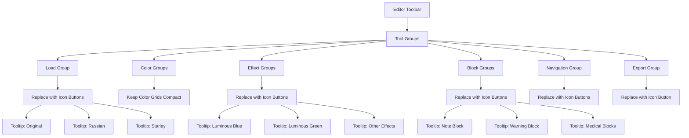

# План оптимизации панели инструментов редактора

## Обзор текущего состояния
Текущая панель инструментов редактора использует текстовые кнопки, которые занимают много места. Необходимо оптимизировать интерфейс, сделав его более компактным за счет использования иконок вместо текстовых меток.

## Цели оптимизации
1. Уменьшить занимаемое пространство панели инструментов
2. Заменить текстовые кнопки на иконки с подсказками (tooltips)
3. Сохранить функциональность всех элементов управления
4. Улучшить визуальное восприятие интерфейса

## Подробный план действий

### 1. Анализ текущей структуры панели инструментов в файле editor.html
- Изучить текущую разметку панели инструментов
- Определить все группы инструментов и их расположение
- Выявить повторяющиеся или схожие элементы

### 2. Определение всех групп инструментов и их функций
- Группа загрузки файлов (Load)
- Группа цветных овалов (Color Oval)
- Группа маркеров (Marker)
- Группа специальных эффектов (Special Effects)
- Группа информационных блоков (Info Boxes)
- Группа цветов текста (Text Color)
- Группа стандартных блоков (Standard Blocks)
- Группа медицинских блоков (Medical Blocks)
- Группа навигации (Navigation)
- Группа эффектов (Effects)
- Группа размера шрифта и заголовков (Font Size & Headers)
- Группа сохранения (Save)

### 3. Подбор подходящих иконок для замени текстовых меток
- Для загрузки файлов: 📄 (Original), 🇷🇺 (Russian), ⭐ (Starley)
- Для специальных эффектов: 💎 (Luminous Blue), 💚 (Luminous Green), ❤️ (Luminous Red), 💛 (Luminous Yellow), 💜 (Luminous Purple), ⚡ (Neon Pink/Blue), ⚡ (Glitch Effect)
- Для информационных блоков: 📦 (Default), ℹ️ (Info), ✅ (Success), ⚠️ (Warning), 🚨 (Danger)
- Для стандартных блоков: ℹ️ (Note), 💡 (Tip), 📌 (Info), ⚠️ (Warning), 🚨 (Danger), ⚡ (Caution)
- Для медицинских блоков: 💉 (Dosage), 🚫 (Contraindication), ⚠️ (Side Effect), 🏥 (Clinical), 🫀 (Anatomy), 🧬 (Physiology), 🔪 (Surgery), 🚑 (ICU), 📊 (Evidence), 📋 (Protocol)
- Для навигации: 🔗 (Link), ⚓ (Anchor), ↩️ (Back Link)
- Для эффектов: 💎 (Luminous Cyan), 🔥 (Luminous Amber), ▶ (Hidden Text)
- Для размера шрифта: %-символы можно заменить на A-значки разного размера
- Для заголовков: # символы оставить, но уменьшить кнопки

### 4. Разработка новой структуры разметки с компактными кнопками-иконками
- Создать компактные кнопки с минимальным внутренним пространством
- Добавить атрибуты title для всплывающих подсказок
- Обеспечить правильную семантику элементов

### 5. Обновление CSS стилей для компактного отображения кнопок
- Уменьшить размеры кнопок
- Оптимизировать внутренние отступы
- Обеспечить хорошую видимость иконок
- Настроить hover-эффекты для иконок

### 6. Добавление всплывающих подсказок (tooltips) для иконок
- Реализовать tooltips с помощью CSS или JavaScript
- Обеспечить доступность подсказок
- Настроить задержку и стиль отображения

### 7. Обеспечение доступности (accessibility) новых иконок
- Добавить aria-label атрибуты для скринридеров
- Обеспечить контрастность иконок
- Поддерживать клавиатурную навигацию

### 8. Тестирование функциональности после изменений
- Проверить работоспособность всех иконок
- Убедиться в корректном отображении на разных разрешениях
- Протестировать доступность интерфейса

## Спецификация изменений

### Файлы для модификации:
1. `editor.html` - основной HTML файл редактора
2. `assets/css/editor.css` - файл стилей редактора

### Группы инструментов для оптимизации:
1. **Загрузка файлов** (Load) - Заменить кнопки Original, Russian, Starley на иконки с подсказками
2. **Цветные овалы** (Color Oval) - Сохранить сетку цветов как есть, так как она уже компактна
3. **Маркеры** (Marker) - Сохранить сетку цветов как есть
4. **Специальные эффекты** (Special Effects) - Заменить кнопки на иконки с подсказками
5. **Информационные блоки** (Info Boxes) - Заменить на иконки с подсказками
6. **Цвета текста** (Text Color) - Сохранить сетку цветов как есть
7. **Стандартные блоки** - Заменить на иконки с подсказками
8. **Медицинские блоки** - Заменить на иконки с подсказками
9. **Навигация** - Заменить на иконки с подсказками
10. **Эффекты** - Заменить на иконки с подсказками
11. **Размер шрифта и заголовки** - Заменить числовые значения на соответствующие иконки
12. **Сохранение** (Save) - Заменить кнопку на иконку с подсказкой

### Технические детали реализации:
- Использование Unicode иконок или иконок из набора (например, Font Awesome, если доступны)
- Добавление атрибута `title` для всплывающих подсказок
- Адаптация размеров кнопок для лучшего отображения иконок
- Обеспечение контрастности иконок на темном фоне панели инструментов

## Архитектурная диаграмма

## Критерии успеха
- Уменьшение высоты панели инструментов минимум на 30%
- Сохранение всей функциональности
- Улучшение читаемости и визуального восприятия
- Обеспечение доступности для пользователей
- Корректное отображение на разных разрешениях экрана